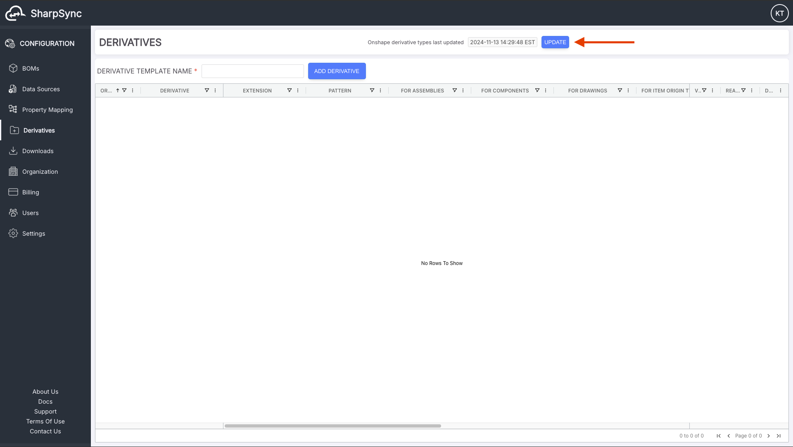
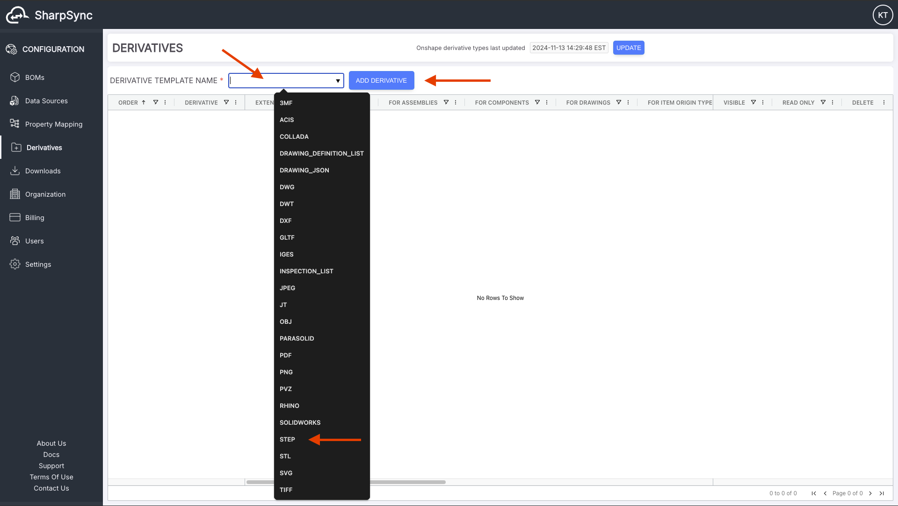
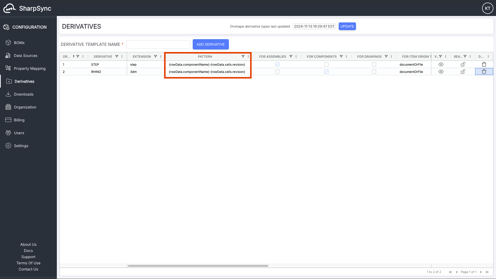
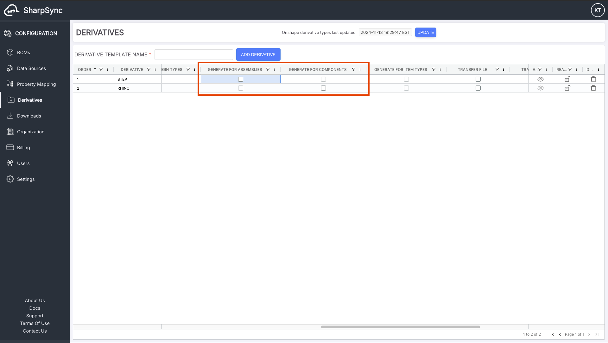
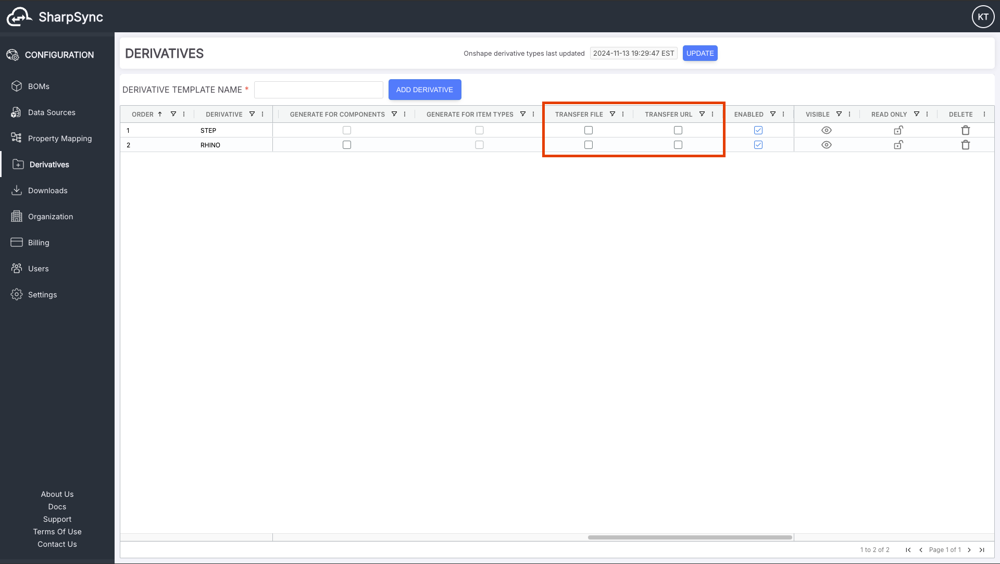
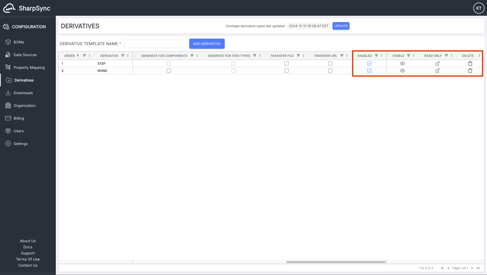
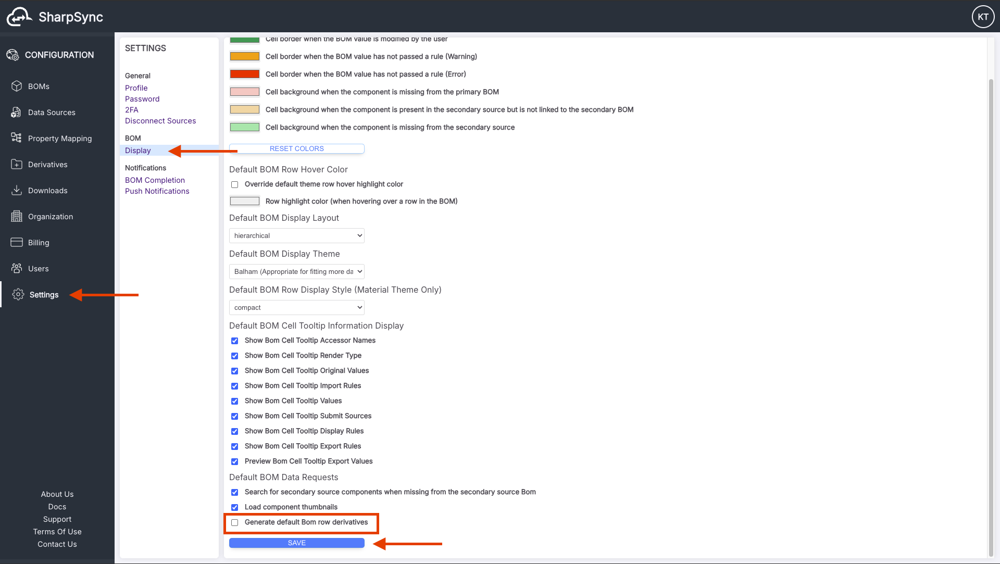
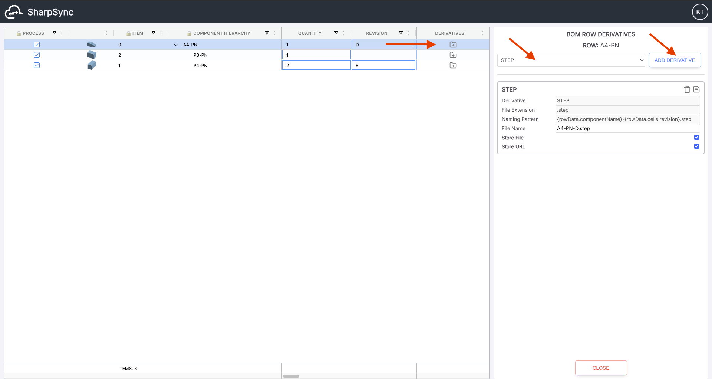
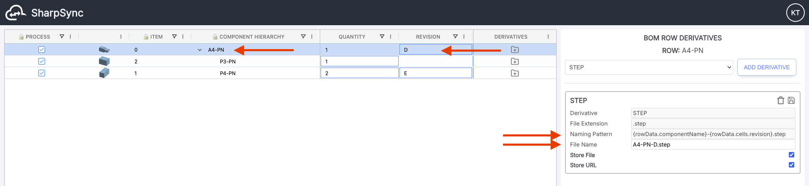
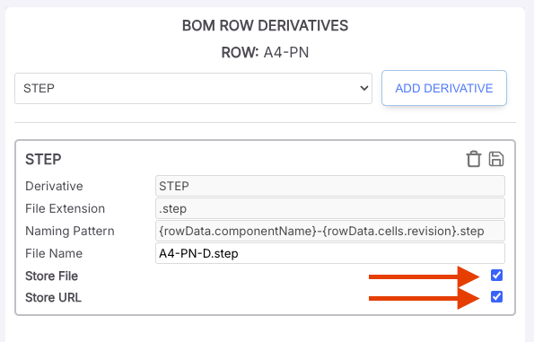

# Derivatives

<figure><figcaption>
Derivatives section icon
</figcaption></figure>

Derivatives are files or URLs that are derived from BOMs and Components in the CAD source, such as STEP, DWG, PDF, etc... files. SharpSync's derivatives feature allows the manual or automated transfer of CAD BOM derivatives from the CAD Data Source to the ERP Data Source. The derivatives feature is currently only available for:

| Source         |    Url Transfer\*    |   File Transfer\*\*  |
| -------------- | :------------------: | :------------------: |
| Onshape        | :white\_check\_mark: | :white\_check\_mark: |
| PropelPLM      | :white\_check\_mark: | :white\_check\_mark: |
| Odoo           | :white\_check\_mark: |   \[mid-late 2025]   |
| NetSuite       | :white\_check\_mark: |     \[on-request]    |
| SolidWorks     |                      |                      |
| Inventor       |                      |                      |
| CSV            |                      |                      |
| SolidWorks PDM |                      |                      |

\* If the source is CAD, then the URL is available and copied to a field in the ERP. If the source is ERP, then the URL may be copied to a field from the CAD.

\*\* If the source is CAD, then the file generated or copied to the ERP. If the source is ERP, then the file is transferred from the CAD to the ERP.

### Concepts

**Derivative templates**

A derivative template is a conversion template which can be used to specify:

* What should be converted (e.g. Part, Assembly, Drawing) &#x20;
* The destination format (e.g. PDF, STEP, IGES, etc)
* What the destination file name should be (e.g. PartNumber + Revision)
* What should be transferred (e.g. the URL to the derivative or a copy of the file or both)

**Derivative**

A derivative is a file or URL that is generated from a document. If the source document are geometric documents, the outputs can be STEP, IGES or OBJ files. If the source documents are drawing documents, the outputs can be DXF, DWG or PDF.


Derivatives are not generated by the SharpSync app.&#x20;

Derivative files are generated by the source system (E.g. Onshape, SolidWorks or SolidWorks PDM or Inventor).


### Instructions

#### Adding Derivative Templates

<figure><figcaption></figcaption></figure>

1. First, make sure you have loaded all available derivatives from your source by clicking on the update source derivatives types button.&#x20;
2. Second, click on the `DERIVATIVE TEMPLATE NAME` input to list the available derivative types to select from, then select a derivative type, and finally click on the `ADD DERIVATIVE` button to add the derivative type.&#x20;

<figure><figcaption>
Derivatives: Select from Source Templates
</figcaption></figure>

3. After adding all the desired derivative types, you can now start to configure their settings

### Configure Derivative Types

There are different types of mappings for derivatives:

* Model geometry for assemblies (e.g. STEP, IGES)
* Model geometry for components (e.g. STEP, IGES)
* Drawing derivative (e.g. DRAWING). This is the drawing itself
  * Uses a search pattern to find a drawing
  * e.g. find first DRAWING matching the pattern `DRW-{rowData.componentName}`
* Drawing derivatives (e.g. PDF / DXF / DWG) which are based on the found DRAWING

For each type of derivative you can select one or more (depending on the type) of option:

* **Transfer URL**:&#x20;
  * Creates a copy of the URL value
  * Copies the URL to the selected property mapping if supported by the ERP Data Source \*\*
  * Selecting this option in the template will cause the option to be auto selected in the BOM view
* **Transfer File**:&#x20;
  * Creates a copy of the file in the destination ERP
  * Selecting this option in the template will cause the option to be auto selected in the BOM view

\*\*_Not available for **offline sources** at the time of writing_

### Limitations

It is important to note the following logic:

* When mapping assembly derivatives \[checkbox `FOR ASSEMBLIES`] (e.g. STEP, IGES):
  * The derivative is _always_ generated based on the version + configuration provided for the component.
  * The derivative is searched for (opt-in) (Not Yet Implemented)
  * If not found, it is generated on the fly.
* When mapping component derivatives \[checkbox `FOR COMPONENTS`] (e.g. STEP, IGES):
  * The derivative is _always_ generated based on the version + configuration provided for the component.
  * The derivative is searched for (opt-in) (Not Yet Implemented)
  * If not found, it is generated on the fly.
* When mapping the DRAWING derivative \[checkbox `FOR DRAWINGS`] (e.g. SolidWorks drawing file SLDDRW / ONSHAPE DRAWING documents):
  * No new drawings will be generated in the source. Drawings cannot be auto generated.
  * A new DRAWING BOM row will be created in the BOM view in SharpSync as child of each item (assemblies + parts) during the BOM loading process, only if a corresponding DRAWING is found in the source matching the defined file search pattern exactly (the search will be based on the DRAWING derivative template file search pattern and the metadata of the parent item.


If the parent item part name is P1-PN, the search pattern `DRW-{rowData.componentName}` will search for a source DRAWING exactly named `DRW-P1-PN`).


* This created row will be read only&#x20;
  * It will not be included as part of BOM submission,&#x20;
  * It will act as a placeholder for possible drawing derivatives (DRAWING, PDF, DWG, etc...).
  * No new item rows will be created in the ERP
* The DRAWING row derivative template can be configured in the DERIVATIVES menu but can only be added to a DRAWING BOM Row. It cannot be added to a part or assembly row.
* After a BOM is submitted, when processing derivatives, SharpSync will use the found source DRAWING. SharpSync will then:
  * Make a copy of the link only (in the case of online CAD _document_ system (e.g. Onshape)) or&#x20;
  * Make a copy of the link and/or file (in the case of online CAD _file_ system (e.g. SolidWorks PDM))
* When mapping drawing derivatives \[checkbox `FOR DRAWINGS`] (e.g. PDF / DXF / DWG ):
  * The derivative is _always_ generated based on&#x20;
    * the DRAWING BOM Row and&#x20;
    * its parent item metadata.
  * This means SharpSync will use the found source DRAWING, and convert it to the supported format specified, and copy the link and/or the file to the destination.
  * The derivative is searched for (opt-in) (Not Yet Implemented)

### Configure Derivative Search or Naming Patterns

1. You can double click on the `PATTERN` cell of each derivative type to change the file search or naming pattern of the derivative that will be transferred to your ERP source. If the search pattern is for a DRAWING document type, then this will be the _search pattern_ used to search for drawings. Not that when searching for drawings, only exact matches are considered. Partial matching is not supported at the time of writing due to the possibility of 1000s of results being returned.&#x20;

<figure><figcaption>
Derivatives: Configure Naming Pattern
</figcaption></figure>

2. You can check/uncheck the `GENERATE FOR ASSEMBLIES` or the `GENERATE FOR COMPONENTS` or the `GENERATE FOR DRAWINGS` checkbox of a derivative type to control which BOM row derivatives can be generated for which BOM component type (assemblies or components or drawings). For example, if the "STEP" derivative type is checked for assemblies, then the "STEP" BOM row derivative can be generated for any assembly row of your loaded BOM. (See also Configure BOM Row Derivatives)&#x20;

<figure><figcaption>
Derivatives: Select Auto Generation
</figcaption></figure>

3. You can check/uncheck the `TRANSFER FILE` or the `TRANSFER URL` checkbox of a derivative type to have the corresponding BOM row derivative checkbox `Store File` or `Store Url` checked by default when the BOM row derivative is generated. (See also Configure BOM Row Derivatives)

<figure><figcaption>
Derivatives: Default Transfer Options
</figcaption></figure>

4. You can uncheck the `ENABLED` checkbox of a derivative type to prevent it from being available to be generated as a BOM row derivative. You can set a derivative type as `READ ONLY` to prevent the related generated BOM row derivatives from being configured on a per row basis. (See also [Configure BOM Row Derivatives](derivatives.md#configure-bom-row-derivatives))&#x20;

<figure><figcaption>
Derivatives: Other Options
</figcaption></figure>

### Auto Generate Default Derivatives

* In `Settings` -> `Display` , you can check/uncheck the `Generate default BOM row derivatives` in order to auto-generate the BOM row derivatives on SharpSync BOM load according to the derivative type configurations that you have set up in the previous section. (See also [Configure BOM Row Derivatives](derivatives.md#configure-bom-row-derivatives))&#x20;

<figure><figcaption>
Derivatives: Enable Auto Generate
</figcaption></figure>

### Configure BOM Row Derivatives

1. If you have the user setting `Generate default BOM row derivatives` checked, all the BOM row derivatives should be auto-generated each time you load your BOM according to the derivative types configurations that you have set up in the previous sections.
2. Otherwise you can always manually add BOM row derivatives per row by:
   * Clicking on each BOM row's `DERIVATIVES` icon
   * Selecting the required derivative type from the selection list
   * Clicking on the `ADD DERIVATIVE` button
3. Note that the available derivative type list changes based on you configured derivative types.&#x20;

<figure><figcaption>
Derivatives: Add a new derivative in the BOM view
</figcaption></figure>

4. You can further configure your generated BOM row derivative (if your derivative types settings permit it) on a per row basis. For example, you can manually change the `File Name` that will be stored in you ERP source. (Note: Some ERP sources such as Propel PLM have a pre-set logic on where to store component derivatives; other ERP sources have a more flexible logic where you can specify the secondary source mapping that will be used to store the url or file derivative. To specify the mapping the to be used to store derivative, in the corresponding DERIVATIVE type template simply select the associated property mapping from the drop down menu of available defined mappings)&#x20;

<figure><figcaption>
Derivatives: Edit the name of the derivative
</figcaption></figure>

5. You can also change the `Store File` or `Store URL` option on a per row basis.&#x20;


Note that the `DRAWING` derivative cannot have its `Store File` checkbox checked as these derivatives will not be generated for online _document_ based systems. You may do this for _file_ based systems.


<figure><figcaption></figcaption></figure>

### Derivatives Transfer

The CAD source (the Primary Source) derivatives will automatically be transferred to your ERP source (Secondary Source) as part of the SharpSync BOM Submittal process (when you click on the `SUBMIT BOM` button) according to your configured Derivative Templates and BOM Row Derivatives settings.
