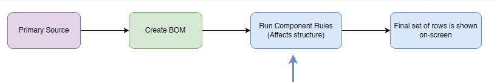

# Row Component Rules

Row Component Rules are rules that run before the BOM is shown on screen the first time. It affects not only the data of the BOM, but also (optionally) _the structure._

These rules are (different from [Property Mapping rules](../fundamentals/rules/)) pre-BOM-load generation rules, or _Row Component_ rules. These rules run:

* _After_ the BOM is generated in the Primary data source, but&#x20;
* _Before_ the BOM is displayed on-screen. This is different to the client-side rules (Property Mapping Rules), which only run per-source, _after_ the BOM is displayed on-screen.

<figure><figcaption><p>Row Component Rules Order</p></figcaption></figure>


You may think of row component rules as rules that affect the _structure_ of a BOM. The structure of the BOM is affected by renaming components or adding new components.\
\
Compare this to Property Mapping rules that only affect the cell values, not the structure or component names.



You should not attempt to rename existing components if you can help it. Only the creation & updates of new components are encouraged. That's not to say it should never be done, but should you chose to do it, use caution.&#x20;


### Where to configure

To configure these rules:

* Navigate to `DataSources` > Your Primary Cad Data Source
* Click the `Configure` button
* Navigate to the `Configuration`  tab
* There is a selection option for `Generate sub-items using rules`
* Change this from `None` ⇒ Specify

When importing rows, you may want materials to automatically be listed as children of part components. The row component rules are meant to assist with this.

The current implementation focuses only on Material Rows generated. Future support is planned for non-material rows.


You may think of row component rules as rules that affect the _structure_ of a BOM. The structure of the BOM is affected by renaming components or removing certain components


<table><thead><tr><th width="437">Supported Row Types</th><th>Supported</th></tr></thead><tbody><tr><td>Generate Single Child Row</td><td><span data-gb-custom-inline data-tag="emoji" data-code="2705">✅</span></td></tr><tr><td>Generate Multiple Child Rows at same level</td><td><span data-gb-custom-inline data-tag="emoji" data-code="2705">✅</span></td></tr><tr><td>Generate Multiple Child Rows at different levels</td><td>❌</td></tr><tr><td>Generated Material Children</td><td><span data-gb-custom-inline data-tag="emoji" data-code="2705">✅</span></td></tr><tr><td>Drawings</td><td>[future release]</td></tr><tr><td>Derivatives</td><td>❌</td></tr></tbody></table>

| Primary Source    | Supported            |
| ----------------- | -------------------- |
| Autodesk Inventor | \[future release]    |
| Autodesk Fusion   | \[future release]    |
| CSV               | \[future release]    |
| Onshape           | :white\_check\_mark: |
| SolidWorks        | \[future release]    |
| SolidWorks PDM    | \[future release]    |

New component rows (or material consumption rows) are rows that are generated for part documents that have a certain condition:

* Each rule is run in the order specified
* Rules are additive, so if the first rule causes the 2nd rule to match that will trigger a multi-rule run

**Structure of a rule**&#x20;

The structure of a rule depends on keywords to manipulate the name. An template is provided below

```
[
  {  
    "order"         : 1,
    "description"   : "Optional. Description of what the rule does",
    "searchRule"    : [ "single", " or list", "of", "criteria", "see [1]"],
    "actions"       : [ "action", "or actions", "to", "perform", "see [2]"]
  }
]
```

Where the following keywords are used

<table><thead><tr><th width="184">Required Keyword</th><th>Description</th></tr></thead><tbody><tr><td><code>order</code></td><td>The order in which a rule is executed</td></tr><tr><td><code>description</code></td><td>A user-friendly description of what the rule does. You may enter anything here</td></tr><tr><td><code>searchRule</code> </td><td>What to search for. This can be a single or multiple criteria. See <a href="row-component-rules.md#id-1-searching">[1]</a>.</td></tr><tr><td><code>actions</code></td><td>The actions to perform when the <code>searchRule</code> is matched. If searching for say, PRT-123, and you find a match, the specified action will be performed. See <a href="row-component-rules.md#id-2-row-actions">[2]</a></td></tr></tbody></table>


Do not include the comments // in the rules. They're only for illustration purposes.


**Example: Add a new material row if the component type equals "SM"**

The following example, we check if a row's componentName starts with `PN-1785`. If it matches. It will automatically create a new row below it, setting the value of `qty` to 1 and naming the component `PCX-1-PN-1785`

```json
[
  {
    "order": 1,
    "description": "Create PC-XXX rows",
    "searchRule": [
      "rowData.componentName",
      "startsWith",
      "PN-1785"
    ],
    "actions": [
      [
        "createMaterialRow",
        "",
        "",
        ""
      ],
      [
        "setCellValue",
        "rowData.componentName",
        "PCX-1-{rowData.componentName}"
      ],
      [
        "setCellValue",
        "quantity",
        1
      ]
    ]
  }
]
```

**Example: Substitute material name**&#x20;

In the example below, we'll search for any material call `Aluminium`. We'll change the value to `AS-2005`

```
[
  {
    "order": 1,
    "description": "Replace aluminium with material code",
    "searchRule": [
      "material",
      "=",
      "Aluminium"
    ],
    "actions": [      
      [
        "setCellValue",
        "material",
        "AS-2005"
      ] 
    ]
  }
]
```


Warning: To make troubleshooting easier, try not to run value substitutions for existing rows. In the example above, this will work, but you might run into difficulty trying to establish why the value in SharpSync is different to that of the value in your CAD system because there is no indication that the value has changed. Ideally you should use row component rules to create new rows only. But you know, we all have different needs, so if you find this is a requirement, go for it! ;)&#x20;


The reason you might want to change values is because you have a legacy CAD library that has old values, and you want to still keep those in place, while updating the values displayed in SharpSync. This can still be achieved with [rules](../fundamentals/rules/ "mention") and you can see that it was edited with a rule. With Row Component Rules, _you will not see_ that it was edited with a rule.



If you're unfamiliar with JSON editors, I've found the easiest editor for JSON is VSCODE&#x20;


And now for the gory technical details

### Technical Details

### \[1] Searching

When searching for a condition to be met, you have some options to play with for the `searchRule` parameter.

The way the `searchRule` works is that it takes 3 parameters. These are

* `Property name` . Single value
* `Match condition` . Single value
* `Search Text` . Can be a list of values

<table><thead><tr><th width="168">Search Rule Parameters</th><th>Description</th></tr></thead><tbody><tr><td>1st Param</td><td><p><code>Property name</code>: The property to search for. This is any property available in <code>rowData.xxxx</code>.</p><p></p><p>This includes values like <code>rowData.isAssemblyRow</code>, <code>rowData.componentName</code>, etc. </p><p></p><p>If the property is not prefixed with <code>rowData.</code> then the assumption is your searching in the row cells. <br><br>If you want to find a cell where the value of X is "Y", you would put <br>[ "X", "==", "Y" ]<br><br>If you want to find a cell where the value of material is "Steel", you would put [ "material", "==", "Steel" ]<br><br>If you want to find a component where the name of part is "PRT-1", you would put [ "rowData.componentName", "==", "PRT-1" ]</p></td></tr><tr><td>2nd Param</td><td><code>Match Condition</code> : This is the condition that must be matched. The conditions available to you are listed in the conditions table below.<br>"contains" : a part of the value matches the specified string<br>"is" | "containsExact" : The value matches the complete string or numeric value you specified<br>"ends.<br><br>See the list of conditions below for all possible options</td></tr><tr><td>3rd Param</td><td><code>Search Text</code>. The text used to identify a row. If the text is matched (or not matched based on the condition), an action is taken.</td></tr></tbody></table>

Search Conditions available in a rule (not case sensitive. Casing is applied below for ease of reading).

Some options have more than 1 way of being specified and is listed on different rows. They evaluate to the same result.

<table><thead><tr><th width="195">Condition Text</th><th>Explanation</th></tr></thead><tbody><tr><td>contains</td><td>The value your looking to match contains the text specified</td></tr><tr><td>is<br>containsExact</td><td>The value your looking to match is exactly the text specified</td></tr><tr><td>endsWith</td><td>The value your looking to match ends with the text specified</td></tr><tr><td>endsWithExact</td><td>The value your looking to match ends with the text specified, including the casing of the text. So 'A' is not the same as 'a'</td></tr><tr><td>equals<br>equal<br>==<br>=</td><td>The value your looking to match is equal to the value specified, ignoring the casing of the value specified. so 'Text' is equal to 'text'</td></tr><tr><td>equalsExact<br>===</td><td>The value your looking to match is equal to the value specified, considering the casing of the value specified. so 'Text' is not equal to 'text'</td></tr><tr><td>isInList<br>in<br>inList</td><td>The value your looking to match is in the list of values. If looking for Alu, you may search in the list [ "alu", "aluminium", "aluminum" ]</td></tr><tr><td>!=</td><td>Does not equal. Does not consider casing.</td></tr><tr><td>doesNotContain
<br>not
<br>notContain
<br>notContains</td><td>The value your looking to match does not contains the specified text, not taking into account the casing. Use this sparingly as this will match most rows.</td></tr><tr><td>notContainsExact</td><td>The value your looking to match does not contains the specified text, taking into account the casing. Use this sparingly as this will match most rows.</td></tr><tr><td>notExact
<br>notExactly
<br>&#x3C;></td><td>The value your looking to match does not equal the full specified text, taking into account the casing. Use this sparingly as this will match most rows.</td></tr><tr><td>regex</td><td>The value your looking to match may be found with the specified regular expression</td></tr><tr><td>startsWith</td><td>The value your looking to match starts with the specified text, ignoring the casing.</td></tr><tr><td>startsWithExact</td><td>The value your looking to match starts with the specified text, taking into account the casing.</td></tr></tbody></table>

### \[2] Row Actions

Row actions are actions that are performed on existing rows or new rows. There are 2 types of actions: `RowCellAction` and `RowCreationAction`

A `RowCellAction` performs an action on the cell specified for the row.

<table><thead><tr><th width="201">Condition Text</th><th>Explanation</th></tr></thead><tbody><tr><td>setValue<br>setCellValue<br>set</td><td>Sets the specified cell value or <code>rowData.xxx</code> value to the user specified value.<br><br>SharpSync considers this value as a source value from the CAD source. Has no noticeable effect on Property Mapping Rules.</td></tr><tr><td>copyValue<br>copyCellValue<br>copy</td><td>Only applicable to new rows. Sets the specified cell value or <code>rowData.xxx</code> value to the user specified value from the source row. This is the parent row values copied to the child row values. <br><br>SharpSync considers this value as a source value from the CAD source. Has no noticeable effect on Property Mapping Rules.</td></tr></tbody></table>

A `RowCreationAction` performs an action for an entire row

<table><thead><tr><th width="197">Condition Text</th><th>Explanation</th></tr></thead><tbody><tr><td>DoNothing</td><td>Default. Don't do anything. Ignore the row</td></tr><tr><td>CreateRow
</td><td>Creates a new componentRow. The rowType is marked as a normal row. SharpSync considers this a source row from the CAD source. Has no noticeable effect on Property Mapping Rules.</td></tr><tr><td>CreateMaterialRow</td><td>Creates a new componentRow. The rowType is marked as isMaterialRow (true). SharpSync considers this a generated row which does not exist in the source CAD system. Can be used in Property Mapping Rules</td></tr><tr><td>ExcludeRow</td><td>Excludes the row from processing if the searchRule matches</td></tr></tbody></table>

&#x20;
