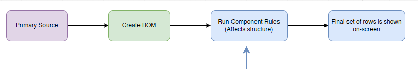

# Row Component Rules

When using SharpSync to send Bill of material data to your ERP, it may be desirable to show material consumption rows. You may want materials to automatically be listed as children of part components. The `Row Component Rules` are meant to assist with this.

### Overview

`Row Component Rules` are rules that run _before_ the BOM is shown on screen the first time. It affects not only the data of the BOM, but also (optionally) _the structure._

These rules are (different from [Property Mapping rules](../fundamentals/rules/)) pre-BOM-load generation rules, or _Row Component_ rules. These rules run:

* _After_ the BOM is generated using the Primary Data Source, but&#x20;
* _Before_ the BOM is displayed on-screen. This is different to the client-side rules (Property Mapping Rules), which only run per-source, _after_ the BOM is displayed on-screen.

<figure><figcaption>
Row Component Rules Order
</figcaption></figure>


You may think of row component rules as rules that affect the _structure_ of a BOM. The structure of the BOM is affected by renaming components or adding new components.\
\
Compare this to Property Mapping rules that only affect the cell values, not the structure or component names.


### Where to configure

To configure these rules:

* Navigate to `Data Sources` > Your Primary Cad Data Source
* Click the `Configure` button
* Navigate to the `Configuration`  tab
* There is a selection option for `Generate sub-items using rules`
* Change this from `No Rules` ⇒ `Specify Rules`
* A new button will become visible, click it: `Configure Server Rules`

### Supported row types

<table><thead><tr><th width="437">Supported Row Types</th><th>Supported</th></tr></thead><tbody><tr><td>Generate Single Child Row</td><td>✅</td></tr><tr><td>Generate Multiple Child Rows at same level</td><td>✅</td></tr><tr><td>Generate Multiple Child Rows at different levels</td><td>❌</td></tr><tr><td>Generated Material Children</td><td>✅</td></tr><tr><td>Drawings</td><td>[future release]</td></tr><tr><td>Derivatives</td><td>❌</td></tr></tbody></table>

| Primary Source    | Supported            |
| ----------------- | -------------------- |
| Autodesk Inventor | \[future release]    |
| Autodesk Fusion   | \[future release]    |
| CSV               | \[future release]    |
| Onshape           | :white\_check\_mark: |
| SolidWorks        | \[future release]    |
| SolidWorks PDM    | \[future release]    |

### How does it work?

* Each rule is run in the order specified
* Rules are additive only
* A rule has 1 or more search conditions
* A rule has 1 or more actions

**Structure of a rule**&#x20;

Where the following key concepts should be noted:

<table><thead><tr><th width="184">Argument</th><th>Description</th></tr></thead><tbody><tr><td><code>Order</code></td><td>The order in which a rule is executed. Drag and drop the handle to re-order rules.</td></tr><tr><td><code>Description</code></td><td>A user-friendly description of what the rule does. You may enter anything here. (optional)</td></tr><tr><td><code>Search Rules</code> </td><td>What to search for. This can be a single or multiple criteria. See <a href="row-component-rules.md#id-1-searching">[1]</a>. If a row is found, an action may be taken. If a row is not found, nothing happens.</td></tr><tr><td><code>Actions</code></td><td>The actions to perform when the <code>Search Rule(s)</code> are matched. If searching for say, PRT-123, and you find a match, the specified action will be performed. See <a href="row-component-rules.md#id-2-row-actions">[2]</a></td></tr></tbody></table>

### Technical Details

#### \[1] Searching

When searching for a row, the row will be found based on the conditions specified.

The way the `Search Rule` works is that it takes 3 parameters. These are

* `Property accessor`. Single value
* `Match condition` . Single value
* `Search Text` . Can be a list of values

<table><thead><tr><th width="168">Search Rule Parameters</th><th>Description</th></tr></thead><tbody><tr><td>1st Param</td><td>
<code>Property accessor</code>: The name of the <a href="../fundamentals/property-mappings/">Property Mapping</a> (accessor) or <code>rowData.xxxx</code> to search for.  

This includes values like <code>rowData.isAssemblyRow</code>, <code>rowData.componentName</code>, etc. 

If the property is not prefixed with <code>rowData.</code> then the assumption is your searching in the row cells.   If you want to find a cell where the value of X is "Y", you would put 'X' as the first param, 'equals' as the second and 'Y' as the last  If you want to find a cell where the value of material is "Steel", you would put  'material' 'equals', 'Steel'. So the first argument would be 'material'  If you want to find a component where the name of part is 'PRT-1', you would put  'rowData.componentName' 'equals' 'PRT-1', so the first argument would be 'rowData.componentName'
</td></tr><tr><td>2nd Param</td><td><code>Match Condition</code> : This is the condition that must be matched.     See the list of conditions below for all possible options</td></tr><tr><td>3rd Param</td><td><code>Search Text</code>. The text used to identify a row. If the text is matched (or not matched based on the condition), an action is taken.</td></tr></tbody></table>

Search Conditions available in a rule (not case sensitive. Casing is applied below for ease of reading).

Some options have more than 1 way of being specified and is listed on different rows. They evaluate to the same result.

<table><thead><tr><th width="195">Condition Text</th><th>Explanation</th></tr></thead><tbody><tr><td>contains</td><td>The value your looking to match contains the text specified</td></tr><tr><td>doesNotContain
</td><td>The value your looking to match does not contains the specified text, not taking into account the casing. Use this sparingly as this will match most rows.</td></tr><tr><td>endsWith</td><td>The value your looking to match ends with the text specified</td></tr><tr><td>endsWithExact</td><td>The value your looking to match ends with the text specified, including the casing of the text. So 'A' is not the same as 'a'</td></tr><tr><td>is containsExact</td><td>The value your looking to match is exactly the text specified</td></tr><tr><td>equals</td><td>The value your looking to match is equal to the value specified, ignoring the casing of the value specified. so 'Text' is equal to 'text'</td></tr><tr><td>equalsExact</td><td>The value your looking to match is equal to the value specified, considering the casing of the value specified. so 'Text' is not equal to 'text'</td></tr><tr><td>isInList</td><td>The value your looking to match is in the list of values. If looking for Alu, you may search in the list [ "alu", "aluminium", "aluminum" ]</td></tr><tr><td>notContainsExact</td><td>The value your looking to match does not contains the specified text, taking into account the casing. Use this sparingly as this will match most rows.</td></tr><tr><td>notExact
</td><td>The value your looking to match does not equal the full specified text, taking into account the casing. Use this sparingly as this will match most rows.</td></tr><tr><td>regex</td><td>The value your looking to match may be found with the specified regular expression</td></tr><tr><td>startsWith</td><td>The value your looking to match starts with the specified text, ignoring the casing.</td></tr><tr><td>startsWithExact</td><td>The value your looking to match starts with the specified text, taking into account the casing.</td></tr><tr><td>!=</td><td>Does not equal. Does not consider text casing.</td></tr><tr><td>!==</td><td>Does not equal. Considers text casing.</td></tr><tr><td>></td><td>[future operator]</td></tr><tr><td>>=</td><td>[future operator]</td></tr><tr><td>&#x3C;</td><td>[future operator]</td></tr><tr><td>&#x3C;=</td><td>[future operator]</td></tr></tbody></table>

#### \[2] Row Actions

Row actions are actions that are performed on existing rows or new rows. There are 2 types of actions: `RowCellAction` and `RowCreationAction`

A `RowCellAction` performs an action on the cell specified for the row.

<table><thead><tr><th width="201">Condition Text</th><th>Explanation</th></tr></thead><tbody><tr><td><code>createMaterialRow</code></td><td>Creates a new row. Does not do anything else. Takes no parameters</td></tr><tr><td> <code>setCellValue</code></td><td>Sets the specified cell value or <code>rowData.xxx</code> value to the user specified value.  SharpSync considers this value as a source value from the CAD source. Has no noticeable effect on Property Mapping Rules.  Should not be used on the same row as <code>createMaterialRow</code></td></tr><tr><td> <code>copyCellValue</code></td><td>Only applicable to new rows. Sets the specified cell value or <code>rowData.xxx</code> value to the user specified value from the source row. This is the parent row values copied to the child row values.   SharpSync considers this value as a source value from the CAD source. Has no noticeable effect on Property Mapping Rules.  Should not be used on the same row as <code>createMaterialRow</code></td></tr></tbody></table>

**Example: Add a new material row if the component material equals "SM-PUR"**

The following example, we check if a row's `material` equals `SM-PUR`. If it matches, a new sheet metal row will be added below the component for a flat pattern, setting the value of `qty` to 1 and naming the component the same as the original, but appending `-FLATPATTERN` at the end.

<table><thead><tr><th width="194">Setting</th><th>Value</th></tr></thead><tbody><tr><td>Order</td><td>1</td></tr><tr><td>Description</td><td>Add material row for SM-PUR</td></tr></tbody></table>

Next we'll setup the search rule condition. This will tell SharpSync how to identify the row. We'll use only a single condition:

<table><thead><tr><th width="230">Accessor</th><th>Arg1</th><th>Arg2</th></tr></thead><tbody><tr><td>rowData.componentName</td><td>equals</td><td>SM-PUR</td></tr></tbody></table>

Now that the search rule condition has been setup, let's setup the actions:

| Accessor          | Arg1                  | Arg2                                |
| ----------------- | --------------------- | ----------------------------------- |
| createMaterialRow | \[blank]              | \[blank]                            |
| setCellValue      | rowData.componentName | {rowData.componentName}-FLATPATTERN |
| setCellValue      | quantity              | 1                                   |
| setCellValue      | canBePurchased        | true                                |

**Example: Substitute material name**&#x20;

In the example below, we'll search for any material call `Aluminium`. We'll change the value to `AS-2005` because we want to use the material code, not the name assigned in the CAD system. We also make sure that the `unitOfMeasure` is in meters, not each:&#x20;

<table><thead><tr><th width="194">Setting</th><th>Value</th></tr></thead><tbody><tr><td>Order</td><td>2</td></tr><tr><td>Description</td><td>Change material name</td></tr></tbody></table>

Next we'll setup the search rule condition. This will tell SharpSync how to identify the row. We'll use only a single condition:

<table><thead><tr><th width="230">Accessor</th><th>Arg1</th><th>Arg2</th></tr></thead><tbody><tr><td>materials</td><td>equals</td><td>Aluminium</td></tr></tbody></table>

Now that the search rule condition has been setup, let's setup the actions. There will be no `createMaterialRow` action since we just want to change the value of the `material`:

| Accessor     | Arg1          | Arg2    |
| ------------ | ------------- | ------- |
| setCellValue | material      | AS-2005 |
| setCellValue | unitOfMeasure | m       |


Take note: To make troubleshooting easier, try not to run value substitutions for existing rows. In the examples above, this will work, but you might run into difficulty trying to establish why the value in SharpSync is different to that of the value in your CAD system because there is no indication that the value has changed. Ideally you should use row component rules to create _new_ rows only. But you know, we all have different needs, so if you find this is a requirement, go for it! ;)&#x20;

The reason you might want to change values is because you have a legacy CAD library that has old values, and you want to still keep those in place, while updating the values displayed in SharpSync. This can still be achieved with [rules](../fundamentals/rules/ "mention") and you can see that it was edited with a rule. With Row Component Rules, _you will not see_ that it was edited with a rule.


