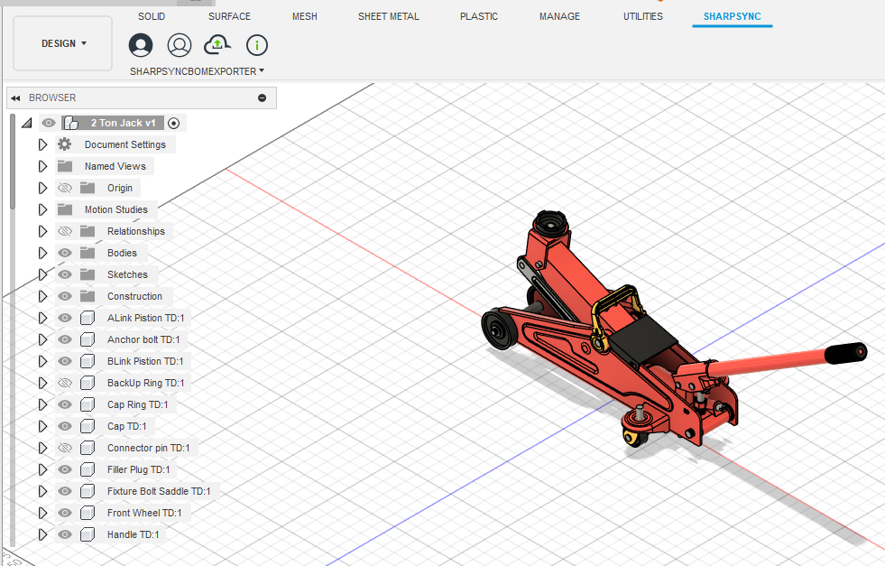
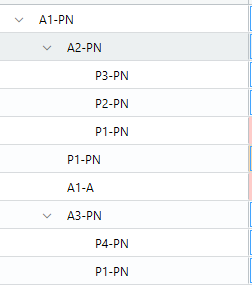

# Autodesk Fusion


The Autodesk Fusion add-in is in Beta. If you would like to give it a test run, please [register](../fundamentals/getting-started/registration.md) on the SharpSync website and reach out to us for a downloadable.


### Bill of Material (BOM) level features

<table><thead><tr><th width="335.0078125">Feature</th><th width="115.390625" align="center">Read</th></tr></thead><tbody><tr><td>BOM hierarchy</td><td align="center">✅</td></tr><tr><td>BOM meta data **</td><td align="center">✅</td></tr><tr><td>BOM quantities</td><td align="center">✅</td></tr><tr><td>Component thumbnails</td><td align="center">✅</td></tr><tr><td>BOM Configurations</td><td align="center">✅</td></tr><tr><td>File derivative transfers (e.g. STEP, DXF)</td><td align="center">N/A</td></tr></tbody></table>

\*\* 2 way sync updates to BOM meta data are available on request

## Fusion Add-in Setup

Fusion files (\*.f3d) are utilized to import Bills of Materials (BOMs) from desktop-based CAD software into SharpSync. (Drawing files' BOM's are not currently supported, but if demand is high enough we will consider it) Follow the steps below to begin importing data into SharpSync using Autodesk Fusion

* Prerequisites
* Setup Instructions
* Push a Bill of Materials to SharpSync

### Prerequisites

* An installation of Fusion 2026 or later (engage us for older versions)
* Download and install the Fusion add-in from the `Downloads` section
* Installation of the add-in
* An assembly or part file
* Drawings Bill of Materials are not supported yet, but talk to us about integration

### Setup Instructions

#### Setup the CSV Data Source in SharpSync

* From the [`Data Sources`](../fundamentals/data-sources.md#core-concept-sources) section, add the CSV Data Source as the Primary Data Source
* Click the `Configure` button > `BOM Configuration`
* On a new line each, enter the Custom Properties to read. The properties supported are:
  * description
  * revision
  * partNumber
  * qty
  * material.description
  * material.appearance.name
  * material.appearance.isValid
  * material.appearance.id
  * physicalProperties.mass
  * physicalProperties.volume
  * physicalProperties.density
  * physicalProperties.area
  * physicalProperties.centerOfMass.x
  * physicalProperties.centerOfMass.y
  * physicalProperties.centerOfMass.z
  * (If there are other properties you would like supported, please reach out to us)\
    &#x20;
* These properties should be the standard properties that exist in any given Fusion file. If it does not exist, a blank value will be used
* Each value entered here will be available as an [`Accessor`](../fundamentals/property-mappings/adding-property-mapping.md) (Property) in the `Property Mappings` tab
* Make sure to add the Qty / qty. column (this will be used later in the property mappings). (The exact naming is not important, as long as it reflects the quantity of parts in an assembly)

> For example if you want to display custom properties `partNumber`, `description`, `material`, then enter these on a new line each

* Click the `Save` button
* On the main Data Source tab, make sure that the `Primary Component Identifier` matches with your `partNumber` custom property.

The primary component identifier is the identifier that _is unique across data sources_. For `PartNumber` the assumption is this property exists in both Fusion _and_ your ERP solution.&#x20;


It does not have to be `partNumber`. It can be called anything as long as it exists as a Fusion custom property. If it does not exist, the `name` will be used as the fallback value


In the example below I've setup

* partNumber
* Description
* Qty (Property Mapping > Settings > `Is Quantity Property` must be enabled)

#### Install the add-in

To install the add-in:

* Download the \*.zip file from the `Downloads` section
* Extract to a convention location
* In Fusion click Utilities > Addins > Script or add-in from device

<figure><figcaption></figcaption></figure>

* Select the folder where the files were extracted
* Select > Run
* Select > Run on startup

The add-in is now ready to use  :thumbsup:

#### Login

After installing the Fusion add-in, you'll need to login before being able to generate BOMs.&#x20;

* Clicking the login button
* A new window will appear
* Enter your credentials&#x20;
* Once the `Connected` window displays, closed it
* You've now successfully logged in.

### Push a Bill of Materials to SharpSync

Pushing data from Fusion to SharpSync is easy and straight forward. To push a Bill of Materials (BOM) to SharpSync do the following:

* Open a part or assembly file
* Make sure you've logged in to SharpSync (Click the login button at least once)
* Click the Push BOM button
* The active configuration of the assembly is used to display data in SharpSync

<figure><figcaption>
Click the button to send the Bill of Materials to SharpSync
</figcaption></figure>

* The BOM structure for the assembly is loaded in SharpSync.

In the example below, the hierarchy in SharpSync is displayed using the mapped `Number` property mapped in SharpSync.

Notice that the component names are taken from the `Number` primary component identifier

<figure><figcaption></figcaption></figure>

You're now ready to submit this to your ERP.
