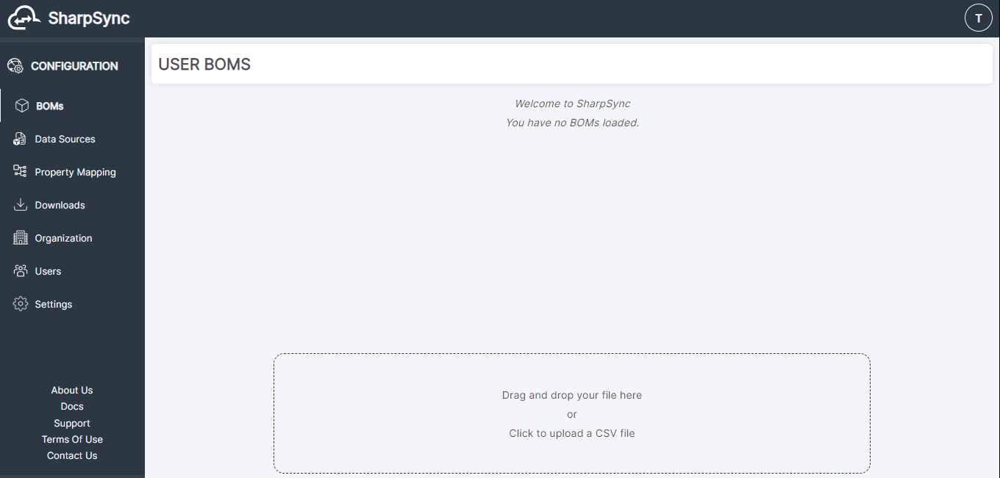
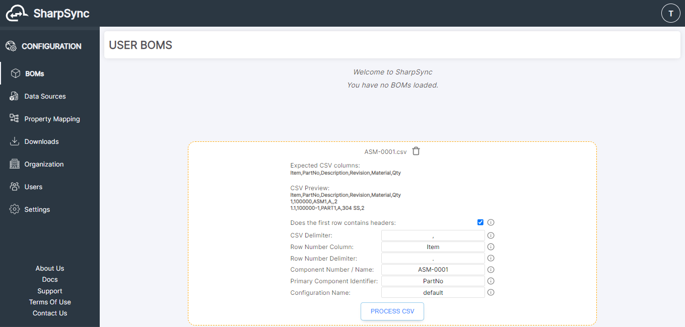
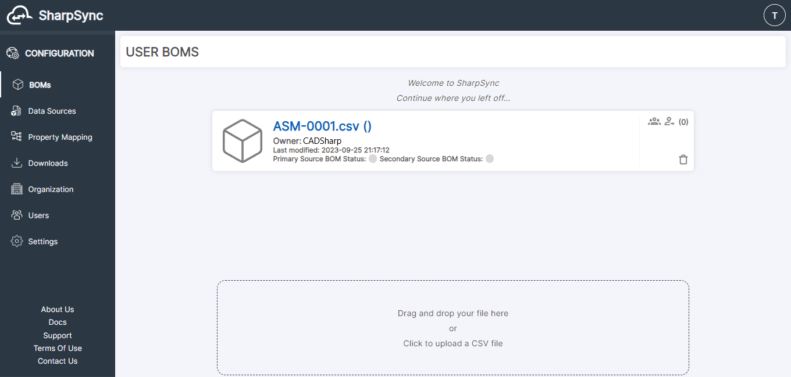
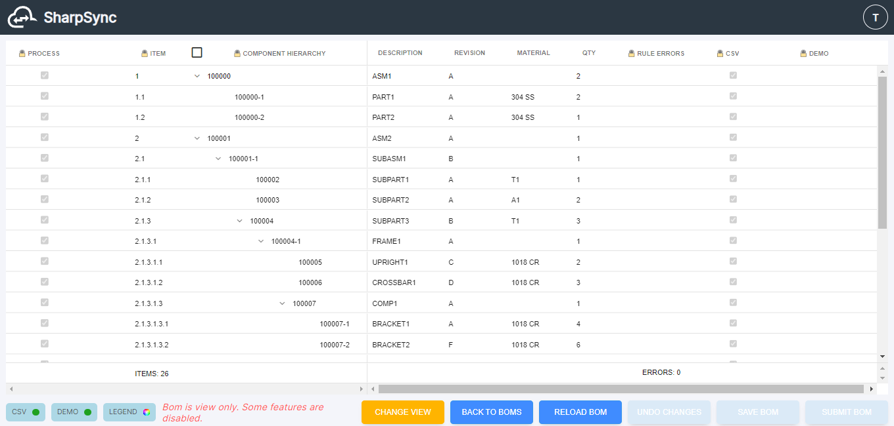

# Importing a Bill of Materials (BOM)

## Importing a CSV BOM

Once the Data Sources and Property Mappings have been set up (see section [Property Mappings](../../fundamentals/property-mappings/)), you can now begin importing CSV Bills of Materials.

#### Get the CSV BOM

<figure><figcaption>
A londing page  where CSV files may be dropped or selected
</figcaption></figure>

\
In the SharpSync BOMs page you will see a section at the bottom of the page with a dash-lined border around it. You can drag and drop your .csv file from a File Manager (Explorer for Windows, Finder for Mac). Alternatively, you can click inside the box and navigate to where the file is located and upload it.

#### Pre-Process Specifications

<figure><figcaption>
Edit the file settings before importing
</figcaption></figure>

1. _Does the first row contain headers._ Toggle the checkbox to indicate if the CSV file has headers.
2. _CSV Delimiter._ Typically, a CSV file will separate each "cell" with a common delimiter, typically a comma. Enter the delimiter used.
3. _Row Number Column._ Type in the column that contains the Row Numbers. This is important as these numbers are what is used to establish the assembly hierarchy. Every cell in this column should have a different Row Number.
4. _Row Number Delimiter._ Enter the row number delimiter. SharpSync parses the hiearchy for each item using its row number.
   * Row Numbers with a Period: 1.2.3.4
   * Row Numbers with a Comma: 1,2,3,4
5. _Component Number/Name._ Enter the Top Level Assembly name or number in this field. Typically, the name/number will match the .csv filename.
6. _Primary Component Identifier._ This is usually synonymous with the Component Name or Number. In the above example, PartNo is the column used.
7. _Configuration Name._ Enter the Top Level Assembly Configuration name, typically set to default.
8. _Process CSV._ Click this button to finish. The BOM page will show the newly added BOM.

<figure><figcaption>
The Bill of Materials is displayed after import
</figcaption></figure>

#### Import Success

The BOM is now ready to be accessed once it is uploaded. Click on the BOM to view its contents.

<figure><figcaption>
The Bill of Materials detail is displayed when selected
</figcaption></figure>

 
