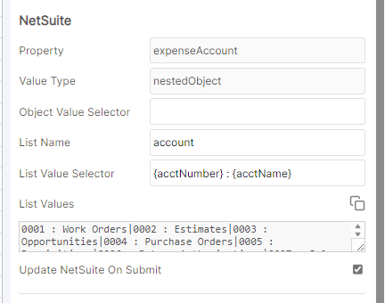

# Configure Accounts Selection

You want to setup a list of accounts to pick from for Income and Expense accounts. This will let you specify a default Income and expense account when creating new items.

To setup a list of accounts to pick from in NetSuite, we'll query the `accounts` list and select some values from it.

Steps:

* Create [a new property mapping](configure-accounts-selection.md#create-a-property-mapping) for income account and expense account
* [Specify the list query](configure-accounts-selection.md#specify-the-list-query)
* Setup the selection

### Create a Property Mapping&#x20;

Create a new Property mapping with the following settings:

| Setting                   | Value                                                                                                                                                     |
| ------------------------- | --------------------------------------------------------------------------------------------------------------------------------------------------------- |
| Primary accessor          | <p>(unmapped) </p><p>or mapped to a Primary Source accessor if you have one</p>                                                                           |
| Secondary accessor        | <p>One of: </p><ul><li>inventoryitem.incomeAccount </li><li>assemblyitem.incomeAccount</li><li>noninventoryresaleitem.incomeAccount</li><li>etc</li></ul> |
| Update Primary on Submit  | unchecked                                                                                                                                                 |
| Update NetSuite on Submit | checked                                                                                                                                                   |
| Prefer NetSuite value     | checked                                                                                                                                                   |
| Rendering Type            | Select List                                                                                                                                               |
| List items                | \*\* see below                                                                                                                                            |

### Specify the list query

When mapping to income account or expense account, the type of item in SharpSync will show as nestedObject. NestedObject is a special type of object which requires SharpSync to query another list to get the value.

The list items will depend on the values returned in the `List Values`section after saving the property mapping the first time or clicking the refresh button.

Once this list has been generated, click the small copy button (next to the refresh button), and then the paste button (clipboard button a little further down)

To setup list selection from NetSuite. Use the following values in the property mapping settings for income account and expense account:

| Option                | Value                         | Description                                                                 |
| --------------------- | ----------------------------- | --------------------------------------------------------------------------- |
| Object Value Selector | `refName`                     | The object to select from the Object returned                               |
| List Name             | `account`                     | The list to query in NetSuite                                               |
| List Value Selector   | `{acctNumber}` : `{acctName}` | Which values to select from the selected object to show as the display name |


What we’re doing here is that we’re requesting a list of values from NetSuite. NetSuite then returns a list of values and those values are a list that look something like this: \[item1, item2, ... etc]

Where Items 1-2 contain at least the following data:

```json
[{
 "acctName" : "Income",
 "refName" : "Income account",
 "acctNumber" : 1234,
 // ... other values
},
{
 "acctName" : "Expense",
 "refName" : "Expense account",
 "acctNumber" : 1235,
 //... other values
}] 
```

In our Property Mapping settings we're specifying that we would like to select `acctName`and `refName`. So we’re selecting individual values from the objects in the list of values and using it as a display name and and id.

Our selector of `{acctNumber} : {acctName}`

Will render a result of:

`1234: Income|1235: Expense`

The reason we use this method of selection is because this lets us pull data from any list in NetSuite, not just accounts, which greatly amplifies the flexibility of the software.

### Setting up accounts from a list

Continuing on, NetSuite has lists which can be queried using the UI of property mappings.

One such list is `accounts`. To show account names, do the following:

* Add a new Property Mapping for `expenseAccount`
* Add a list value selector `{acctNumber} : {acctName}`



\*\* A list value selector is a string that selects token values (text items wrapped in curly braces) from the returned JSON object. In our example above, when specifying the list name of `account`, the object returned for each list may look something like this:

```json
{
  "links": [
    {
      "rel": "self",
      "href": "https://[customerId].suitetalk.api.netsuite.com/services/rest/record/v1/account/677"
    }
  ],
  "accountContextSearch": {
    "links": [
      {
        "rel": "self",
        "href": "https://[customerId].suitetalk.api.netsuite.com/services/rest/record/v1/account/677/accountContextSearch"
      }
    ]
  },
  "acctName": "Beginning Equity AP",
  "acctNumber": "5305",
  "acctType": {
    "id": "Equity",
    "refName": "Equity"
  },
  "balance": 0.0,
  "eliminate": false,
  "id": "677",
  "inventory": false,
  "isInactive": false,
  "isSummary": false,
  "lastModifiedDate": "2024-05-06T14:55:00Z",
  "localizations": {
    "links": [
      {
        "rel": "self",
        "href": "https://[customerId].suitetalk.api.netsuite.com/services/rest/record/v1/account/677/localizations"
      }
    ]
  },
  "parent": {
    "links": [
      {
        "rel": "self",
        "href": "https://[customerId].suitetalk.api.netsuite.com/services/rest/record/v1/account/188"
      }
    ],
    "id": "188",
    "refName": "5800 Amanda L. Perry"
  },
  "revalue": false,
  "subsidiary": {
    "links": [
      {
        "rel": "self",
        "href": "https://[customerId].suitetalk.api.netsuite.com/services/rest/record/v1/account/677/subsidiary"
      }
    ]
  }
}
```

#### Example 1

Suppose we want to display the account name from the above example as `5305 - Beginning Equity AP` then our list value selector would be made up of 2 seperate json tokens.

1. `5305` - the json token `acctNumber`
2. `Beginning Equity AP` - the json token `acctName`

We then specify a token selection string of `{acctNumber} - {acctName}`

#### Example 2

Suppose we want to display the account name from the above example as `5800 Amanda L. Perry` then our list value selector would be made up of a single json token.

We then specify a token selection string of `{parent.refName}` because we're selecting the child `refName` from the token called `parent`

Both the examples above will result in a list seperated by the pipe symbol |

note: if you don't specify the selector string, then the entire json object will the shown as the listitem.

note2: The difference between a `list value selector` and an `object value selector` is that the former will construct a text item from a json object, and return a list of items separated by pipe symbol |. The latter will select a value from a single nested object, and return only a single item, not a list of strings.

note3: Should you want to change the selector string or any of the tokens being selected, then you have to first remove the list name, save, change the tokens, then enter the list name again. The selection is generated at the time of loading the list from NetSuite, and since this can be a data intensive process, SharpSync doesn't store all the details all the time, it only stores the specified details.

### Setting up a default value for income and expense accounts


It is desirable to prefer the values for accounts from NetSuite over that of your CAD system since CAD file may not even include this information.&#x20;

Make sure to set the checkbox `Prefer NetSuite value` in the property Mapping settings


&#x20;To setup a default value, you can make use of a [Rule ](../../../fundamentals/rule-templates.md)such as this

**Rule 1**

<table><thead><tr><th>Item</th><th width="238">Value</th><th>Comment</th></tr></thead><tbody><tr><td>Rule name</td><td>Set empty cells</td><td>Only triggers for empty cells</td></tr><tr><td>Type</td><td>Import Rule</td><td></td></tr><tr><td>Value</td><td><code>7116 : Indirect Materials and Supplies - Absorbed</code></td><td>this must match the pattern you use in your <code>Object value selector</code>)</td></tr></tbody></table>

**Rule 2 Optional**

You can add rules to help you manage account data like the below which prevents the income and expense account from being the same.

| Item      | Value           | Comment                                                              |
| --------- | --------------- | -------------------------------------------------------------------- |
| Rule name | Text Evaluation | Dynamic scriptable rule                                              |
| Type      | Display Rule    |                                                                      |
| Value     | see below       | this must match the pattern you use in your `Object value selector`) |

#### Rule text

```javascript
if (rowData.cells.expenseAccount == rowData.cells.incomeAccount) 
   return { 'status': 'failure' }
```
