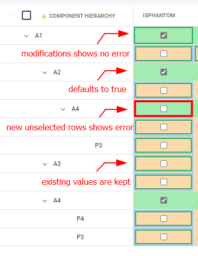

# Configure isPhantom mapping

This setup will cause all new assemblies in NetSuite to be marked as Phantom. Onscreen you will also see any new assemblies (not marked as Phantom) showing with an error.



To setup isPhantom, add a Property Mapping with accessor value `isPhantom`:

### IsPhantom Property Mapping Settings

| Setting                   | Value                                                                           |
| ------------------------- | ------------------------------------------------------------------------------- |
| Primary accessor          | <p>(Unmapped) </p><p>or mapped to a Primary Source accessor if you have one</p> |
| Secondary accessor        | assemblyitem.isPhantom                                                          |
| Update Primary on Submit  | unchecked                                                                       |
| Update NetSuite on Submit | checked                                                                         |
| Rendering Type            | Checkbox                                                                        |
| Prefer NetSuite value     | checked                                                                         |

### IsPhantom Property Mapping Rules

Given this input, create the following rules:

* A `Text Manipulation` import rule for your Primary/CAD source with the following text:

```javascript
if (rowData.isAssemblyRow === true) {
  return true;
} else {
  return false;
}
```

* A `Text Evaluation` display rule that blocks submittal with the following text:&#x20;

```javascript
const isNewAssemblyRow = rowData.isAssemblyRow === true && rowData.isMissingInSecondaryDatasource == true && rowData.isFoundInSecondaryDatasource == false;

if (isNewAssemblyRow === true && (rowData.cells.isPhantom === false || (`isPhantom` in rowData.modifications === true && rowData.modifications.isPhantom === false)))
{
  return { status: 'failure', message: `New Assemblies must be set to isPhantom=true` }
}
```

