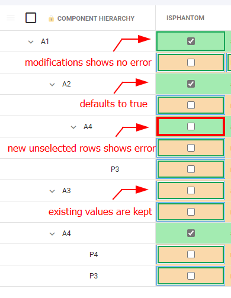

# Configure New assemblies as isPhantom

### Set all new assemblies as \`isPhantom\` with rule check + evaluation

This setup will cause all new assemblies in NetSuite to be marked as Phantom. Onscreen you will also see any new assemblies (not marked as Phantom) showing with an error.



Prerequisites: You have a property mapping set where the accessorName is `phantomYN`

#### New Rule

Accessor name: `isPhantom` Property Mapping in Netsuite: `isPhantom` Rule: `Text manipulation` (Import)

Value:

```javascript
const isNewAssemblyRow = rowData.isAssemblyRow && rowData.isMissingInSecondaryDatasource == true && rowData.isFoundInSecondaryDatasource == false;

if (isNewAssemblyRow)
  { return true; }
else
  { return rowData.cells.isPhantom || rowData.differences.isPhantom || true; }
```

#### New Rule

Accessor name: `isPhantom` Property Mapping in Netsuite: `isPhantom` Rule: `Text evaluation` (Display Rule) Value:

```javascript
const isNewAssemblyRow = rowData.isAssemblyRow && rowData.isMissingInSecondaryDatasource == true && rowData.isFoundInSecondaryDatasource == false;

if (isNewAssemblyRow && (rowData.cells.isPhantom === "false" || (`isPhantom` in rowData.modifications === true && rowData.modifications.isPhantom === false)))
{
  return { status: 'failure', message: `New Assemblies must be set to isPhantom=true` }
}
```
