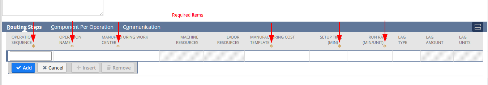
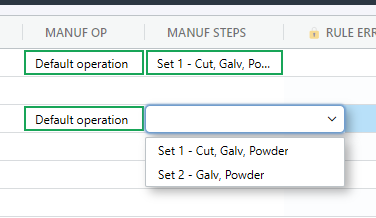

# Configure Routings

Routings in NetSuite, or in any manufacturing context, refers to a sequence of operations or steps that a product must go through during the manufacturing process. These steps can include various operations such as assembly, machining, laser and inspection.

<figure><figcaption><p>NetSuite BOMs and their routing relationships</p></figcaption></figure>


For the NetSuite module, SharpSync only adds routings to BOMs that do NOT ALREADY have routings. This is to prevent overwriting existing manufacturing processes which may have been defined already. Please engage us for upgrading this functionality should you have need for it.





Each assembly will contain 0:N Manufacturing Routings

Each step has a name and is assigned to a Work Center

Each routing step

* Requires setup time (minutes) and a run rate (minutes / unit)

An assembly has a 1:N relationship with routings An assembly has a 1:1 relationship an individual routing, with routings not being reusable across assemblies, therefore

* Assembly 1:N Routing 1:N RoutingSteps

An individual routing

* Has a 1:1 relationship with an assembly
* Has a 1:N relationship with RoutingSteps
* Has a `customForm` id
* Must have a name unique to that routing (provide template string for this e.g. `{componentName} - Routing`)
* Must have a BOM id
* Must have default subsidiary



To configure routings for NetSuite in SharpSync, add 2 property mapping with the setting enabled:

* `Is Manufacturing Operation` (let's refer to this as  `operationStep`)
* AND 1 more mapping
* `Is Manufacturing Step` (let's refer to this as`manufacturingStep`)

#### Step 1: Manufacturing operation

For the property `operationStep` use the settings:

<table><thead><tr><th width="265">Setting</th><th>Value</th></tr></thead><tbody><tr><td>Primary source Property</td><td>(Unmapped)</td></tr><tr><td>Secondary source Property</td><td>(Unmapped)</td></tr><tr><td>Is Manufacturing Operation</td><td>Yes</td></tr><tr><td>Is Manufacturing Step</td><td>No</td></tr><tr><td>Rendering Type</td><td>Advanced List</td></tr><tr><td>List Display Selector</td><td>name</td></tr><tr><td>List Value Selector</td><td>id</td></tr><tr><td>List Items</td><td>See List items for Operation Step and Finding the subsidiary and location IDs</td></tr></tbody></table>

#### List items for Operation Step

```json
[
  {
    "name": "Location - Inhouse",
    "id": 1,
    "value": {
      "name": "SharpSync routing via rest",
      "subsidiary": { "id": 1 },
      "location": { "items": [{ "id": 5 }] }
    }
  },
  {
    "name": "Location - External",
    "id": 2,
    "value": {
      "name": "SharpSync routing via rest",
      "subsidiary": { "id": 1 },
      "location": { "items": [{ "id": 6 }] }
    }
  }
]
```

#### Finding the subsidiary IDs

To find your available subsidiary ids you can simply select Setup > Other Setup > Subsidiaries, and then grab the `INTERNAL ID`.

For the more technical users, use POSTMAN to authenticate, then

> /GET https://\[companyId].suitetalk.api.netsuite.com/services/rest/record/v1/subsidiary

and then followup with

> /GET https://\[companyId].suitetalk.api.netsuite.com/services/rest/record/v1/subsidiary/{id}

#### Finding the location IDs

To find your available location ids you can simply select Financial > Lists > Locations, and then grab the `INTERNAL ID`. (Note: make sure you use a valid combination of subsidiary and location)

For the more technical users, use POSTMAN to authenticate, then

> /GET https://\[companyId].suitetalk.api.netsuite.com/services/rest/record/v1/location

and then followup with

> /GET https://\[companyId].suitetalk.api.netsuite.com/services/rest/record/v1/location/{id}

#### Step 2: Manufacturing operation steps

For the property `manufacturingStep` use the settings:

| Setting                    | Value                                 |
| -------------------------- | ------------------------------------- |
| Primary source Property    | (Unmapped)                            |
| Secondary source Property  | (Unmapped)                            |
| Is Manufacturing Operation | No                                    |
| Is Manufacturing Step      | Yes                                   |
| Rendering Type             | Advanced List                         |
| List Display Selector      | name                                  |
| List Value Selector        | id                                    |
| List Items                 | See List items for Manufacturing Step |

#### List items for Manufacturing Step

Operation steps are groupings of steps performed on an operation. Say you have a default set of steps for an assembly. Let's say it's to be powdercoated, cut, galvanized, then you'll want setup the steps accordingly (let's call this Set 1):

You mileage may vary, but the default items required for setting up a routing are:

* Sequence,
* Name,
* WorkCenter
* CostTemplate
* SetupTime
* RunRate

<figure><figcaption></figcaption></figure>

This leads us to a JSON array body (Let's call this Set 1) that looks something like the following:

```json
[
  {
    "operationsequence": 10,
    "operationName": "10 - Cutting",
    "manufacturingCostTemplate": { "id": 6 },
    "manufacturingWorkCenter": { "id": 48 },
    "setupTime": 5,
    "runRate": 1
  },
  {
    "operationName": "20 - Galvanize",
    "operationsequence": 20,
    "manufacturingCostTemplate": { "id": 6 },
    "manufacturingWorkCenter": { "id": 48 },
    "setupTime": 5,
    "runRate": 1
  },
  {
    "operationName": "30 - Powdercoat",
    "operationsequence": 30,
    "manufacturingCostTemplate": { "id": 6 },
    "manufacturingWorkCenter": { "id": 48 },
    "setupTime": 5,
    "runRate": 1,
    "lagType" : { "id" : "qtypercent"},
    "lagAmount" : 50
  }
]
```

Take note that there are some limitations imposed by NetSuite that must be followed. In the example shown above you cannot have `lagTime` at any step in the list of steps except the last.

#### Finding the Manufacturing Cost Template IDs

To find your available manufacturing cost template ids you can simply select Financial > Manufacturing > Manufacturing Cost Templates, and then grab the `INTERNAL ID`.

#### Finding the Manufacturing Work Center IDs

_(Work in progress)_


However for a different type of assembly you might not require the cutting part as that is subcontracted out, so you have a different set of steps (Let's call this Set 2):

```json
[ 
  {
    "operationName": "10 - Galvanize",
    "operationsequence": 10,
    "manufacturingCostTemplate": { "id": 6 },
    "manufacturingWorkCenter": { "id": 48 },
    "setupTime": 5,
    "runRate": 1
  },
  {
    "operationName": "20 - Powdercoat",
    "operationsequence": 20,
    "manufacturingCostTemplate": { "id": 6 },
    "manufacturingWorkCenter": { "id": 48 },
    "setupTime": 5,
    "runRate": 1
  }
]
```

You can group both of these "sets of steps" in an object list as follows:

```json
[
  {
    "name" : "Set 1 - Cut, Galv, Powder",
    "id" : 1,
    "value" : [] // "{paste the values from set 1}",
  },
  {
    "name" : "Set 2 - Galv, Powder",
    "id" : 2,
    "value" : [] // "{paste the values from set 2}",
  }
]
```

You finally paste this list in the List Items of the Manufacturing Step property mapping, then save the mapping.

#### Add Routing Mappings Export Rules

For each of the above defined property mappings, go to rules and add a `Text Manipulation` `Export` rule.

Paste the following `JavaScript expression` :

```
if (s === "") {   return s; } else {   const listItem = JSON.parse(pm.objectListItems).find((item) => item.id == s);   return listItem.value; }
```

Check the checkbox for `NetSuite`

Then save the rule.

#### Using / Setting BOM Routings

You can now use / set routings by loading a BOM and edit the corresponding routings BOM cells.

<figure><figcaption><p>Make a selection using Advanced Selection Lists</p></figcaption></figure>


