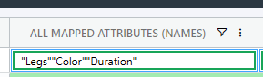

# Display All Attribute Names

To view the values of a Product Template's attributes in SharpSync, use the Property Mapping list `product.attribute` (see also [List Names](../../list-names.md))

The list `product.attribute` is special in that you can expand upon the query by adding attribute name at the end in square brackets. See [display-single-attribute-values.md](display-single-attribute-values.md "mention")


Start by adding a [Property Mapping ](../../../../fundamentals/property-mappings/)for&#x20;

> product.template.attributes

<table><thead><tr><th width="284">Setting</th><th>Value</th></tr></thead><tbody><tr><td>Primary Accessor</td><td>(Unmapped)</td></tr><tr><td>Secondary Accessor</td><td><code>product.template.attribute_line_ids</code></td></tr><tr><td>List Name</td><td><code>product.attribute</code></td></tr><tr><td>List Value Selector</td><td>{id}:{name}</td></tr><tr><td>Prefer Odoo Value</td><td>checked</td></tr><tr><td>Update Odoo on submit</td><td>unchecked. (We'll enable the update for individual names)</td></tr></tbody></table>


* Open the Property Mapping > Settings and enter a `List Name` of&#x20;

> product.attribute

Click the `Save` button. The list preview will update and show values like this

```json
{
  "create_variant": "always",
  "display_type": "color",
  "display_name": "Color",
  "id": 2,
  "name": "Color",
  "number_related_products": 4,
  "sequence": 20,
  "value_ids": [
    3,
    4,
    11,
    12
  ]
}
|
{
  "create_variant": "always",
  "display_type": "radio",
  "display_name": "Legs",
  "id": 1,
  "name": "Legs",
  "number_related_products": 6,
  "sequence": 10,
  "value_ids": [
    1,
    2,
    8
  ]
}
```

From this list, you can pick individual key/value pairs like `id`and `name` as a `List Value Selector`&#x20;

Change the `List Value Selector` to&#x20;

> {id}:{name}

Click the Save button, then the refresh button next to the list preview.

This will shorten the list to&#x20;

> 1:Legs|2:Color|3:Duration|5:Finish

We have the information we need, lets make this dynamic in the SharpSync Bill of Material view

### Setup a Render Type

We have the values returned from the above list is as follows:

> 1:Legs|2:Color|3:Duration|5:Finish

This means each attribute has an internal id \`id\`, and a display name or 'name' value associated with the id value. Our next step is convert this list to a list of JSON objects in the form

> \[&#x20;
>
> &#x20; { "id" : "id1Value" , "name" : "displayName1" },
>
> &#x20; { "id" : "id2Value" , "name" : "displayName2" }
>
> ]

You can create this by hand or use the following handy prompt in [Copilot ](https://copilot.microsoft.com/)or [ChatGPT ](https://chatgpt.com/)with your text string pasted after:

> Convert the following string into a JSON array with "id" and "name" key value pair objects. The keys must be integers

* Click the copy button next to the generated list of values

In SharpSync make the following changes to the Property Mapping:

<table><thead><tr><th>Setting</th><th>Value</th></tr></thead><tbody><tr><td>Rendering Type</td><td><mark style="color:blue;"><code>Advanced List</code></mark></td></tr><tr><td>List Display Selector</td><td><code>name</code></td></tr><tr><td>List Value Selector</td><td><code>id</code></td></tr><tr><td>List Items</td><td><pre class="language-json"><code class="lang-json">[ 
  { "id" : 1, "name" : "Legs" },
  { "id" : 2, "name" : "Color" },
  { "id" : 3, "name" : "Duration" },
  { "id" : 5, "name" : "Finish" }  
]
</code></pre></td></tr></tbody></table>



Important! Make sure the <mark style="color:orange;">`id`</mark>parameter is an <mark style="color:orange;">`integer`</mark> value (not wrapped in quotes "")


* Click the save button



### Pro Tip: You could add a { "id" : 0, "name" : "" } item to show blank values when nothing is found and trigger a display rule to warn you.

```json
[ 
  { "id" : 0, "name" : "" },
  { "id" : 1, "name" : "Legs" },
  { "id" : 2, "name" : "Color" },
  { "id" : 3, "name" : "Duration" },
  { "id" : 5, "name" : "Finish" }  
]
```



You now have the values in the list, but nothing will yet display in the Bill Of Materials view. &#x20;

The next step will be to parse the values from Odoo so that it automatically selects the correct value onscreen when the BOM is loaded from Odoo.

### Add a new Rule Mapping

The values that arrive from Odoo are complex nested values (the type is `nestedObject` in SharpSync) and looks something like this:

```json
[
  {
    "id": 27,
    "value_count": 2,
    "sequence": 10,
    "attribute_id": {
      "id": 1,
      "display_name": "Legs"
    },
    "value_ids": [
      {
        "id": 1,
        "display_name": "Steel",
        "color": 9
      },
      {
        "id": 2,
        "display_name": "Aluminium",
        "color": 3
      }
    ]
  },
  {
    "id": 28,
    "value_count": 2,
    "sequence": 11,
    "attribute_id": {
      "id": 2,
      "display_name": "Color"
    },
    "value_ids": [
      {
        "id": 3,
        "display_name": "White",
        "color": 3
      },
      {
        "id": 4,
        "display_name": "Black",
        "color": 3
      }
    ]
  }
]
```

This must be converted this to a more readable format for the BOM comparison screen, so we'll make use of an `import rule`.&#x20;

Navigate to the Property Mapping. Add a new Import Rule:

<table><thead><tr><th width="162">Setting</th><th>Value</th></tr></thead><tbody><tr><td>Rule Type</td><td>Import</td></tr><tr><td>Rule Name</td><td>Text Manipulation</td></tr><tr><td>Value</td><td><p></p><pre class="language-javascript"><code class="lang-javascript">const valueWhenNoJson = [0]; 

if (!s)
{
  return valueWhenNoJson;
}

/* Extract attribute values into a new array */
/* Removes falsy values like undefined */
const attributeValues = s.map(item => item.attribute_id &#x26;&#x26; item.attribute_id[0]).filter(Boolean);
 
return (attributeValues?.length ?? 0) > 0 ? attributeValues : valueWhenNoJson;
</code></pre></td></tr><tr><td>Enabled for</td><td>Odoo only</td></tr></tbody></table>


ProTip: Open the browser dev tools (F12) and add a line

`console.log('attributeValues', attributeValues);`

immediately before the `return` line to see the values at runtime + troubleshoot them. When you're done, simply remove it again.

If the value for attribute\_id is not an array, change the text

```javascript
s.map(item => item.attribute_id && item.attribute_id[0]).filter(Boolean);
```

to this&#x20;

```javascript
s.map(item => item.attribute_id && item.attribute_id.id).filter(Boolean);
```



If you get an error reading

`Fail: Failed to evaluate rule with error: TypeError: s.map is not a function`

Add a new import rule before the selection import rule to convert the text to JSON (enabled only for Odoo):<br>

```javascript
return JSON.parse(s ?? "[]");
```


This will return a string of 'ids' as a result, select the values from the list of values to the screen, and return the selected values

<figure><figcaption><p>Showing all mapped attribute names</p></figcaption></figure>
