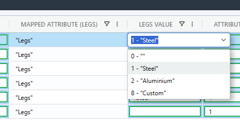

# Display Single Attribute Values


Attributes in Odoo are an advanced topic. You should approach this with a lot of patience and caution.


The goal is to display a single attribute, and select a different value. Once the BOM is submitted the new value will take effect.

### Setting up the list

We start by specifying the list name `product.attribute`. The list `product.attribute` is special in that you can expand upon the query by adding an attribute name at the end in square brackets. Use the steps in the previous topic to duplicate the mapping.

### Read individual attribute values

To view the values of an individual Product Template's attribute in SharpSync, use the Property Mapping list `product.attribute["{nestedListName"}]` (see also [List Names](../../list-names.md))

Start by adding a [Property Mapping ](../../../../fundamentals/property-mappings/)for&#x20;

> product.template.attribute\_line\_ids

Summary of the settings below:

<table><thead><tr><th width="284">Setting</th><th>Value</th></tr></thead><tbody><tr><td>Primary Accessor</td><td>(Unmapped)</td></tr><tr><td>Secondary Accessor</td><td><code>product.template.attribute_line_ids</code></td></tr><tr><td>List Name</td><td><code>product.attribute["Legs"]</code></td></tr><tr><td>List Value Selector</td><td><code>{id}:{name}, attribute_id : {attribute_id[0]}</code></td></tr><tr><td>Prefer Odoo Value</td><td>checked</td></tr><tr><td>Update Odoo on submit</td><td><p>Checked. </p><div data-gb-custom-block data-tag="hint" data-style="danger" class="hint hint-danger"><p>Warning! Enable only if mapping a single value ! </p><p>[You have been warned!] . Always <em>always</em> test attribute mappings. </p><p>If you are unsure, leave this unchecked</p></div></td></tr><tr><td>Render Type</td><td><code>Advanced List</code></td></tr></tbody></table>

We'll specify our list name and add an attribute name 'Legs' as follows:

> product.attribute\["Legs"]

Click the Save button at the bottom, then the 'refresh' icon below the `List Value Selector`item.

A new list of items is returned

> 1:Steel, attribute\_id : 1|2:Aluminium, attribute\_id : 1|8:Custom, attribute\_id : 1

In SharpSync make the following changes to the Property Mapping:

| Setting               | Value                                                                                                                                                                                                                                 |
| --------------------- | ------------------------------------------------------------------------------------------------------------------------------------------------------------------------------------------------------------------------------------- |
| Rendering Type        | `Advanced List`                                                                                                                                                                                                                       |
| List Display Selector | `name`                                                                                                                                                                                                                                |
| List Value Selector   | `id`                                                                                                                                                                                                                                  |
| List Items            | <pre class="language-json5"><code class="lang-json5">[
  { "id": 1, "name": "Steel", "attributeId" : 1 },
  { "id": 2, "name": "Aluminium" , "attributeId" : 1 },
  { "id": 8, "name": "Custom" , "attributeId" : 1 }
]
</code></pre> |



Important! Make sure the <mark style="color:orange;">`id`</mark>parameter is an <mark style="color:orange;">`integer`</mark> value (not wrapped in quotes "")


* Click the `Save` button at the bottom.


### Pro Tip: You could add a \`{ "id" : 0, "name" : "" }\`  item to show blank values when nothing is found and trigger a display rule to warn you.

```json
[
  { "id": 0, "name": ""},
  { "id": 1, "name": "Steel", "attributeId" : 1 },
  { "id": 2, "name": "Aluminium" , "attributeId" : 1 },
  { "id": 8, "name": "Custom" , "attributeId" : 1 }
]
```



You now have the values in the list, but nothing will yet display in the Bill Of Materials view. &#x20;

The next step will be to parse the values from Odoo so that it automatically selects the correct value onscreen when the BOM is loaded from Odoo.

### Add a New Rule To Parse the Value Ids

The values that arrive from Odoo are complex nested values (the type is `nestedObject` in SharpSync) and looks something like this:

```json
[
  {
    "id": 27,
    "value_count": 2,
    "sequence": 10,
    "attribute_id": {
      "id": 1,
      "display_name": "Legs"
    },
    "value_ids": [
      {
        "id": 1,
        "display_name": "Steel",
        "color": 9
      },
      {
        "id": 2,
        "display_name": "Aluminium",
        "color": 3
      }
    ]
  },
  {
    "id": 28,
    "value_count": 2,
    "sequence": 11,
    "attribute_id": {
      "id": 2,
      "display_name": "Color"
    },
    "value_ids": [      
      {
        "id": 11,
        "display_name": "Red",
        "color": 3
      },
      {
        "id": 12,
        "display_name": "Satin Black",
        "color": 3
      },
      // ... more
    ]
  }
]
```

This must be converted to a more readable format for the BOM comparison screen, so we'll make use of an `Import Rule`.&#x20;

Navigate to the Property Mapping. Add a new Import Rule to parse the values from Odoo for Legs:

<table><thead><tr><th width="162">Setting</th><th>Value</th></tr></thead><tbody><tr><td>Rule Type</td><td><code>Import</code></td></tr><tr><td>Rule Name</td><td><code>Text Manipulation</code></td></tr><tr><td>Value</td><td><p></p><pre class="language-javascript"><code class="lang-javascript">const attributeName = "Legs";
const valueWhenNotFound = []; 

if (!Array.isArray(s)) {
  let isArray = false;
  if (typeof s === "string" &#x26;&#x26; s.trim().startsWith("[") &#x26;&#x26; s.trim().endsWith("]"))
  {
    try {
      s = JSON.parse(s);
      isArray = true;
    } catch (e) {
      console.error("Failed to parse JSON string", e);
      return valueWhenNotFound;
    }
  }
  else
  {
    console.warn("s is not an array or a parsable string", typeof s);
    return valueWhenNotFound;
  }
  
  if (!isArray)
    return valueWhenNotFound;
}

const attributeValueIds = s.find((item) => item.attribute_id?.display_name === attributeName)?.value_ids || [];
var retVal = attributeValueIds.length > 0 ? attributeValueIds.map((vi) => vi.id) : valueWhenNotFound;
console.log("retVal", retVal);

if (retVal.length === 0)
{
  return valueWhenNotFound;
}

return retVal[0];

</code></pre></td></tr><tr><td>Enabled for</td><td>Odoo only</td></tr></tbody></table>

This parses the values from Odoo and filters out everything but the first value. If you want to return all the values from Odoo, change the last line from&#x20;

```javascript
return retVal[0];
```

to

```javascript
return retVal;
```

This will return a list of 'ids' as a result, allow selection of the values from the list of values on the screen.



We can now read the values. The next step is to put an optional blocking rule in place.

### Add Blocking Rule

Add a new rule which will block multiple values from being submitted to Odoo.

&#x20;Navigate to the Property Mapping.&#x20;

Add a new Import Rule:

<table><thead><tr><th width="201">Setting</th><th>Value</th></tr></thead><tbody><tr><td>Rule Type</td><td><code>Import</code></td></tr><tr><td>Rule Name</td><td><code>Text Evaluation</code></td></tr><tr><td>Value</td><td><pre class="language-javascript"><code class="lang-javascript">if (s &#x26;&#x26; s.length > 1)  
  return { status: "failure", message: `Only a single property value is supported`, passOrBlock: `pass` };

</code></pre></td></tr><tr><td>On Rule Failure Action:</td><td><code>block</code></td></tr></tbody></table>

At the time of writing, we do not support multiple value updates. You will have to change the rendering type from Advanced MultiSelect List to Advanced List (Single selection)

