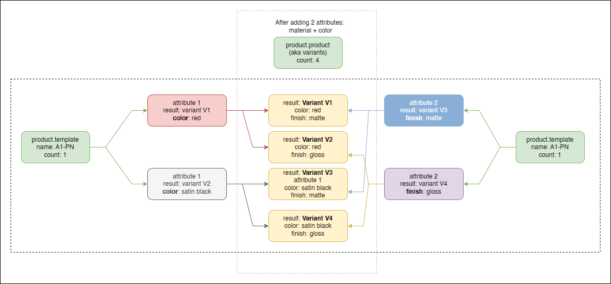

# Map attribute values

Some terms before you read the below:

<table><thead><tr><th width="186">Term</th><th>Explanation</th></tr></thead><tbody><tr><td><code>product.template</code></td><td>A product. The top level type which encapsulates all the information about a product that is sold on the web portal</td></tr><tr><td><code>product.product</code></td><td><p>A product <code>variant</code>. A different version of the <code>product.template</code>. It has something different like a color, material or finish, but has the same underlying geometry or shares some properties which are similar.</p><p></p><p>There is a 1:1 or 1:N relationship between <code>product.template</code>and <code>product.product</code>, depending on the number of attributes defined.</p></td></tr><tr><td><code>unique identifier</code></td><td>The value on a product.template or product.product that uniquely identifies it in the entire Odoo system.</td></tr></tbody></table>



CAUTION: You should note that attributes (In Odoo) are the equivalent of configurations in your CAD system.&#x20;

This means that:

1. For a given configuration in your CAD system,&#x20;
2. The properties for the model will list as multiple attributes in a product template, but only a single value on a product variant.
3. Deleting an attribute is the equivalent of deleting a configuration (unless it is referenced on a purchase order, in which case it is archived (becomes invisible))

Please read the information below carefully as it could result in data loss in Odoo if done incorrectly!



CAUTION: Removing a variant attribute will remove the variant (unless it is used in a purchase order). &#x20;


### Adding an removing  attributes in Odoo

When adding new attributes in Odoo, Odoo automatically creates new variants. It does not set the internal reference (you have to do that), but it creates multiple variants. Product Templates and Product Variants have a 1:N relationship in Odoo. For a single template attribute value, it is a 1:1 relationship. Anything more than that results in multiple product variants.

<figure><figcaption><p>For every attribute value added, a variant is created</p></figcaption></figure>

\[You can add new,  attributes by navigating to the `Attributes and variants`tab in Odoo and adding new values]

### Single attributes

If a single attribute with 1 value is added, the default `product.product` variant is updated with that value. If any more than a single value is added, then an additional  variant is created with the new value:

<figure><figcaption><p>Adding an attribute creates additional product variants (product.product) with the new value.</p></figcaption></figure>

### Multiple attributes

Multiple attributes in Odoo automatically adds multiple variants. It increases the relationship from a 1:N`product.template`: `product.product`to a 1T:N:M relationship where&#x20;

* 1T =  1 Product Template
* N = N number of attributes
* M = M number of variants

Below is an image that illustrates this for the product A1-PN, where 2 different attributes with 2 values each results in 4 variants.

<figure><figcaption><p>Adding multiple attributes increases the count of product variants (product.product)</p></figcaption></figure>

### Mapping the Property Mappings

Each configuration's properties in the CAD system will be mapped as an attribute in Odoo. Let's say we have the following setup:

* Assembly A1-PN, with configuration&#x20;
  * C1
  * C2

Each configuration has a Color value.&#x20;

* C1, Color = <mark style="color:red;">Red</mark>
* C2, Color = <mark style="color:orange;">Satin Black</mark>.

Each configuration has a Finish value

* C1, Finish = <mark style="color:blue;">Matte</mark>
* C1, Finish = <mark style="color:purple;">Gloss</mark>


To display these values in SharpSync, we map the following Property Mappings

* `product.template.attribute_line_ids`
* `product.product.attribute_line_ids`

There is a 1:1 mapping in the BOM comparison screen for Color. Sending the BOM to SharpSync should display _either_ a value of Blue OR Red for the part. Not both.

There is a 1:1 mapping in the BOM comparison screen for Finish. Sending the BOM to SharpSync should display _either_ a value of Satin Black OR Bronze for the part. Not both.

### Displaying the values from Odoo

When mapping to _product.template_.color

> a value of <mark style="color:red;">Red</mark> **AND** <mark style="color:orange;">Satin Black</mark>. will be displayed on screen.&#x20;

But when mapping to _product.product_.color.

> a value of <mark style="color:red;">Red</mark> **OR** <mark style="color:orange;">Satin Black</mark> will be displayed on screen

When mapping to _product.template_.finish

> a value of <mark style="color:blue;">Matte</mark> **AND** <mark style="color:purple;">Gloss</mark>. will be displayed on screen.&#x20;

But when mapping to _product.product_.finish.

> a value of <mark style="color:blue;">Matte</mark> **OR** <mark style="color:purple;">Gloss</mark> will be displayed on screen


**From SharpSync ⇒ Odoo**&#x20;


You should thoroughly test this functionality when mapping attributes. Incorrectly mapping + setting updates can delete `product.product` variants in Odoo. You have been warned!



The status of implementation:

<table><thead><tr><th width="123">Odoo Version</th><th width="176">Read attributes</th><th>Write attributes</th><th width="197">Available </th></tr></thead><tbody><tr><td>16</td><td><span data-gb-custom-inline data-tag="emoji" data-code="2705">✅</span></td><td>Single attribute values</td><td>late 2025</td></tr><tr><td>17</td><td><span data-gb-custom-inline data-tag="emoji" data-code="2705">✅</span></td><td>Single attribute values</td><td>late 2025</td></tr><tr><td>18</td><td>[scheduled for development]</td><td>[scheduled for development]</td><td>[scheduled for development]</td></tr></tbody></table>


Attributes in Odoo are analogous to configuration values in a CAD system. When adding an attribute to a product template or a product variant, you are creating a new variant (new configuration) of that product.

To setup attribute lists in SharpSync these are major steps:

* Read the values
* Setup a Render Type
* Write the values back to Odoo&#x20;

### Read the values

To view the list values of an attribute for Odoo, use the list `product.attribute` (see also [List Names](../list-names.md))

The list `product.attribute` is special in that you can expand upon the query by adding attribute name at the end in square brackets.&#x20;

* Start by adding a [Property Mapping ](../../../fundamentals/property-mappings.md)for&#x20;

> product.template.attribute\_line\_ids

<table><thead><tr><th width="284">Setting</th><th>Value</th></tr></thead><tbody><tr><td>Primary Accessor</td><td>(Unmapped)</td></tr><tr><td>Secondary Accessor</td><td><code>product.template.attribute_line_ids</code></td></tr><tr><td>List Name</td><td><code>product.attribute["Finish"]</code></td></tr><tr><td>List Value Selector</td><td>{id}:{name}</td></tr><tr><td>Prefer Odoo Value</td><td>checked</td></tr><tr><td>Update Odoo on submit</td><td><p>! enable only if mapping a single value ! </p><p>[You have been warned!] </p></td></tr></tbody></table>


* Open the Property Mapping > Settings and enter a `List Name` of&#x20;

> product.attribute

Click the `Save` button. The list will update.

Pick the name of the attribute, and append it to the back of the `product.attribute` list included as an array parameter. E.g. if I had a list of `Finish` I would use

> product.attribute\["Finish"]

Click the `Save` button. Click the 'Refresh' button. The list will update.

This will query all the values of the Finish attribute. However this may return complex values (objects with many properties) which you could refine with a `List Value Selector` such as&#x20;

> {id} : {name}&#x20;


You can select more complicated values, but this is a good starting point



The result returned from this may look something like this&#x20;

> 1:Powder Blue|9 : Satin Black

The next step is to format this data to display it as a selection List in SharpSync.


### Setup a Render Type

Let's say  the values returned from the above list is as follows:

> 11 : Red|12 : Satin Black|3 : White|4 : Black

This means that each attribute has an internal id, and a display name or 'name' value associated with the id value. Our next step is convert this list to a list of JSON objects in the form

> \[&#x20;
>
> &#x20; { "id" : "id1Value" , "name" : "displayName1" },
>
> &#x20; { "id" : "id2Value" , "name" : "displayName2" }
>
> ]

You can create this by hand or use the following handy prompt in [Copilot ](https://copilot.microsoft.com/)or [ChatGPT ](https://chatgpt.com/)with your text string pasted after:

> Convert the following string into a JSON array with "id" and "name" key value pair objects. The keys must be strings

* Click the copy button next to the generated list of values
* Change the Property Mapping [Rendering Type](../../../property-mappings/settings.md) to <mark style="color:blue;">`Advanced Multi Select List`</mark>
* For `List Display Selector`, enter <mark style="color:blue;">`name`</mark>
* For List Value Selector, enter <mark style="color:blue;">`id`</mark>
* For List Items, transform the values into an array of values as follows:

```json
[ 
  { "id" : "3", "name" : "White" },
  { "id" : "4", "name" : "Black" },
  { "id" : "11", "name" : "Red" },
  { "id" : "12", "name" : "Satin Black" }  
]
```


Important! Make sure the <mark style="color:blue;">`id`</mark> parameter is a string (wrapped in quotes "")


* Click the save button
* Repeat this process for each attribute

You are now able to Select attributes from the BOM Comparison page.&#x20;


While this functionality doesn't let you write values to Odoo yet, it will let you display existing values onscreen.&#x20;


The next step will be to parse the values from Odoo so that it automatically selects the correct value onscreen when the BOM is loaded from Odoo.

### Add a new Rule Mapping

The values that arrive from Odoo are complex nested values (the type is `nestedObject` in SharpSync) and looks something like this:

```json
[
  {
    "id": 27,
    "value_count": 2,
    "sequence": 10,
    "attribute_id": {
      "id": 1,
      "display_name": "Legs"
    },
    "value_ids": [
      {
        "id": 1,
        "display_name": "Steel",
        "color": 9
      },
      {
        "id": 2,
        "display_name": "Aluminium",
        "color": 3
      }
    ]
  },
  {
    "id": 28,
    "value_count": 2,
    "sequence": 11,
    "attribute_id": {
      "id": 2,
      "display_name": "Color"
    },
    "value_ids": [
      {
        "id": 3,
        "display_name": "White",
        "color": 3
      },
      {
        "id": 4,
        "display_name": "Black",
        "color": 3
      }
    ]
  }
]
```

This must be converted this to a more readable format for the BOM comparison screen, so we'll make use of an `import rule`.&#x20;

Navigate to the Property Mapping. Add a new Import Rule:

<table><thead><tr><th width="162">Setting</th><th>Value</th></tr></thead><tbody><tr><td>Rule Type</td><td>Import</td></tr><tr><td>Rule Name</td><td>Text Manipulation</td></tr><tr><td>Value</td><td><p></p><pre class="language-javascript"><code class="lang-javascript">let sArr = JSON.parse(s); 
let attributeName = "Finish";  

if (Array.isArray(sArr)) 
{   
  let attributeList = sArr.find(item => item.attribute_id.display_name === attributeName);   
  if (!attributeList) 
     return []; 

  let retVal = attributeList.value_ids.map(vi => vi.id.toString()) || [];   
  
  return retVal; 
}  

return [];  
</code></pre></td></tr><tr><td>Enabled for</td><td>Odoo only</td></tr></tbody></table>


This will return a string of 'ids' to the screen.&#x20;


### Write the values back to Odoo


Writing values back to Odoo is  a work in progress. A rich feature update is coming to SharpSync in the not-too-distant-future which will enable multi configuration export / import per assembly or part.&#x20;

During the development of this feature, writing of multiple attribute values will become supported. Until such time, only a single value is supported.


Read: Only a single value is supported for now ;)&#x20;

The reason for this is that multiple variants are created when setting attribute line ids, and multiple default\_code (Internal reference in Odoo) cannot be set using the single component's name or part number. And there is no way to generate it for other configurations. The CAD system has to send this data, which we cannot do at the time of writing this. It is coming in a future update.


### Limitations in Odoo on uniqueness

Odoo uses attribute values like configurations.

Let's sketch a hypothetical scenario which, while possible in Odoo, is not supported by SharpSync.

You have a product template (pt1) with variants (v1, v2, v3) which were created through setting some variant attribute values.

You add a unique internal reference to each variant namely

* PV1-I
* PV2-I
* PV3-I

You then archive PV2. In this step, the internal reference is no longer considered as part of the uniqueness rule in Odoo.

You then rename PV3-I to PV2-I.

Finally, you unarchive the original PV2.

The situation you've now arrived at is that PV2 contains 2 product variants (product.product) instances with the same internal reference. Attempting to save either will result in an error in Odoo informing you that you have a unique constraint violation. _But importantly, it does allow the duplicates!._

In SharpSync, when setting the primary search identifier to _default\_code_ (which is the internal name of the `internal reference`) field, SharpSync will search for and sometimes find _both_ items if both variants are linked to the _same_ BOM. This will result in an error stating that you have duplicate items.

#### The fix

In Odoo - change the internal or unique reference for the item shown in SharpSync to something which makes it unique again.
