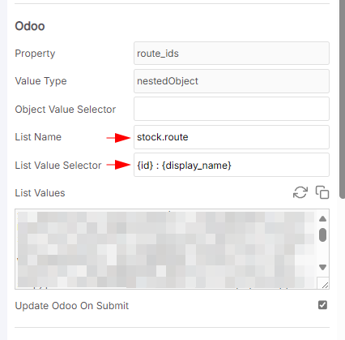
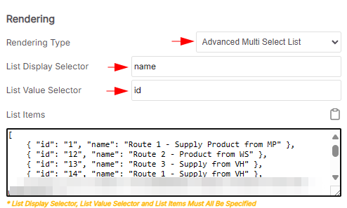
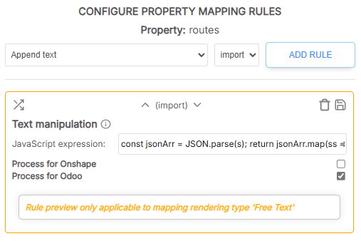

# List Names

## Common List names

When setting up an Odoo source, it is useful to query the Odoo instance for lists of values for use in nestedObject property mappings. This provides a way for you to keep the values that users can select in sync with those in Odoo.

> \[!NOTE] For this to work the type in Odoo (as shown in SharpSync) must be `nestedObject`. We don't currently support list queries for other native SharpSync types like `array`

| List name                      | Returns                                                | Sample data                                                           |
| ------------------------------ | ------------------------------------------------------ | --------------------------------------------------------------------- |
| mrp.routing.workcenter         | List of workcenter routing operations                  | \[ 8, "Drill"], \[9, "Galvanize"]                                     |
| mrp.workcenter                 | List of work centers                                   | \[ 1, "Assembly Line 1"], \[ 2, "Drilling" ]                          |
| mrp.workcenter.tag             | List of work center tags                               | \[ 1, "Finishes" ]                                                    |
| product.category               | Product template categories                            | `[ 1, "All" ], [ 9, "All / Consumable" ]`                             |
| product.attribute \*\*         | Returns registered attributes                          | \[ "Color", "Duration", "Finish" ]                                    |
| product.tag                    | Tags assigned on the `General Information` tab         | `[ 11, "Kit" ], [ 12, "Assemble" ], [ 81, "Switches" ]`               |
| res.company / resource.company | List of all registered companies in your Odoo instance | \[ 3, "SharpSync CA"], \[1, "SharpSync USA"]                          |
| stock.location                 | Locations you can assign for warehouses                | `[ 14986, "MP" ], [ 14995, "MP/Assemble" ], [ 14990, "MP/Output" ],`  |
| stock.route                    | Routes available for selection \[2]                    | `[ 1, "Replenish on Order (ROO)" ], [ 2, "Receive in 1 step (RIS)" ]` |


```postman_json
You can view and configure all the attributes by navigating to Inventory > Configuration > Attributes
```



\*\* The list `product.attribute` is special in that you can expand upon the query by adding attribute name at the end in square brackets. Example, by looking at the list values above, you can use the value&#x20;

> `product.attribute["Finish"]`&#x20;

This will query all the values of the `Finish` attribute.

However this may return complex values which you could refine with a value selector such as&#x20;

> {id} : {name}

### The result returned from this may look something like this&#x20;

> 1 : |10 : Powder Blue|2 : |3 : |4 : |9 : Satin Black

### List data (e.g. Stock Routes)

List data values (in this case Stock routes) are represented as integer values in Odoo. You can query list values with the following POSTMan request

```json
{
  "id": 27,
  "jsonrpc": "2.0",
  "method": "call",
  "params": {
    "args": [ ],
    "model": "stock.route",
    "method": "name_search",
    "kwargs": {
      "context": {
        "lang": "en_US",
        "tz": false,
        "uid": 1,
        "allowed_company_ids": [ 1 ] // leave blank for all companies
      }
    }
  }
}
```

A typical list of values for this request returned from Odoo looks like this:

```json
{
    "jsonrpc": "2.0",
    "id": 27,
    "result": [
        [
            1,
            "Route 1 - Supply Product from MP"
        ],
        [
            2,
            "Route 1 - Product from WS"
        ],
        [
            3,
            "Route 1 - Supply from VH"
        ],
        //...etc
}
```

A typical cell value returned from Odoo looks like this:

> \[1,5,7]

or

> \[7]

Not very user friendly, but we can fix that in the next step

### Setting up the list on screen

Now that we know how to get the values, lets setup the list displayed onscreen. Lists like this can be cached in SharpSync, so the setup is done once and refreshed from time to time.

<figure><figcaption></figcaption></figure>

List name: `stock.route` List Value Selector: `{id} : {display_name}`

<figure><figcaption></figcaption></figure>

Once this is done, click the `copy` button&#x20;

So we need to convert the ids into a proper string to display onscreen. For that we'll use a `Text Manipulation` Rule to do the trick.

<figure><figcaption></figcaption></figure>

Make sure that the following `Text Manipulation` rule is applied for stock routes

* Rule Type: Text manipulation
* Applies to: Odoo
* Rule Value:

```js
const jsonArr = JSON.parse(s); 
return jsonArr.map(ss => ss.toString());
```
