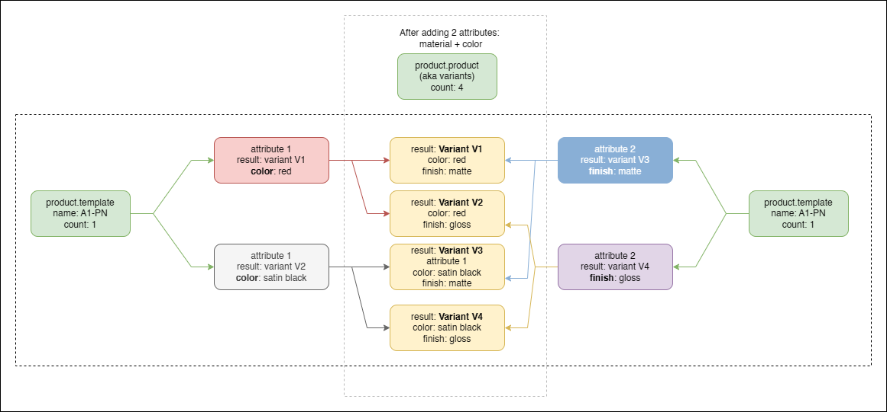

# Map attribute values

Some terms before you read the below:

<table><thead><tr><th width="186">Term</th><th>Explanation</th></tr></thead><tbody><tr><td><code>product.template</code></td><td>A product. The top level type which encapsulates all the information about a product that is sold on the web portal</td></tr><tr><td><code>product.product</code></td><td>
A product <code>variant</code>. A different version of the <code>product.template</code>. It has something different like a color, material or finish, but has the same underlying geometry or shares some properties which are similar.

There is a 1:1 or 1:N relationship between <code>product.template</code>and <code>product.product</code>, depending on the number of attributes defined.
</td></tr><tr><td><code>unique identifier</code></td><td>The value on a product.template or product.product that uniquely identifies it in the entire Odoo system.</td></tr></tbody></table>


CAUTION: You should note that attributes (In Odoo) are the equivalent of configurations in your CAD system.&#x20;

This means that:

1. For a given configuration in your CAD system,&#x20;
2. The properties for the model will list as multiple attributes in a product template, but only a single value on a product variant.
3. Deleting an attribute is the equivalent of deleting one or more configurations (unless they are referenced on a purchase order, in which case they will be archived (becomes invisible))

Please read the information below carefully as it could result in data loss in Odoo if done incorrectly!



CAUTION: Removing an attribute value (if there is more than 1 value for the same attribute) will remove the associated variant (unless it is used in a purchase order). &#x20;


### Adding an removing  attributes in Odoo

When adding new attributes in Odoo, Odoo automatically creates new variants. It does not set the internal reference (you have to do that), but it creates multiple variants. Product Templates and Product Variants have a 1:N relationship in Odoo. For a single template attribute value, it is a 1:1 relationship. Anything more than that results in multiple product variants.

<figure><figcaption>
For every attribute value added per attribute line on a product template, a new variant is created
</figcaption></figure>

\[You can add new Attributes (and in doing so, product variants) by navigating to the `Attributes and variants` Tab in Odoo and adding new values]

### Single attributes values

If a single attribute with 1 value is added, the default `product.product` variant is updated with that value.

If another attribute is added, also only with a single value, only 1 variant is available.&#x20;

If any more than a single value is added, then an additional  variants are created with the new values:

<figure><figcaption>
Adding an attribute creates additional product variants (product.product) with the new value.
</figcaption></figure>

SharpSync does not currently support the generation of multiple variant lines with multiple attribute values. Only a single attribute value is supported.

### Multiple attributes

Multiple attributes in Odoo automatically adds multiple variants. It increases the relationship from a 1x`product.template`:1x `product.product`to a 1T:N:M relationship where&#x20;

* 1T =  1 Product Template
* N = N number of attributes
* M = M number of variants

Below is an image that illustrates this for the product A1-PN, where 2 different attributes with 2 values each results in 4 variants.

<figure><figcaption>
Adding multiple attributes increases the count of product variants (product.product)
</figcaption></figure>

### Displaying an attribute as a Property Mapping

Each configuration's properties in the CAD system will be mapped as an attribute in Odoo. Let's say we have the following setup:

* Assembly A1-PN, with configuration&#x20;
  * C1
  * C2

Each configuration has a Color value.&#x20;

* C1, Color = <mark style="color:red;">Red</mark>
* C2, Color = <mark style="color:orange;">Satin Black</mark>.

Each configuration has a Finish value

* C1, Finish = <mark style="color:blue;">Matte</mark>
* C1, Finish = <mark style="color:purple;">Gloss</mark>

To display these values in SharpSync, we map the following Property Mappings

* `product.template.attributes`


Do NOT map `product.template.attribute_line_ids`. These values are the ids of the attribute lines, not the attribute values.


There is a 1:1 mapping in the BOM comparison screen for Color. Sending the BOM to SharpSync should display _either_ a value of Blue OR Red for the part. Not both.

There is a 1:1 mapping in the BOM comparison screen for Finish. Sending the BOM to SharpSync should display _either_ a value of Satin Black OR Bronze for the part. Not both.

**From SharpSync ⇒ Odoo**&#x20;


You should thoroughly test this functionality when mapping attributes. Incorrectly mapping + setting updates can delete `product.product` variants in Odoo. You have been warned!


Attributes in Odoo are analogous to configuration values in a CAD system. When adding an attribute to a product template or a product variant, you are creating a new variant (new configuration) of that product.

To setup attribute lists in SharpSync these are major steps:

* Read the values
* Setup a Render Type
* Write the values back to Odoo&#x20;

### Limitations in Odoo on Uniqueness

Odoo uses attribute values like CAD configurations.

Let's sketch a hypothetical scenario which, while possible in Odoo, is not supported by SharpSync.

You have a product template (T1) with variants (v1, v2, v3) which were created through setting some variant attribute values.

You add a unique internal reference to each variant namely

* PT1-PV1-I
* PT1-PV2-I
* PT1-PV3-I

You then archive, say, PV2. In this step, the internal reference is no longer considered as part of the uniqueness rule in Odoo.

You then rename PV3 to PV2.

Finally, you unarchive the original PV2.

The situation you've now arrived at is that PV2 contains 2 product variants (product.product) instances with the same internal reference. Attempting to save either will result in an error in Odoo informing you that you have a unique constraint violation. _But importantly, it does allow the duplicates!._

In SharpSync, when setting the primary search identifier to _default\_code_ (which is the internal name of the `internal reference`) field, SharpSync will search for and sometimes find _both_ items if both variants are linked to the _same_ BOM. This will result in an error stating that you have duplicate items.

#### The fix

In Odoo - change the internal or unique reference for the item shown in SharpSync to something which makes it unique again.
