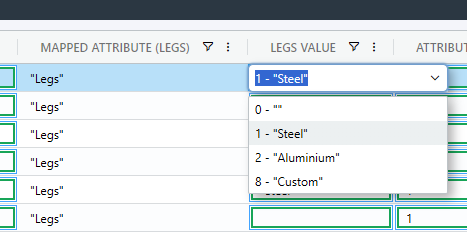

# Display Single Attribute Names


Attributes in Odoo are an advanced topic. You should approach this with a lot of patience and caution.


The goal is to display a single attribute, and select a different value. Once the BOM is submitted the new value will take effect.

### Setting up the list

We start by specifying the list name `product.attribute`. The list `product.attribute` is special in that you can expand upon the query by adding an attribute name at the end in square brackets.&#x20;

To view the values of a Product Template's attributes in SharpSync, use the Property Mapping list `product.attribute["{nestedListName"}]` (see also [List Names](../list-names.md))

Start by adding a [Property Mapping ](../../../fundamentals/property-mappings.md)for&#x20;

> product.template.attributes

<table><thead><tr><th width="284">Setting</th><th>Value</th></tr></thead><tbody><tr><td>Primary Accessor</td><td>(Unmapped)</td></tr><tr><td>Secondary Accessor</td><td><code>product.template.attributes</code></td></tr><tr><td>List Name</td><td><code>product.attribute</code></td></tr><tr><td>List Value Selector</td><td><code>{id}:{name}</code></td></tr><tr><td>Prefer Odoo Value</td><td>checked</td></tr><tr><td>Update Odoo on submit</td><td>Do NOT enable. We'll enable the next mapping.</td></tr><tr><td>Render Type</td><td><code>Advanced List</code></td></tr></tbody></table>

### Populate the list of attributes

* Open the Property Mapping > Settings and enter a `List Name` of&#x20;

> product.attribute

Click the `Save` button. You'll immediately see results in the List preview. Typically you would select a single name from the list returned. For my use-case, I was returned the list below, and I picked the value 'Legs'

> 1:Legs|2:Color|3:Duration|5:Finish


Leaving out the `List Value Selector` value will return all the fields (which may contain additional useful data)


The new list must be formatted into a list that SharpSync can understand. We'll make use of the `Advanced List` option which lets us customize the values


### ProTip

You can use ChatGPT or CoPilot with this prompt to easily convert the data returned from Odoo. Use the following prompt:

_Convert the following string into a JSON array with "id" and "name" key value pair objects. The keys must be integers_


After converting the values, you'll get a list like this

```json5
[ 
{
  "id": 1,
  "name": "Legs"
},
{
  "id": 2,
  "name": "Color"
},
// ... more
]
```

Copy and paste the values to the `List Items` text area (It becomes visible after selecting a render type of `Advanced List`).

We'll apply the `Prefer Odoo Value` checkbox setting here so that we always get shown the Odoo value. Check the checkbox to display values from our secondary source in favor of values from the Primary CAD / PDM / PLM Source.

Click the `Save` button at the bottom

If you pull a BOM from Odoo, you'll now be able to select an attribute from the list.

### Read individual attribute values

We want to take this a step further. We don't _just_ want to read whether I have a 'Legs' attribute on the product template. I want to also read the value of the 'Legs' attribute for the product template.

Let's go ahead and add a new property mapping.&#x20;

Start by adding a [Property Mapping ](../../../fundamentals/property-mappings.md)for&#x20;


tests


> product.template.attribute\_line\_ids

Summary of the settings below:

<table><thead><tr><th width="284">Setting</th><th>Value</th></tr></thead><tbody><tr><td>Primary Accessor</td><td>(Unmapped)</td></tr><tr><td>Secondary Accessor</td><td><code>product.template.attributes</code></td></tr><tr><td>List Name</td><td><code>product.attribute["Legs"]</code></td></tr><tr><td>List Value Selector</td><td><code>{id}:{name}, attribute_id : {attribute_id[0]}</code></td></tr><tr><td>Prefer Odoo Value</td><td>checked</td></tr><tr><td>Update Odoo on submit</td><td><p>Checked. </p><div data-gb-custom-block data-tag="hint" data-style="danger" class="hint hint-danger"><p>Warning! Enable only if mapping a single value ! </p><p>[You have been warned!] . Always <em>always</em> test attribute mappings. </p><p>If you are unsure, leave this unchecked</p></div></td></tr><tr><td>Render Type</td><td><code>Advanced List</code></td></tr></tbody></table>

We'll specify our list name and add an attribute name 'Legs' as follows:

> product.attribute\["Legs"]

Click the Save button at the bottom, then the 'refresh' icon below the `List Value Selector`item.

A new list of items is returned

> 1:Steel, attribute\_id : 1|2:Aluminium, attribute\_id : 1|8:Custom, attribute\_id : 1

In SharpSync make the following changes to the Property Mapping:

| Setting               | Value                                                                                                                                                                                                                                 |
| --------------------- | ------------------------------------------------------------------------------------------------------------------------------------------------------------------------------------------------------------------------------------- |
| Rendering Type        | <mark style="color:blue;">`Advanced List`</mark>                                                                                                                                                                                      |
| List Display Selector | `name`                                                                                                                                                                                                                                |
| List Value Selector   | `id`                                                                                                                                                                                                                                  |
| List Items            | <pre class="language-json5"><code class="lang-json5">[
  { "id": 1, "name": "Steel", "attributeId" : 1 },
  { "id": 2, "name": "Aluminium" , "attributeId" : 1 },
  { "id": 8, "name": "Custom" , "attributeId" : 1 }
]
</code></pre> |



Important! Make sure the <mark style="color:orange;">`id`</mark>parameter is an <mark style="color:orange;">`integer`</mark> value (not wrapped in quotes "")


* Click the `Save` button at the bottom.


### Pro Tip: You could add a \`{ "id" : 0, "name" : "" }\`  item to show blank values when nothing is found and trigger a display rule to warn you.

```json
[
  { "id": 0, "name": ""},
  { "id": 1, "name": "Steel", "attributeId" : 1 },
  { "id": 2, "name": "Aluminium" , "attributeId" : 1 },
  { "id": 8, "name": "Custom" , "attributeId" : 1 }
]
```



You now have the values in the list, but nothing will yet display in the Bill Of Materials view. &#x20;

The next step will be to parse the values from Odoo so that it automatically selects the correct value onscreen when the BOM is loaded from Odoo.

### Add a New Rule To Parse the Value Ids

The values that arrive from Odoo are complex nested values (the type is `nestedObject` in SharpSync) and looks something like this:

```json
[
  {
    "id": 27,
    "value_count": 2,
    "sequence": 10,
    "attribute_id": {
      "id": 1,
      "display_name": "Legs"
    },
    "value_ids": [
      {
        "id": 1,
        "display_name": "Steel",
        "color": 9
      },
      {
        "id": 2,
        "display_name": "Aluminium",
        "color": 3
      }
    ]
  },
  {
    "id": 28,
    "value_count": 2,
    "sequence": 11,
    "attribute_id": {
      "id": 2,
      "display_name": "Color"
    },
    "value_ids": [      
      {
        "id": 11,
        "display_name": "Red",
        "color": 3
      },
      {
        "id": 12,
        "display_name": "Satin Black",
        "color": 3
      },
      // ... more
    ]
  }
]
```

This must be converted to a more readable format for the BOM comparison screen, so we'll make use of an `Import Rule`.&#x20;

Navigate to the Property Mapping. Add a new Import Rule to parse the values from Odoo for Legs:

<table><thead><tr><th width="162">Setting</th><th>Value</th></tr></thead><tbody><tr><td>Rule Type</td><td><code>Import</code></td></tr><tr><td>Rule Name</td><td><code>Text Manipulation</code></td></tr><tr><td>Value</td><td><p></p><pre class="language-javascript"><code class="lang-javascript">const attributeName = "Legs";
const valueWhenNotFound = []; 

if (!Array.isArray(s)) {
  let isArray = false;
  if (typeof s === "string" &#x26;&#x26; s.trim().startsWith("[") &#x26;&#x26; s.trim().endsWith("]"))
  {
    try {
      s = JSON.parse(s);
      isArray = true;
    } catch (e) {
      console.error("Failed to parse JSON string", e);
      return valueWhenNotFound;
    }
  }
  else
  {
    console.warn("s is not an array or a parsable string", typeof s);
    return valueWhenNotFound;
  }
  
  if (!isArray)
    return valueWhenNotFound;
}

const attributeValueIds = s.find((item) => item.attribute_id?.display_name === attributeName)?.value_ids || [];
var retVal = attributeValueIds.length > 0 ? attributeValueIds.map((vi) => vi.id) : valueWhenNotFound;
console.log("retVal", retVal);

if (retVal.length === 0)
{
  return valueWhenNotFound;
}

return retVal[0];

</code></pre></td></tr><tr><td>Enabled for</td><td>Odoo only</td></tr></tbody></table>

This parses the values from Odoo and filters out everything but the first value. If you want to return all the values from Odoo, change the last line from&#x20;

```
return retVal[0];
```

to

```
return retVal;
```

This will return a list of 'ids' as a result, allow selection of the values from the list of values on the screen.



This deals with the values. The next step is to put an optional blocking rule in place.

### Add Blocking Rule

Add a new rule which will block multiple values from being submitted to Odoo.

&#x20;Navigate to the Property Mapping.&#x20;

Add a new Import Rule:

<table><thead><tr><th width="201">Setting</th><th>Value</th></tr></thead><tbody><tr><td>Rule Type</td><td><code>Import</code></td></tr><tr><td>Rule Name</td><td><code>Text Evaluation</code></td></tr><tr><td>Value</td><td><pre class="language-javascript"><code class="lang-javascript">const legsAttributeId = 1;

if (s &#x26;&#x26; s.length > 1)  
  return { status: "failure", message: `Only a single property value is supported`, passOrBlock: `pass` };

</code></pre></td></tr><tr><td>On Rule Failure Action:</td><td><code>block</code></td></tr></tbody></table>

At the time of writing, we do not support multiple value updates. You will have to change the rendering type from Advanced MultiSelect List to Advanced List (Single selection)

