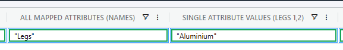
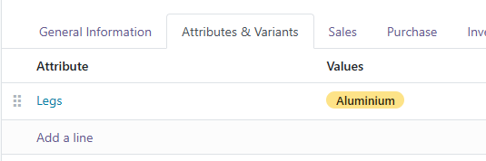

# Writing attributes

### Write the values back to Odoo


Care should be taken writing values back to Odoo as it can result in data loss. A rich feature update is scheduled for development which will enable multi configuration export / import per assembly or part.&#x20;

During the development of this feature, writing of multiple attribute values will become supported. Until such time, only a single value is supported. You may have multiple attribute lines, but only a  single value per line.


**TLDR; Only a single value per attribute line is supported for now!**


The reason for this is that multiple variants are created when setting attribute line ids, and multiple default\_code (Internal reference in Odoo) cannot be set using the single component's name or part number.&#x20;

There is no way to generate internal references for other configurations. The CAD system has to send this data, which we cannot do at the time of writing this. It is coming in a future update.


When writing values to Odoo you require the following pieces to put the puzzle together:

* The attribute line id
* The attribute value operation to perform (add / update / delete)
* The value to set (e.g. Color = Red or Legs = Steel)

This setup requires the following mappings:

* At least 1 Property Mapping for the secondary accessor `product.template.attribute_line_ids`&#x20;
* At least 1 Property Mapping for the new or existing value to use (single value)
* At least a mapping that sets `product.template.default_code` (or your primary search identifier in the datasource if its not `default_code`&#x20;


You may repeat this single value setup for other attributes, as long as you follow the 'single-line-single-attribute-value' setup we will support your configuration



Until further notice we do not support multiple value updates while setting the `default_code`. Should you choose to still sync multiple values (it is possible), please note that we will not be able to provide support. It doesn't mean it can't be done - we just can't support you right now.


Create a new Property Mapping for a single attribute line id. Follow the guide to [display-single-attribute-values.md](display-single-attribute-values.md "mention").

Your display in SharpSync and Odoo should now look something like this:

| SharpSync                                                  | Odoo                                                  |
| ---------------------------------------------------------- | ----------------------------------------------------- |
|  |  |

### Example: Legs

The data we want to send to Odoo is in the form&#x20;

> \[ {attributeId} , \[ {arrayOfValues} ] ]

Each value for each attribute must be combined into a final attribute value, so multiples would look like this&#x20;

> \[ \[ {attributeId1} , \[ {arrayOfValues1} ] ], \[ {attributeId2} , \[ {arrayOfValues2} ] ] ]

Or more concisely represented&#x20;

> \[ attribute1Values, attribute2Values ]

<table><thead><tr><th width="228">Data</th><th>Description</th></tr></thead><tbody><tr><td>1</td><td>The attribute (this is the ID for Legs)</td></tr><tr><td>2</td><td>The attribute value id (this is the ID for Aluminium)</td></tr><tr><td>[[ 1, [2] ]]</td><td>The combined attribute id and value id</td></tr><tr><td><p><code>[</code><br>   <code>[ 1,   [2] ],</code></p><p>  <code>[ 2, [11,12] ]</code></p><p><code>]</code></p></td><td>The combined attribute ids and value ids.<br>Attribute 1 (Legs), Value ID 2 (Aluminium)<br>Attribute 2 (Color), Value ID 5 and 8 (Red, Satin Black)</td></tr></tbody></table>


To do this, we create a mapping for the Legs (See [display-single-attribute-values.md](display-single-attribute-values.md "mention") )

Once this is setup, we have the ID of the attribute 'Legs', which is the value `1`

Then we take the value `1` and combine it with the possible values from the attribute value ids


We do this with the following export manipulation rule

```javascript
const attributeAccessorName = "attributeLegsName";
const attributeIdInOdoo = attributeAccessorName in rowData.modifications  ? rowData.modifications[attributeAccessorName] : rowData.cells[attributeAccessorName];
const isNewRow = !rowData.isFoundInSecondaryDatasource && rowData.isMissingInSecondaryDatasource;

if (isNewRow)
  return [[attributeIdInOdoo, [s]]];

return [[attributeIdInOdoo[0], [s]]];

```

#### Explanation

```javascript

// The name of the property mapping accessor that contains the attribute id
const attributeAccessorName = "attributeLegsName";
// this checks if the attributeId has been modified (rowData.modifications). 
// If it has, use it, otherwise fall back to the value in the rowData.cells (value of the primary)
const attributeIdInOdoo = attributeAccessorName in rowData.modifications  ? rowData.modifications[attributeAccessorName] : rowData.cells[attributeAccessorName];
// a value checking if the row is new. If it is, there will not be an existing value
const isNewRow = !rowData.isFoundInSecondaryDatasource && rowData.isMissingInSecondaryDatasource;

if (isNewRow)
  return [[attributeIdInOdoo, [s]]];

return [[attributeIdInOdoo[0], [s]]];
```
