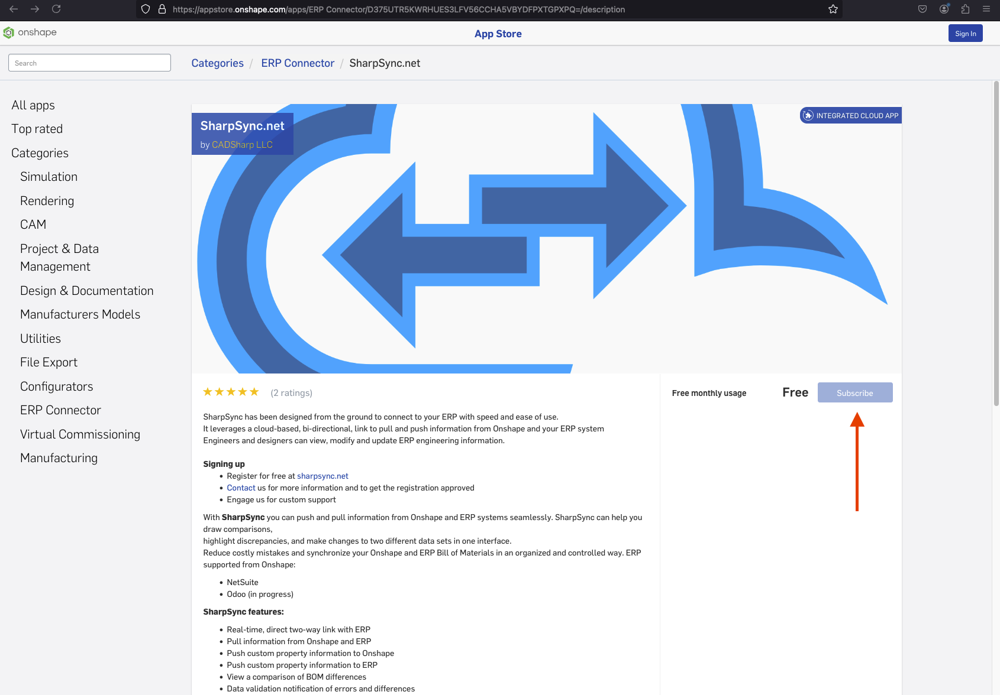
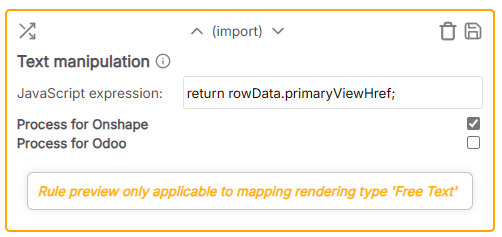
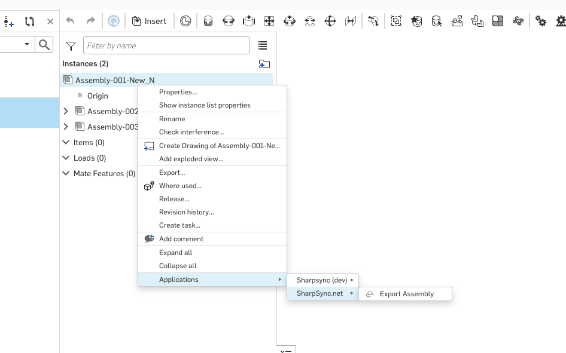
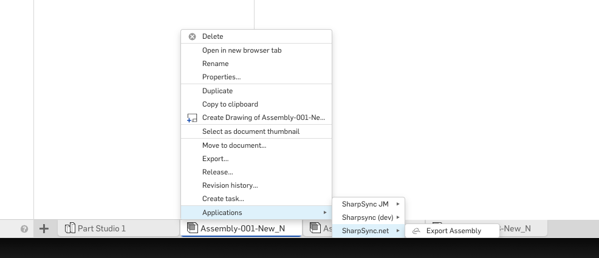
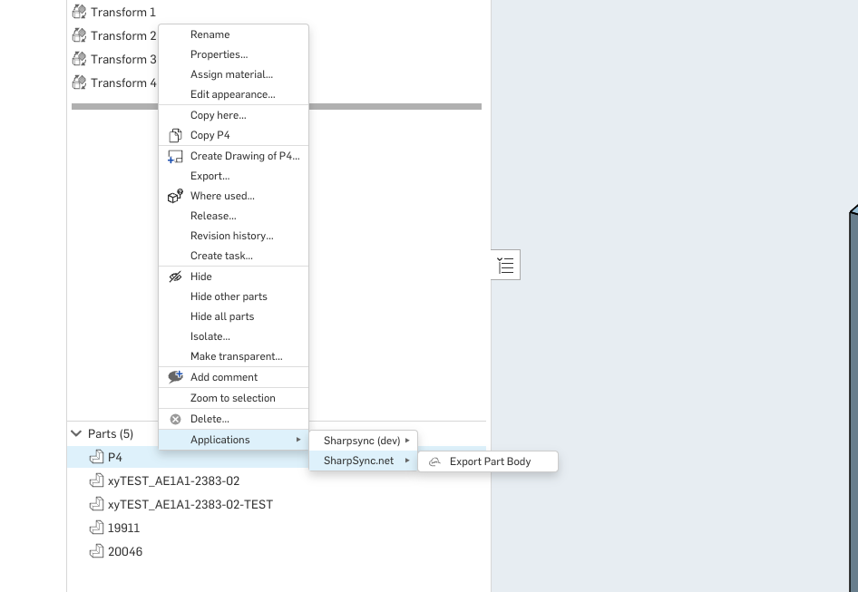

# Onshape

## Onshape Setup

* [Onshape App Store Subscription](onshape.md#onshape-app-store-subscription)
* Setting up Onshape
* Configure the authentication options
* Mapping values to ERP
* Export Assembly or Part from Onshape
* Troubleshooting

`Note:` Onshape integration for SharpSync is not currently supported for free versions. In order for SharpSync to work, you need to create custom properties in a company in Onshape. This is only possible with the Professional or Enterprise versions of Onshape. This is a limitation in Onshape

### Onshape App Store Subscription

<figure><figcaption></figcaption></figure>

* Find and subscribe to the [SharpSync.net](https://appstore.onshape.com/apps/ERP%20Connector/D375UTR5KWRHUES3LFV56CCHA5VBYDFPXTGPXPQ=/description) onshape app in the Onshape App Store&#x20;

<figure><figcaption></figcaption></figure>

* For Onshape Enterprise users, make sure to add the related Onshape users to the list of users that have permission to access the Onhsape App Store&#x20;

### Setting up Onshape Data Source in SharpSync

* In the Navigation Bar, select Data Sources
* In Data Sources, select OnShape as the Primary Data Source and click ADD DATASOURCE
* Change the Server URL to:

```
https://cad.onshape.com
```

* Scroll to the bottom of the page and click UPDATE
* Change the Authentication Type to OAuth2
* [Configure the authentication options](onshape.md#configure-the-authentication-options)
* Click AUTHENTICATE. If the configuration is successful, the Authentication Status will update and show <mark style="color:green;">Connected</mark>.&#x20;
* Scroll to the bottom of the page and click UPDATE
* Configure the Primary and Secondary Identifiers as follows:
  * Primary Identifier: partNumber
  * Secondary Identifier: `name`&#x20;
* Scroll to the bottom of the page and click UPDATE

Please make sure to set up your Secondary Data Source. For more information, refer to the other Data Sources listed in the Navigation Bar.

#### Configure the authentication options

* Click CONFIGURE
* Choose one of the two paths below depending on your version of our product:



Base API path

<mark style="color:orange;">The Base API we use to connect</mark>

* Leave the default link to the OnShape instance as-is<mark style="color:orange;">:</mark>

> https://cad.onshape.com/api

#### Authentication Types (see below\*\*)

<mark style="color:orange;">The type of authentication method to use when authenticating with OnShape.</mark>&#x20;

We only support:

> OAuth 2.0

* Select OAuth 2.0

Once you have selected the Authentication Type, the remainder of the form should autocomplete to the following:

<figure><figcaption><p>Configuration Settings</p></figcaption></figure>

* Click SAVE to save and close the form



Base API path

<mark style="color:orange;">The Base API we use to connect</mark>

* Fill in the values for your enterprise name. This means that, in the url, instead of

> https://cad.onshape.com/api

you will have

```
https://{enterpriseName}.onshape.com/api 
```

#### Authentication Types (see below\*\*)

<mark style="color:orange;">The type of authentication method to use when authenticating with OnShape.</mark>&#x20;

We only support:

> OAuth 2.0

* Select OAuth 2.0

Once you have selected the Authentication Type, the remainder of the form should autocomplete to the following:

<figure><figcaption><p>Configuration Settings</p></figcaption></figure>

* Click SAVE to save and close the form



Please make sure to set up your Secondary Source. For more information, refer to the other Data Sources listed in the Navigation Bar.

### Mapping values to ERP

#### Mapping the URL to a field in the ERP

Onshape is an online Data Source, so you can map the URL of the document to a field in the ERP.

To map an Onshape document URL to a property in the ERP do the following:

* Create a new property mapping
* Onshape property: `(Unmapped)`
* ERP property: `{nameOfField}` e.g. `document_url`
* Rendering Type: `URL`
* Create a new rule: `Text manipulation`
* Rule value: `return rowData.primaryViewHref;`

<figure><figcaption></figcaption></figure>


* Click Save
* Reload the BOM to display in the BOM Comparison screen
* Click Submit to update

### Export Assembly or Part from Onshape

*   You can export a BOM from Onshape to SharpSync through the following methods:

    * The Onshape Tree Structure Assembly Context Menu&#x20;

    <figure><figcaption></figcaption></figure>

    * The Onshape Assembly Tab Context Menu&#x20;

    <figure><figcaption></figcaption></figure>

    * The Onshape Part Studio Tab Part Context Menu&#x20;

    <figure><figcaption></figcaption></figure>

### Troubleshooting

#### Could not find data source

The following response in the network tab with a 400 status code

```
Request Method: GET
Status Code: 400 Bad Request

Could not add file lookup to the server
{"message":"Invalid id specified or bad request"}

OR

{"message":"Could not find datasource for organization {uuid} and module Onshape","data":[]}
```

You are trying to sync to an organization in SharpSync that have not yet been created.&#x20;

First create the organization by following the steps in ...

#### Cannot get properties

The following response in the network tab with a 500 status code

```json
Request Method: GET
Status Code: 502 Bad Gateway

{
    "message": "Could not find the Onshape company that the user belongs to when loading the BOM"
}
```

This means that you're attempting to use SharpSync with a free version. Free versions are currently not supported due to a limitation in Onshape that you cannot create custom properties (True at the time of writing this)

#### Cannot pull Onshape BOM

The following response in the network tab with a 502 status code

```json
{
    "message": "Could not pull the bom from Onshape - request was Forbidden. Check that the document hostname/origin matches the datasource server hostname"
}
```

Let's say the enterprise name is `starkindustries.onshape.com` .

Check:

* The hostname is configured correctly in the datasource (e.g. cad.onshape.com vs starkindustries.onshape.com)
* The oauth hostnames all match
  * For free version: `oauth.onshape.com` and NOT `cad.onshape.com`
  * For enterprise version `starkindustries.onshape.com` and NOT `oauth.onshape.com`
