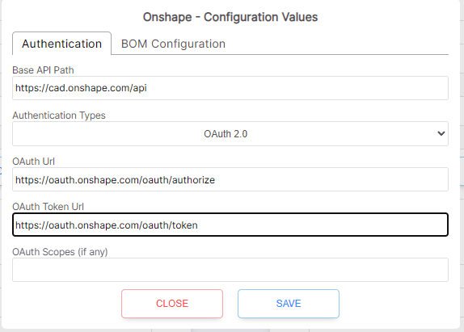

# Onshape

## Onshape Setup

* Onshape App Store Subscribtion
* Setting up Onshape
* Configure the authentication options
* Mapping values to ERP
* Export Assembly or Part from Onshape
* Troubleshooting

`Note:` Onshape integration for SharpSync is not currently supported for free versions. In order for SharpSync to work, you need to create custom properties in a company in Onshape. This is only possible with the Professional or Enterprise versions of Onshape. This is a limitation in Onshape

### Onshape App Store Subscription

<figure><figcaption></figcaption></figure>

* Find and subscribe to the [SharpSync.net](https://appstore.onshape.com/apps/ERP%20Connector/D375UTR5KWRHUES3LFV56CCHA5VBYDFPXTGPXPQ=/description) onshape app in the Onshape App Store&#x20;

<figure><figcaption></figcaption></figure>

* For Onshape Enterprise users, make sure to add the related Onshape users to the list of users that have permission to access the Onhsape App Store&#x20;

### Setting up Onshape Datasource

* Select + Add the Onshape datasource
* Configure the authentication options
* Click Authenticate

### Configure the authentication options

* Click the configure button
* For Onshape Professional or the free version:

<figure><figcaption></figcaption></figure>

* For enterprise environments, fill in the values for your enterprise name. This means that, in the url, instead of

> `https://cad.onshape.com/api`

you will have

> `https://{enterpriseName}.onshape.com/api`

### Mapping values to ERP

#### Mapping the URL to a field in the ERP

Onshape is an online Data Source, so you can map the URL of the document to a field in the ERP.

To map an Onshape document URL to a property in the ERP do the following:

* Create a new property mapping
* Onshape property: `(Unmapped)`
* ERP property: `{nameOfField}` e.g. `document_url`
* Rendering Type: `URL`
* Create a new rule: `Text manipulation`
* Rule value: `return rowData.primaryViewHref;`

<figure><figcaption></figcaption></figure>


* Click Save
* Reload the BOM to display in the BOM Comparison screen
* Click Submit to update

### Export Assembly or Part from Onshape

*   You can export a BOM from Onshape to SharpSync through the following methods:

    * The Onshape Tree Structure Assembly Context Menu&#x20;

    <figure><figcaption></figcaption></figure>

    * The Onshape Assembly Tab Context Menu&#x20;

    <figure><figcaption></figcaption></figure>

    * The Onshape Part Studio Tab Part Context Menu&#x20;

    <figure><figcaption></figcaption></figure>

### Troubleshooting

#### Cannot get properties

The following response in the network tab with a 500 statuscode

```json
Request Method: GET
Status Code: 502 Bad Gateway

{
    "message": "Could not find the Onshape company that the user belongs to when loading the BOM"
}
```

This means that you're attempting to use SharpSync with a free version. Free versions are not supported atm due to a limitation in Onshape that you cannot create custom properties (True at the time of writing this)

#### Cannot pull Onshape BOM

The following response in the network tab with a 502 statuscode

```json
{
    "message": "Could not pull the bom from Onshape - request was Forbidden. Check that the document hostname/origin matches the datasource server hostname"
}
```

Let's say the enterprise name is `starkindustries.onshape.com` .

Check:

* The hostname is configured correctly in the datasource (e.g. cad.onshape.com vs starkindustries.onshape.com)
* The oauth hostnames all match
  * For free version: `oauth.onshape.com` and NOT `cad.onshape.com`
  * For enterprise version `starkindustries.onshape.com` and NOT `oauth.onshape.com`
