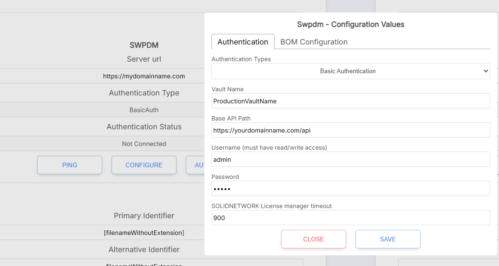

# SolidWorks PDM

SolidWorks PDM is a product by Dassault Systemes. It is typically installed on a self-hosted server and has basic support via a web API. There are 2 flavors of PDM:

* PDM Standard
* PDM Professional


The Standard version does not allow add-in customization and does not have an web API component, so SharpSync cannot support the Standard version


### Bill of Material (BOM) level features

<table><thead><tr><th width="335.0078125">Feature</th><th width="115.390625" align="center">Read</th><th width="144.890625" align="center">Create</th><th width="113.16796875" align="center">Update</th></tr></thead><tbody><tr><td>BOM hierarchy</td><td align="center">✅</td><td align="center">N/A</td><td align="center">N/A</td></tr><tr><td>BOM meta data</td><td align="center">✅</td><td align="center">N/A</td><td align="center">✅**</td></tr><tr><td>BOM quantities</td><td align="center">✅</td><td align="center">N/A</td><td align="center">N/A</td></tr><tr><td>Component thumbnails</td><td align="center">✅</td><td align="center">N/A</td><td align="center">N/A</td></tr><tr><td>BOM Configurations</td><td align="center">✅</td><td align="center">N/A</td><td align="center">N/A</td></tr><tr><td>File derivative transfers (e.g. STEP, DXF)</td><td align="center">✅</td><td align="center">N/A</td><td align="center">N/A</td></tr></tbody></table>


\*\* Updates to BOM metadata are available on request. Each customer's setup is unique and requires different configuration


## SOLIDWORKS PDM Setup

The setup steps for SWPDM are as follows:

* Make the PDM Web API available to the internet
* Add the SWPDM data source
* Test the connectivity to the server
* Download and install the PDM client
* Configure the PDM client for the vault
* Configure the PDM client for the logged in user

See also Configure the add-in for testing

### Step: Make the PDM Web API available to the internet

_The PDM Web API must be accessible over the public internet._ This is required for SharpSync to be able to connect to the PDM vault.


A domain name is not required. A public IP address is sufficient.&#x20;

However either of these (IP address or domain name) must be accessible from the internet.

(See Test connectivity to server)


Once the API is available, go back to the data source configuration page and click `Ping` button. Upon success the following message will be displayed:

> Name\
> Connection status: Healthy\
> Connection message: `{serverName}` is accessible from the API

Where `{serverName}` is the name of the server that is hosting the PDM Web API

<figure><figcaption></figcaption></figure>

### Step: Add the SWPDM Data Source

* Login on SharpSync
* Navigate to the Data Sources section
* Select SWPDM
* Click Add Data Source

Update the following settings

<table><thead><tr><th width="212">Setting</th><th>Value</th><th>Description</th></tr></thead><tbody><tr><td>Server Url</td><td>
<code>https://{myserver.com}</code>  

or

<code>https://{myserver.com}:port</code>
</td><td>The address (including any ports) where your server may be reached on the public internet. VPNs are not supported.</td></tr><tr><td>Primary Identifier</td><td><code>Number</code></td><td>The unique identifier. Usually <code>Number</code>, but it can be any data card variable name. You can also use [filenameWithoutExtension] as a value to use the name of files</td></tr><tr><td>Alternative Identifier</td><td><code>[filenameWithoutExtension]</code></td><td>If a value for 'Number' is not found, fall back to this value. You can use this as your Primary Identifier if you wish to.</td></tr></tbody></table>

* Click the Save button.

### Step: Test connectivity to the server

* In the Data Source configuration section, select the PDM Data Source.
* After updating the server URL, make sure to click the 'Update' button.
* Click the Ping button.&#x20;
* If configured correctly, SharpSync will attempt to Ping the host.
* Important: Make sure that ICMP ping is enabled for this part. If it is not, please enable it (it can be disabled again)

You're now ready to [download](solidworks-pdm/downloading-and-installing-the-add-in.md), [install ](solidworks-pdm/downloading-and-installing-the-add-in.md)and [configure ](solidworks-pdm/configure-the-add-in.md)the PDM add-in.
