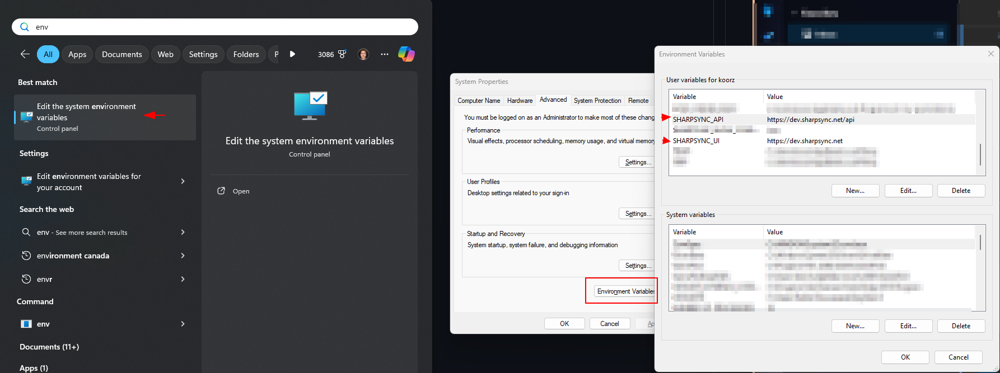
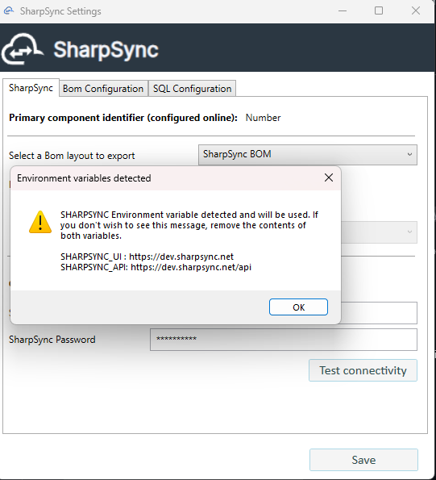

# Advanced: Configure add-in for testing

Under some circumstances it can be desirable to send data to our test environment before using it in production.


This is not the norm and should only be followed when instructed to do so as an existing organization will not exist unless SharpSync staff has created one.&#x20;


## Configure add-in for testing

The SolidWorks PDM add-in by default points to the production server which is located at https://app.sharpsync.net.

While this is the default, it can be preferable to use the development server for testing purpose.

### Steps involved

* Configure environment variables
* Configure the add-in
* Reverting environment variables

#### Configure environment variables

To configure your environment variables

* Click Start > type `Environment` and select the option `Edit the system environment variables`
* Click `Environment Variables` at the bottom
* For the `User` variables, enter the following key value pairs by clicking `New`:
  * SHARPSYNC\_API : https://dev.sharpsync.net/api
  * SHARPSYNC\_UI : https://dev.sharpsync.net

<figure><figcaption></figcaption></figure>

NOTE: Make sure to restart your machine or any processes so that the new values can take effect

#### Configure the add-in

After configuring the environment variables, its time to setup the add-in inside the PDM administration tool

* Open the PDM administration tool > Login to the vault
* Navigate to the add-in > Right click > Configure
* Select the `Test connectivity` button
* A warning is display that a different environment to that of production will be used

<figure><figcaption></figcaption></figure>

#### Setup local user

After the add-in has been configured, the same can be done for the user submitting the BOM to the SharpSync server.

* Navigate to the PDM view
* Right click the background > SharpSync > Configure SharpSync User ...&#x20;

<figure><figcaption></figcaption></figure>

* Enter your SharpSync username and password > Click OK

You are now ready to submit Bill of materials to the testing environment


You should revert this setting for the specific user after testing has completed.


#### Reverting environment variables

To revert your environment variables and work with the production instance

* Click Start > type `Environment` and select the option `Edit the system environment variables`
* Click `Environment Variables` at the bottom
* For the `User` variables, remove the following key value pairs by selecting them, and then clicking > Delete
  * SHARPSYNC\_API
  * SHARPSYNC\_UI

