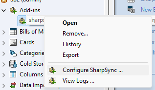
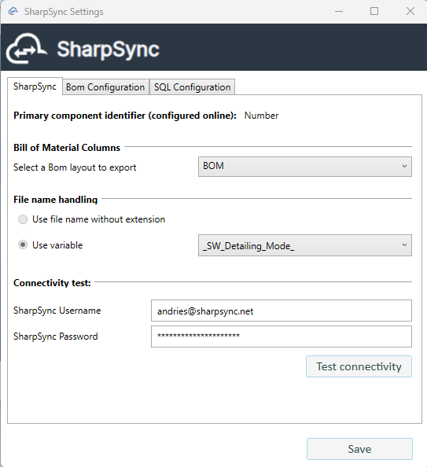
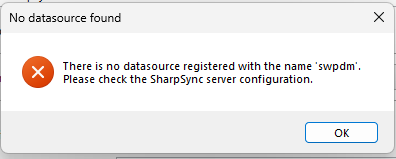
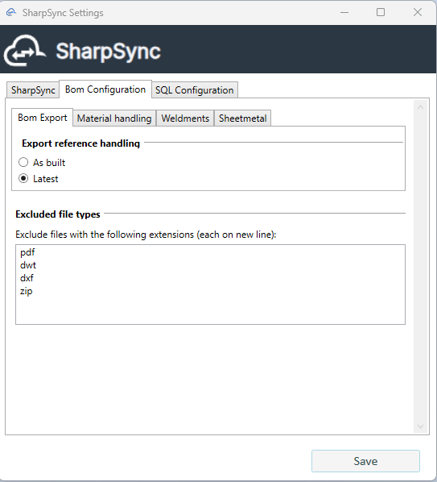
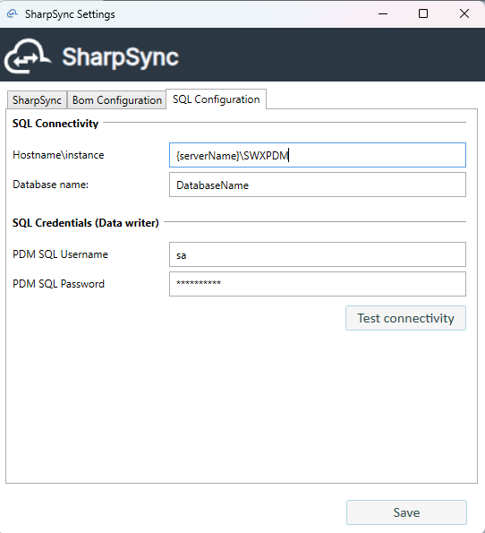
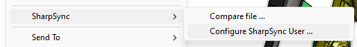
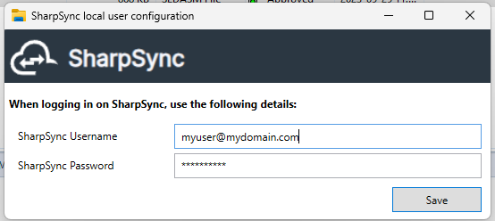

# Configure the add-in

The SharpSync PDM add-in has several pages for local configuration. These may be accessed by navigating to the PDM administration tool and right clicking > Configure SharpSync.

<figure><figcaption>
Right Click > Configure SharpSync
</figcaption></figure>

### Major configuration steps

* Configure a BOM view
* Test connection to the server

### Step: Configure a BOM view

A BOM view in PDM lets you view columns of data. SharpSync uses this information to populate data in SharpSync in combination with the property mappings.

The BOM view must contain the same columns as the columns mapped in the Property Mappings, with the exception of any column names wrapped in angled brackets '<>'. For example \<state> and \<folder> does not have to appear in the BOM view.

### Step: Configure the PDM client for the vault

When configuring the add-in for the vault, these are the sections to configure:

* The general setup which applies to all users
* The BOM configuration section (how to process BOMs)
* The SQL setup which is used internally by the add-in to assist with determining child item types

#### General setup

This image shows a landing screen of the setup.

<figure><figcaption></figcaption></figure>

The following fields must be configured:

| Name                        | Description                                                                                              | Recommended value                                                                                 |
| --------------------------- | -------------------------------------------------------------------------------------------------------- | ------------------------------------------------------------------------------------------------- |
| BOM Layout                  | The columns + values exported to SharpSync                                                               | BOM (or whatever layout you want to export to SharpSync)\[1]                           |
| SharpSync Admin credentials | User credentials that are used to setup the Data Source                                                  | -                                                                                                 |
| File name handling          | How files will be named in the hierarchy. Can be either the name of the file or a variable (e.g. Number) | This is automatically configured in Data Source configuration and cannot be changed in the add-in |

\[1] If you want Sheetmetal or weldments to display as child items of the BOM, make sure to enable one of the  following settings in the BOM display

Click `Connect..`. Upon success, the configured primary identifier will be listed in the `Primary Identifier` field. This is the value that will be used to identify the file in SharpSync.

NOTE: If you get an error saying that no source is configured,

<figure><figcaption></figcaption></figure>

First go to SharpSync > Data Sources (you must be an admin) > Add the PDM Data Source > This will create a source in SharpSync which will be used to pull Bill of Material (BOM) information from your vault.

#### BOM Configuration setup

Setting up the BOM configuration allows you to customize how Bill of materials are uploaded to SharpSync.

| Section             | Option                                  | Description                                                                                                              |
| ------------------- | --------------------------------------- | ------------------------------------------------------------------------------------------------------------------------ |
| BOM export          | As Built                                | Export the version of the BOM and its associated references as at the version selected                                   |
| BOM export          | Latest                                  | Export the latest version of the BOM and its associated references                                                       |
| Weldments           | Export a weldment part as a part        | Exports the weldment with the same qty referenced in the original BOM. Does not add children items from weldment members |
| Weldments           | Export a weldment part as a assembly    | Exports the weldment with the same qty referenced in the original BOM. _DOES_ add children items                         |
| Sheetmetal          | Export a sheet metal part as a part     | Exports the weldment with the same qty referenced in the original BOM. Does not add children items from multibody parts  |
| Sheetmetal          | Export a sheet metal part as a assembly | Exports the weldment with the same qty referenced in the original BOM. _DOES_ add children items                         |
| Excluded file types | Add file types on new lines             | If a linked reference is found in the PDM BOM, it is not exported to SharpSync                                           |

<figure><figcaption></figcaption></figure>

#### SQL setup

The SQL configuration page requires `data_reader` access for SQL Server.

<figure><figcaption></figcaption></figure>

This image shows a screen of the setup&#x20;

Setting up the BOM configuration allows you to customize how Bill of materials are uploaded to SharpSync.

| Section          | Option            | Description                                                                                                          |
| ---------------- | ----------------- | -------------------------------------------------------------------------------------------------------------------- |
| SQL Connectivity | Hostname\instance | Enter the name of the server and the SQL instance. Use \MSSQL if the instance is not named                           |
| SQL Connectivity | Database name     | Enter the name of the database. Typically the same as the vault name. Consult your IT Admin if you don't have access |
| SQL Credentials  | PDM SQL Username  | Name of a user which has the ability to create and execute stored procedures.                                        |
| SQL Credentials  | PDM SQL Password  | Password of a user which has the ability to create and execute stored procedures.                                    |

Note: The SQL connection details are not stored in SharpSync online services. The credentials are stored in a vault dictionary called SharpSync using the PDM API. You can search for it using SQL Server Management Studio and going to the Vault Database > Tables > Dictionaries > SharpSync

### Step: Configure the PDM client for the logged in user

The general vault configuration applies to all users in the vault. However when uploading BOMs to SharpSync, the user must configure their own credentials to use SharpSync add-in.

This is so that each BOM that is uploaded is associated with a user in SharpSync. This allows SharpSync to track who uploaded the BOM and who approved the BOM.

To configure the add-in for the logged in user, follow these steps:

* Login to the PDM Professional Vault
* Right click in the background or on any file > SharpSync > Configure SharpSync user...

<figure><figcaption></figcaption></figure>

Specify the user credentials that will be used to upload BOMs to SharpSync.

_(This is the name of user that has access in SharpSync, not the details of the user in PDM)_

<figure><figcaption></figcaption></figure>
