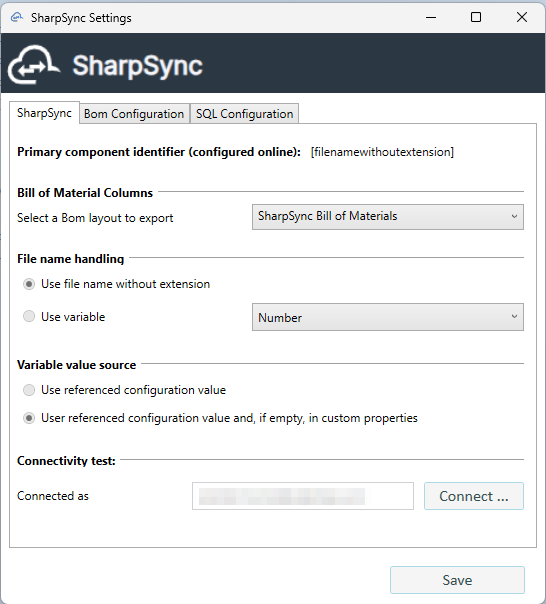
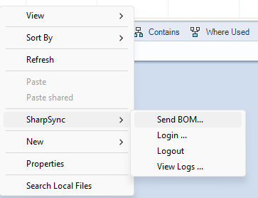
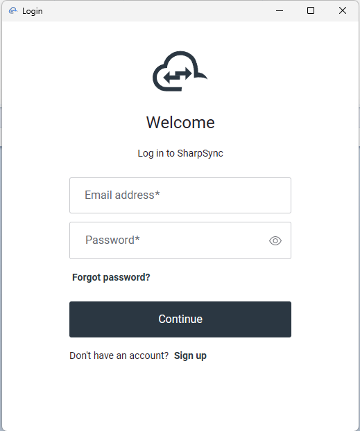

# Configure the add-in

The SharpSync PDM add-in has several pages for local configuration. These may be accessed by navigating to the PDM administration tool and right clicking > Configure SharpSync.

<figure><figcaption>
Right Click > Configure SharpSync
</figcaption></figure>

### Major configuration steps

* Configure a BOM view
* Test connection to the server

### Step: Configure a BOM view

A BOM view in PDM lets you view columns of data. You can use this information to confirm data in SharpSync in combination with the property mappings.&#x20;

For convenience, the BOM view must contain the same columns as the columns mapped in the Property Mappings, with the exception of any column names wrapped in angled brackets '<>'. For example \<state> and \<folder> does not have to appear in the BOM view.

If a column is not visible in the BOM view, the value from the data card will be used for the configuration referenced.

### Step: Configure the PDM client for the vault

When configuring the add-in for the vault, these are the sections to configure:

* The general setup which applies to all users
* The BOM configuration section (how to process BOMs)
* The SQL setup which is used internally by the add-in to assist with determining child item types

#### General setup

This image shows a landing screen of the setup.

<figure><figcaption>
When connecting to SharpSync, the settings are loaded in the add-in UI
</figcaption></figure>

The following fields must be configured:

| Name                        | Description                                                                                              | Recommended value                                                                                 |
| --------------------------- | -------------------------------------------------------------------------------------------------------- | ------------------------------------------------------------------------------------------------- |
| BOM Layout                  | The columns + values exported to SharpSync                                                               | BOM (or whatever layout you want to export to SharpSync)\[1]                           |
| SharpSync Admin credentials | User credentials that are used to setup the Data Source                                                  | -                                                                                                 |
| File name handling          | How files will be named in the hierarchy. Can be either the name of the file or a variable (e.g. Number) | This is automatically configured in Data Source configuration and cannot be changed in the add-in |

\[1] If you want Sheetmetal or weldments to display as child items of the BOM, make sure to enable one of the  following settings in the BOM display

Click `Connect..`. Upon success, the configured primary identifier will be listed in the `Primary Identifier` field. This is the value that will be used to identify the file in SharpSync.

NOTE: If you get an error saying that no source is configured,

<figure><figcaption></figcaption></figure>

First go to SharpSync > Data Sources (you must be an admin) > Add the PDM Data Source > This will create a source in SharpSync which will be used to pull Bill of Material (BOM) information from your vault.

#### BOM Configuration setup

When exporting a BOM from PDM, the columns shown in the PDM BOM view is helpful, but the settings for values exported are controlled in the add-in's setup.&#x20;

Setting up the BOM settings in the PDM add-in allows you to customize how Bill of Material defaults are controlled when sending BOM data to SharpSync.

<table><thead><tr><th width="184">Section</th><th width="195">Option</th><th>Description</th></tr></thead><tbody><tr><td>BOM export</td><td>As Built</td><td>Export the version of the BOM and its associated references as at the version selected</td></tr><tr><td>BOM export</td><td>Latest</td><td>Export the latest version of the BOM and its associated references</td></tr><tr><td>Weldments</td><td>Export a weldment part as a part</td><td>Exports the weldment with the same qty referenced in the original BOM. Does not add children items from weldment members</td></tr><tr><td>Weldments</td><td>Export a weldment part as a assembly</td><td>Exports the weldment with the same qty referenced in the original BOM. <em>DOES</em> add children items</td></tr><tr><td>Sheetmetal</td><td>Export a sheet metal part as a part</td><td>Exports the weldment with the same qty referenced in the original BOM. Does not add children items from multibody parts</td></tr><tr><td>Sheetmetal</td><td>Export a sheet metal part as a assembly</td><td>Exports the weldment with the same qty referenced in the original BOM. <em>DOES</em> add children items</td></tr><tr><td>Excluded file types</td><td>Add file types on new lines</td><td>If a linked reference is found in the PDM BOM, it is not exported to SharpSync</td></tr></tbody></table>

<figure><figcaption></figcaption></figure>

#### SQL setup

The SQL configuration page requires:

* `data_writer` access when setting up the add-in for first time use \*\*
* &#x20;`data_reader` access when operating normally for connected client machines.

\*\* Initially when connecting the account will need the ability to create stored procedures, a new stored procedure will be created called `SharpSyncDocumentChildrenTypes` . &#x20;


The SQL server connection information is never sent to the SharpSync servers or surfaced in developer logs (unless you send it). This information is used by your LAN or WAN clients to help collect BOM information during the BOM rows collection step before the BOM data is sent to SharpSync.


<figure><figcaption>
Enter your SQL server connection information. During the setup process, enter <code>data_writer</code> information. Once the setup is complete, change this to an account that has <code>data_reader</code> access
</figcaption></figure>

Settings are explained in more detail below:

| Section          | Option            | Description                                                                                                          |
| ---------------- | ----------------- | -------------------------------------------------------------------------------------------------------------------- |
| SQL Connectivity | Hostname\instance | Enter the name of the server and the SQL instance. Use \MSSQL if the instance is not named                           |
| SQL Connectivity | Database name     | Enter the name of the database. Typically the same as the vault name. Consult your IT Admin if you don't have access |
| SQL Credentials  | PDM SQL Username  | Name of a user which has the ability to create and execute stored procedures.                                        |
| SQL Credentials  | PDM SQL Password  | Password of a user which has the ability to create and execute stored procedures.                                    |

Note: The SQL connection details are not stored in SharpSync online services. The credentials are stored in a vault dictionary called `SharpSync` using the PDM Approved API. You can search for it using SQL Server Management Studio and going to the Vault Database&#x20;

> Database > Tables > Dictionaries > SharpSync

### Step: Configure the PDM client for the logged in user

The general vault configuration applies to all users in the vault. However when uploading BOMs to SharpSync, the user must configure their own credentials to use SharpSync add-in.

This is so that each BOM that is uploaded is associated with a user in SharpSync. This allows SharpSync to track who uploaded the BOM and who approved the BOM.

To configure the add-in for the logged in user, follow these steps:

* Login to the PDM Professional Vault
* Right click in the background or on any file > SharpSync >Login ...

<figure><figcaption></figcaption></figure>

Specify the user credentials that will be used to upload BOMs to SharpSync.

_(This is the name of user that has access in SharpSync, not the details of the user in PDM)_

<figure><figcaption></figcaption></figure>

This user will stay logged in for a period of 30 days after which they will be logged out. You'll be required to refresh the credentials every 30 days.

Multiple users of PDM are not currently supported _on the same machine_. You'll have to logout and login for each user.
