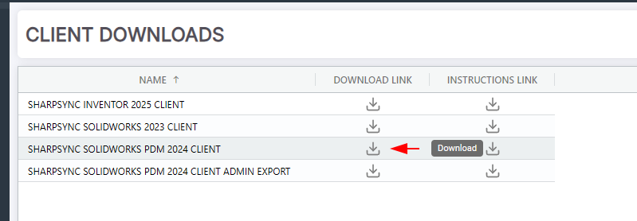
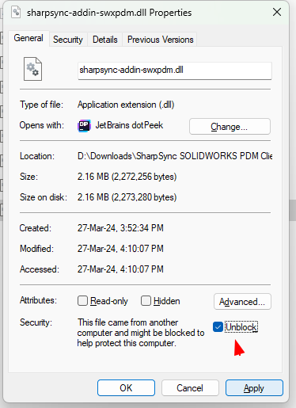
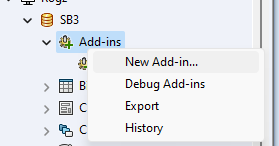
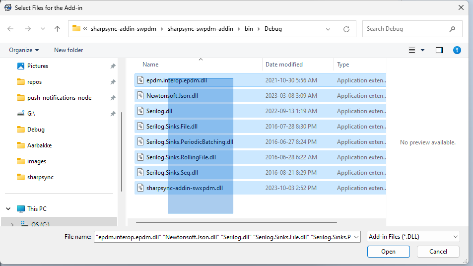

# Downloading and installing the add-in

SolidWorks PDM is a data management solution from Dassault Systémes. It allows you to manage SolidWorks files and their revisions, along with metadata like Vendor, Material, Description, etc.

### Prerequisites

* The PDM Professional version must be used
* The PDM Professional version API must be exposed to the internet using the Web API setup guide
* We do support bi-directional sync on request, but this is disabled by default to prevent updates to already approved data

### Downloading the add-in

The download for the PDM client may be found at [https://app.sharpsync.net/admin/downloads](https://app.sharpsync.net/admin/downloads)

The preferred method of installation are the DLL files, but due to security restrictions you may have to use the Admin Export (\*.cex) file.


The PDM Client is only available for Windows machines. It is not available for Mac or Linux.


* Login on SharpSync
* Navigate to the Downloads section
* Download the PDM Client&#x20;

<figure><figcaption>
These were the PDM client versions at the time of writing
</figcaption></figure>

* If you're having trouble installing the add-in through the client, you can download the Admin Export (\*.cex) file
* Extract all the files to a known location (e.g. Desktop)

### Installing the add-in


By default Windows will block all `.dll` and `.exe` files downloaded from an internet source. Because of this the add-in will fail to install. You first need to unblock it.


#### Extracting the files

When downloading the client from the `Downloads` section, a new zip file will be created on your machine. Extract the files to a convenient location using `Right click > Extract all...` and extract to a convenient location.

#### Preparing the files for installation

&#x20;To unblock a file:

* `Right Click > Properties`
* At the bottom of the first tab, there is a security warning
* Select the checkbox reading `Unblock`
* Click the apply button
* Repeat for all other files in the folder

<figure><figcaption></figcaption></figure>

Failing to do so may result in the following message when installing a PDM add-in:

> "The archive server could not open the Windows Registry",

* \[Install using the downloadable instructions link or follow along here]
* Open the administration tool and login on the vault
* Right click Add-ins > New Add-in

<figure><figcaption></figcaption></figure>

* Select the SharpSync add-in from the extracted files. Make sure to _select_ _all_ the files

<figure><figcaption></figcaption></figure>

* Click Open

#### If you see no other error messages, the add-in is considered installed

Here are some other steps in case installation still fails.

There are several things that can cause this error but these are the fixes that resolved this issue 100% of the time:

* Right click each `*.dll`file, go to Properties, and check 'Unblock' in the lower right hand corner. This works most of the time (example above).
* If that doesn't work, export the add-in from a working system as a `*.cex` and install it on the end users system by importing it. Bear in mind that this may cause other issues though, so only use it as a last resort.
* It can also happen when the .net framework that the add-in is written against does not exist on the machine where the -is being installed

