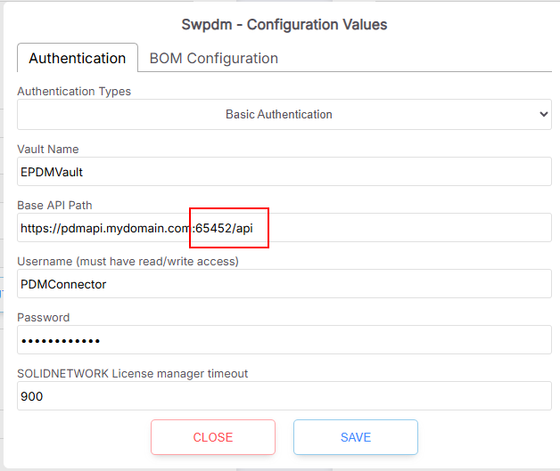

# Setting up the Solidworks PDM Web 2

These are the major components required when installing and operating PDM Web to:

* Static IP address OR DynDNS subscription for dynamic IP address resolution
* TLS Certificate
* Web2 API server
* Web2 PDM server (optional)

### Static IP or Dynamic DNS for testing

To connect from SharpSync to {yourserver}, a static IP address or domain name is required. This means that an IP address for a machine (your PDM server) stays the same or can be found using a name (domain name).&#x20;


If you don't own a static IP address (preferable), then a dynamic DNS client is preferred. SharpSync does not endorse any specific services, but [https://my.noip.com/](https://my.noip.com/) is a free service.

This service lets you register your machine under a semi-custom domain name and keeps that domain name active for 30 days at a time. For testing purposes this is sufficient.



A domain name in turn points to a static IP address (your PDM server). A domain name is not strictly necessary but is more convenient to remember than an IP address. A domain name is something that your company would use on the internet to host your own website at e.g.

> https://yourcompany.com.

Once you've setup a domain name (either in your company or using a dynamic DNS service), you can use this new name in the SharpSync settings for PDM.&#x20;


Be sure to test this name from another computer (PING or curl to login) outside your network before using it in SharpSync. If it doesn't work from a computer outside your network, it won't work in SharpSync


### TLS Certificate

A TLS certificate is something that you use to encrypt the traffic between `https://yourcompany.com` and `https://app.sharpsync.net`. A TLS certificate is used to change the _type_ of traffic from `http` => `https` A TLS certificate may be obtained from a certificate authority such as DigiCert or GoDaddy

> [https://www.digicert.com/tls-ssl/compare-single-domain-certificates](https://www.digicert.com/tls-ssl/compare-single-domain-certificates)

OR

> [https://www.godaddy.com/en-ca/web-security/ssl-certificate](https://www.godaddy.com/en-ca/web-security/ssl-certificate)

For the more adventurous amongst you there are free TLS certificates available from Let's encrypt.

### SW PDM Web2 API Server

#### Installing the Web2 API server

* [x] Install the Web2 API server according to the installation instructions
* [x] Host the web API server in IIS, then add the API to the List of WebAPI servers in the Administration tool.
*
[ ] 
    <figure><figcaption></figcaption></figure>


Expose the API to the public internet. The API must be exposed and visible (using CURL login, see below) from computers outside your network


* [x] Take note of the port number that is visible in the IIS configuration options (or if being forwarded from a reverse proxy, then take note of that port)
* [x] Test the connection from an _external machine (e.g. your phone or another computer outside your network)_ by connecting to the API using the following curl request&#x20;

```bash
curl -L https://{yourdomainOrStaticIpAndPort}/api/{vaultName}/authenticate \
-d "{
  'username': '{registeredVaultUser}',
  'password': '{registeredVaultUserPassword}'
}"
```

or a more convenient one-liner (since Windows terminal doesn't always work so well with multiline):

```bash
curl -L http://{yourdomainOrStaticIpAndPort}/api/{vaultName}/authenticate -H "Content-Type: application/json" -d "{ 'Username': 'admin', 'Password': 'admin' }"
```


This must return a 200 OK Response with a token


WARNING! DO NOT, under any circumstances, leave the default username of 'Admin' and password of 'Admin' enabled. This is a serious security vulnerability



* [x] In SharpSync,  copy the URL of the Web2 API and enter it in the configuration options for SWPDM
*
[ ] 
    <figure><figcaption></figcaption></figure>

###

### Test the connection


### Installing the Web2 PDM Server (Optional)

The web 2 server allows an organization to navigate and view their files over the internet. This component is optional, but allows for navigation links to be generated in SharpSync for easy navigation to files in the vault.

\[If you need more documentation or assistance, please engage us for more information]
