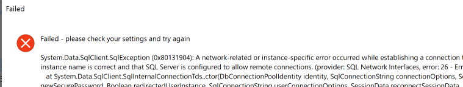

# Troubleshooting

## **Issue: Testing a connection to SQL fails**

When testing your connection to your SQL server, the SharpSync add-in tries to connect to the server using the specified credentials.

To connect to just use {serverName}&#x20;


If your instance of SQL is the default instance but there are more than 1 instances on the box, use the scheme {serverName}\MSSQL


In the setup, on the SQL Config Tab, when clicking `Test Connectivity` you may receive this error message:

<figure><figcaption>
Connection to SQL server failed
</figcaption></figure>

If that is the case, try adding / removing the instance name

## **Issue: Add-in fails to extract or register on load**

It is possible that when the SharpSync add-in is installed with insufficient permissions, that the installation fails.

The way SolidWorks PDM add-ins are distributed in a vault are:

* The client view starts up (viewserver.exe)
* It checks the database for add-in versions
* If the installed versions of the add-in does not match, it copies a new version of the addin to the local machine.
* The new version is copied to&#x20;

> %localAppData%\SolidWorks\SOLIDWORKS PDM\Plugins\\{vaultName}\\{CLSID}{version}

<figure><figcaption></figcaption></figure>

* The addin is then registered.
* During activation (logging into the vault), the registration process can fail if insufficient permissions are available or the registration process is interrupted.

Any subsequent activation of the add-in may fail with the below error

> Failed to extract add-in from&#x20;
>
> %localAppData%\SolidWorks\SOLIDWORKS PDM\Plugins\\{vaultName}\\{CLSID}{version}
>
> Class not registered.

<figure><figcaption></figcaption></figure>

#### The fix

Should this happen, do the following

* Log out of the vault on the machine
* Run Registry Editor as administrator (regedit.exe)
* Find the key in the HKCR\CLSID folder for the broken add in here&#x20;

> Computer\HKEY\_CLASSES\_ROOT\CLSID\\{4B1265A4-C784-4CC5-991F-2AD1442538F3}

* Delete the key

<figure><figcaption></figcaption></figure>

* Sometimes you might have to restart the machine, but simply logging back in to the vault should complete the registration process.
