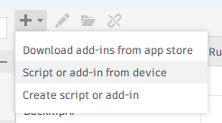

# BOM Comparison

<figure><figcaption></figcaption></figure>

The BOM comparison screen is where you will ultimately spend most of your time

### BOM row updates

BOM row updates can occur in the Primary or Secondary Data Source and is influenced by your settings for:

* Property Mappings
* Rules
  * Import Rules
  * Display Rules

BOM row updates (updating values + the BOM structure) in the Secondary Data Source are also influenced by whether the `PROCESS` checkbox is checked or unchecked. You can use the context menu of any given row's `PROCESS` cell to bulk check/uncheck the `PROCESS` checkbox of related rows and children rows.

#### Primary Source updates

When updating BOM rows in a Data Source the following table illustrates how updates occur at the Primary source.

A Primary source is typically a CAD or PDM or PLM system. For primary sources, quantity values cannot updated, neither can component or item Names.

Using the default color scheme for BOM comparison, you can expect the following results:

<table data-full-width="false"><thead><tr><th align="center">Process Row</th><th>Row Background</th><th align="center">Item Creation</th><th width="125">Bom Structure</th><th width="126" align="center">Quantity</th><th width="159" align="center">Item Properties</th><th align="center">Routings</th><th align="center">Derivatives</th></tr></thead><tbody><tr><td align="center">☑️</td><td>⬜ White</td><td align="center">N/A</td><td>Unchanged</td><td align="center">Unchanged</td><td align="center">Updated</td><td align="center">N/A</td><td align="center">N/A</td></tr><tr><td align="center">☑️</td><td>🟩 Green</td><td align="center">N/A</td><td>Unchanged</td><td align="center">Unchanged</td><td align="center">Updated</td><td align="center">N/A</td><td align="center">N/A</td></tr><tr><td align="center">☑️</td><td>🟨 Yellow</td><td align="center">N/A</td><td>Unchanged</td><td align="center">Unchanged</td><td align="center">Updated</td><td align="center">N/A</td><td align="center">N/A</td></tr><tr><td align="center">☑️</td><td>🟥 Red</td><td align="center">N/A</td><td>Unchanged</td><td align="center">Unchanged</td><td align="center">Ignored</td><td align="center">N/A</td><td align="center">N/A</td></tr><tr><td align="center"></td><td>⬜ White</td><td align="center">N/A</td><td>Unchanged</td><td align="center">Unchanged</td><td align="center">Ignored</td><td align="center">N/A</td><td align="center">N/A</td></tr><tr><td align="center"></td><td>🟩 Green</td><td align="center">N/A</td><td>Unchanged</td><td align="center">Unchanged</td><td align="center">Ignored</td><td align="center">N/A</td><td align="center">N/A</td></tr><tr><td align="center"></td><td>🟨 Yellow</td><td align="center">N/A</td><td>Unchanged</td><td align="center">Unchanged</td><td align="center">Ignored</td><td align="center">N/A</td><td align="center">N/A</td></tr><tr><td align="center"></td><td>🟥 Red</td><td align="center">N/A</td><td>Unchanged</td><td align="center">Unchanged</td><td align="center">Ignored</td><td align="center">N/A</td><td align="center">N/A</td></tr></tbody></table>

#### Secondary Source updates

When updating BOM rows the following table illustrates how updates occur at the Secondary Data Source.

A Secondary source is typically an ERP or PLM system. For Secondary Data Sources, quantity values are typically updated to reflect the quantities of the primary source. In addition to quantity values, new items (or components) may be created or items may be unlinked from Bill of Materials.

Using the default color scheme for BOM comparison, you can expect the following results:

<table data-full-width="false"><thead><tr><th width="113.8671875" align="center">Process Row</th><th width="141.5625">Row Background</th><th width="113.69921875" align="center">Item Creation</th><th width="338.8203125">Bom Structure</th><th width="104.38671875" align="center">Quantity</th><th width="114.1015625" align="center">Item Properties</th><th width="100.59765625" align="center">Routings</th><th width="108.87109375" align="center">Derivatives</th></tr></thead><tbody><tr><td align="center">☑️</td><td>⬜ White</td><td align="center"></td><td>Unchanged</td><td align="center">Updated</td><td align="center">Updated</td><td align="center">Updated</td><td align="center">Processed</td></tr><tr><td align="center">☑️</td><td>🟩 Green</td><td align="center">Created</td><td>Linked To Parent</td><td align="center">Updated</td><td align="center">Updated</td><td align="center">Updated</td><td align="center">Processed</td></tr><tr><td align="center">☑️</td><td>🟨 Yellow</td><td align="center"></td><td>Linked To Parent</td><td align="center">Updated</td><td align="center">Updated</td><td align="center">Updated</td><td align="center">Processed</td></tr><tr><td align="center">☑️</td><td>🟥 Red</td><td align="center"></td><td>Unlinked From Parent + Children Ignored</td><td align="center">Ignored</td><td align="center">Ignored</td><td align="center">Ignored</td><td align="center">Ignored</td></tr><tr><td align="center"></td><td>⬜ White</td><td align="center"></td><td>Unchanged</td><td align="center">Ignored</td><td align="center">Ignored</td><td align="center">Ignored</td><td align="center">Ignored</td></tr><tr><td align="center"></td><td>🟩 Green</td><td align="center">Not Created</td><td>Not Linked To Parent</td><td align="center">Ignored</td><td align="center">Ignored</td><td align="center">Ignored</td><td align="center">Ignored</td></tr><tr><td align="center"></td><td>🟨 Yellow</td><td align="center"></td><td>Not Linked To Parent</td><td align="center">Ignored</td><td align="center">Ignored</td><td align="center">Ignored</td><td align="center">Ignored</td></tr><tr><td align="center"></td><td>🟥 Red</td><td align="center"></td><td>Link To Parent Kept + Children Ignored</td><td align="center">Ignored</td><td align="center">Ignored</td><td align="center">Ignored</td><td align="center">Ignored</td></tr></tbody></table>

### BOM Comparison Legend

<table data-full-width="false"><thead><tr><th width="227">Color scheme</th><th>Description</th></tr></thead><tbody><tr><td>[no color]</td><td>No border on the cell. The Primary Data Source and the Secondary Data Source are the same, with no user modifications</td></tr><tr><td></td><td>Blue border - Primary Data Source and Secondary Data Source values are different. Without user modifications</td></tr><tr><td></td><td>Blue &#x26; green border - Primary Data Source and Secondary Data Source values are different. With user modifications. See <a href="bom-comparison.md#id-1-preferred-values-and-user-modifications">[1]</a></td></tr><tr><td></td><td>Green border - Primary Data Source  and Secondary Data Source values are identical. With user modifications. See <a href="bom-comparison.md#id-1-preferred-values-and-user-modifications">[1]</a></td></tr><tr><td></td><td>Orange border - Cell value did not pass one or more Property Mapping Display Rule. The rule was set to show as a Warning. You may still submit the BOM but should take note of the warning shown by hovering over the cell or opening the Cell Rules Panel using Right Click > Open Cell Rules Panel</td></tr><tr><td></td><td>Red border - Cell value did not pass one or more Property Mapping Display Rule. The rule was set to show as an Error. The submit button for the BOM is disabled until the Error is addressed. Either fix the source data or fix the data on-screen if the column is writeable. Take note of the error shown by hovering over the cell or opening the Cell Rules Panel using Right Click > Open Cell Rules Panel</td></tr><tr><td></td><td>Red background - Component is missing from the Primary Data Source BOM. It exists in the Secondary Data Source, but not in the Primary. If you do not uncheck the 'Process' checkbox, it will be unlinked from the Secondary Data Source BOM. The item will <em>not be deleted</em> in the Secondary Data Source. SharpSync never deletes items.</td></tr><tr><td></td><td>Orange background - Component is present in Secondary Data Source but does not exists as a row item in the BOM in the Secondary Data Source. The item will be linked to the corresponding Secondary Data Source BOM.</td></tr><tr><td></td><td>Green background - Component is missing or not found in Secondary Data Source. A new item will be created in the Secondary Data Source and linked to the corresponding parent BOM.</td></tr><tr><td></td><td>Blue background- Row line type is drawing used to configure drawing types derivatives. A user cannot interact with drawing Rows</td></tr></tbody></table>

If you ever find yourself in the need to review this information, click the `Legend` button at the bottom of the BOM Comparison screen


These colors are modifiable under then User Settings


<figure><figcaption></figcaption></figure>

#### &#x20;\[1] Preferred values and user modifications

Property Mappings have a setting which can be turned on to prefer the Secondary Source's (ERP) data. This means that, when loading the Bill of Materials (BOM), this sequence of events is executed:

* Load the BOM from the Primary (CAD, PDM, PLM)
* Load the BOM from the Secondary (ERP)
* Display the Primary BOM onscreen
* For each Property Mapping that has the 'Prefer Secondary' setting turned on, overwrite any values from the Primary with that of the Secondary&#x20;

When you use the setting "Prefer {source} Value", SharpSync will use the value from the Secondary source (the ERP), in favor of the Primary Source (CAD, PDM, PLM), marking it as a _Modification_. This affects the border color of the cell.&#x20;

Both values are still present, it's just that the Secondary's value is displayed in favor of the Primary's value.&#x20;

To select the Primary Source's value, Right Click the cell and pick the value from the Primary or turn off the setting (affects all cells in that column).&#x20;


Your colors may vary based on personal settings, but they will show in the legend


When the 'Prefer {source} Value' setting is turned on, the following table applies based on settings:

<table><thead><tr><th width="223">Value for both sources</th><th width="207">Color Rectangle</th><th>Explanation</th></tr></thead><tbody><tr><td> Are The same</td><td>Dark Green</td><td>The CAD value shows as a 'modified' value or a <em>Modification</em> because you've chosen to overwrite the Primary source data using a preference. Using the Legend as a reference, modifications are shown as Dark Green</td></tr><tr><td>Are Different</td><td>Dark Green + Light Blue</td><td>The value shows as a <em>Difference</em> and a Modification.  Using the Legend as a reference, modifications are shown as Dark Green + Light Blue</td></tr></tbody></table>

### BOM Submittal Statuses

When submitting a Bill of Materials (BOM), the BOM runs through a number of stages. You can hover over the dot of the BOM to understand its status before submittal and after submittal.

<figure><figcaption>
Hovering over a dot will show the status
</figcaption></figure>

Below is a table listing common statuses

<table><thead><tr><th width="120">Dot</th><th width="122">Dot color</th><th>Explanation</th></tr></thead><tbody><tr><td></td><td>Light Gray</td><td>Bill of Materials has been created, but not submitted. It may or may not have been loaded</td></tr><tr><td></td><td>Yellow</td><td>Bill of Materials has been submitted, but it is being processed. The possible processing states depends on whether it is a Primary or Secondary source. A Primary Source may generate derivatives first before the data is ready for the Secondary Source to process**</td></tr><tr><td></td><td>Green</td><td>The Bill of Materials has successfully completed all specified operations.</td></tr><tr><td></td><td>Orange</td><td>The Bill of Materials completed with warnings. These are typically warnings that you may ignore, but you should have a look to see what happened. This can happen if you send invalid values to a source (e.g. text instead of a number)</td></tr><tr><td></td><td>Red</td><td>The Bill of Materials completed with errors. This usually means there was something that happened that prevented the BOM from completing fully. You should look at the errors to see what happened.  </td></tr></tbody></table>

\*\* When a Bill of Materials is submitted, there are sub-process which may run which lengthens the time to process the BOM. You can close your tab and come back later, or wait for the toast notification to show when it's done (the color will change)

Below is a decision tree on how the processing takes place, and this will help you form an understanding of why a Bill of Materials takes time to complete

<figure><figcaption></figcaption></figure>

