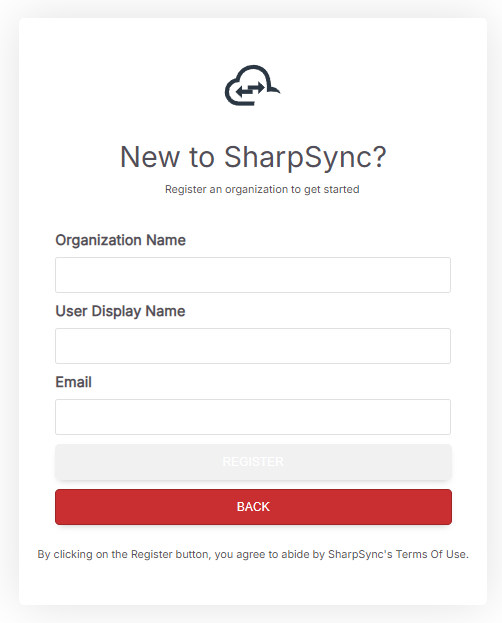
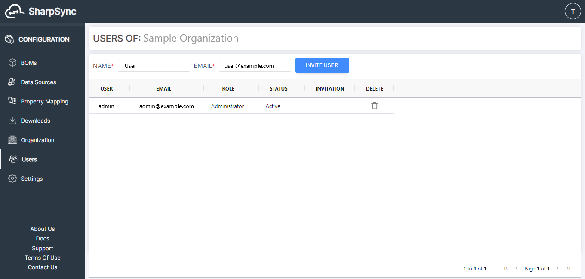

# Registration

### Getting Started

1. From the [sharpsync.net](https://app.sharpsync.net/login) main page, click on the Log In button to begin. To begin your SharpSync experience, you must first register your organization. Click on _Sign up now_ as shown below.

<figure><figcaption></figcaption></figure>

2. On the next screen, fill the information below. Once complete, click on Register.

* Organization Name
* User Display Name
* Email

<figure><figcaption></figcaption></figure>

Your organization registration request will then be reviewed internally, and, once approved, an email will be sent with further instructions to add your user's credentials and verify to login.

#### Inviting New Users

To add more users to your organization, click on the Users icon in the App Settings sidebar.

<figure><figcaption></figcaption></figure>

1. In the Users section, enter the User's name and their email address.
2. Click on Invite User. (An email will be sent to the user inviting them to join the organization on SharpSync).
3. You can remove a User by clicking on the trash can icon in the Delete column.

For more information, check out the [User Management](/broken/pages/xBRhptqXyFeYT0p7TfFp) section.

<figure><figcaption></figcaption></figure>
