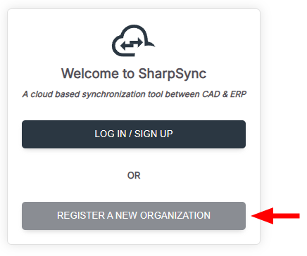
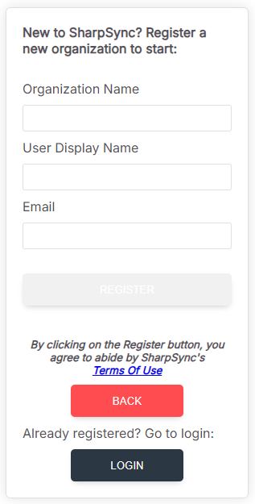

# Registration

### Getting Started

1. From the [sharpsync.net](https://app.sharpsync.net/login) main page, click on the Log In button to begin. To begin your SharpSync experience, you must first register your organization. Click on _Registering a new Organization?_ as shown below.

<figure><figcaption></figcaption></figure>

2. On the next screen, fill the information below. Once complete, click on Register.

* Organization Name
* User Display Name
* Email

<figure><figcaption></figcaption></figure>

An email with a verification link will be sent; click on the link to complete the registration. Login to begin.

#### Inviting New Users

 

<figure><figcaption></figcaption></figure>

To add more users to your organization, click on the Users icon in the App Settings sidebar.

1. In the Users section, enter the User's name and their email address.&#x20;
2. Click on Invite User. (An email will be sent to the user inviting them to join the organization on SharpSync).
3. You can remove a User by clicking on the trash can icon in the Delete column.

For more, check out the [User Management](broken-reference) section.

<figure><figcaption></figcaption></figure>
