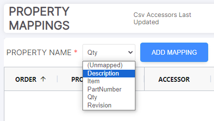
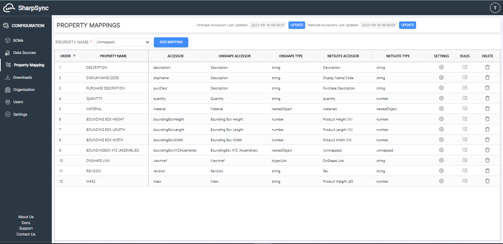

# Adding Property Mapping

Property Mappings can display a variety of information including, but not limited to:

* BOM columns,
* Part or Assembly custom metadata information,
* Configuration information (such as name or configuration property)
* CAD model data captured in custom properties (or metadata)
* Generated values based on metadata (if rules are setup)

SharpSync has built-in rules and settings for each property mapping. These rules and settings help codify, standardize, and push changes to the selected Data Sources. See also Property mapping rules

### Adding Property Mappings

1. On the Property Mapping page, select the Property you wish to map to the BOM and click `ADD MAPPING`.
   * The column headers you entered in the Data Source BOM Configuration will populate each Property Mapping.
   * Each Property Mapping will be displayed as a column on the Component Assembly BOM page.

<figure><figcaption></figcaption></figure>

2. Once you have selected the property mappings that you want to appear in the SharpSync BOM, confirm that the Accessors, Primary Data Source Properties, and Secondary Data Source Properties columns are correct. You can double-click on the cells in each column to change the value SharpSync will match. The accessor must be present in the appropriate Data Source.

<figure><figcaption></figcaption></figure>
