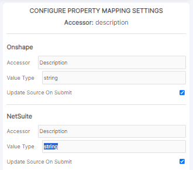
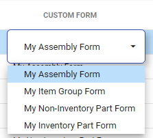
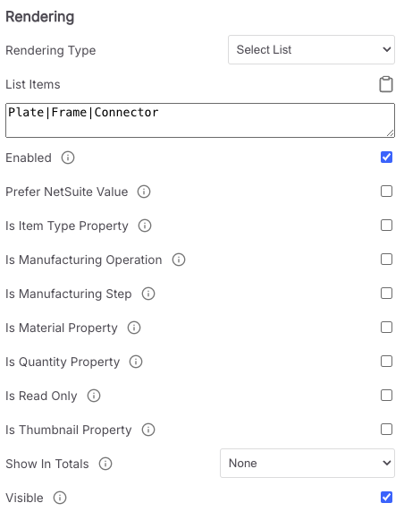

# Property Mapping Settings

To change the settings of each Property Mapping, click on the coressponding mapping gear in the Settings column.

**Update** Data Source

Verify that the accessor for each Data Source is correct:

* Example: If you only want the CAD data (Primary Data Source) information to change the ERP/PDM/PLM (Secondary Data Source), then check only the Secondary Data Source checkbox for 'Update Source On Submit'. The opposite direction can be achieved by unchecking the Secondary Data Source and checking the Primary Data Source.
* If you want both sources to change, check the "Update Source on Submit" checkboxes for both sources.
* Settings are saved for each Property Mapping.

<figure><figcaption><p>Property Mapping: Update sources</p></figcaption></figure>


**Rendering**

Rendering defines how an accessor/mapping of a value is viewed and accessed in the Bill of Materials view.

Before we go too deep, let's define some terms:

| Term                | Description                                                                                                 |
| ------------------- | ----------------------------------------------------------------------------------------------------------- |
| Render type         | How the user may interact with the cell                                                                     |
| Accessor / Property | The internal name as SharpSync refers to it                                                                 |
| Options             | An optional configuration option affecting the behavior of a column when the Bill Of materials is displayed |

**Rendering Types**

Changes the behaviour display of the Property Mapping when the Bill of Materials shows on-screen:

| Type                       | Description                                                                                                                                                                                                                                                                                                                                                                                                                                                                                                                                                                                                                                                                                                                                                                                                                                                                                                                          | Configuration                                                                                                                                                          |
| -------------------------- | ------------------------------------------------------------------------------------------------------------------------------------------------------------------------------------------------------------------------------------------------------------------------------------------------------------------------------------------------------------------------------------------------------------------------------------------------------------------------------------------------------------------------------------------------------------------------------------------------------------------------------------------------------------------------------------------------------------------------------------------------------------------------------------------------------------------------------------------------------------------------------------------------------------------------------------ | ---------------------------------------------------------------------------------------------------------------------------------------------------------------------- |
| Checkbox                   | <p>Renders the data as a checkbox. Supported values are 'true', 'false', '1', '0', 'Yes', 'No'. Anything not in these values are rendered as unchecked.</p><p></p><p>User interacts via clicking only.</p>                                                                                                                                                                                                                                                                                                                                                                                                                                                                                                                                                                                                                                                                                                                           | None                                                                                                                                                                   |
| Free text                  | <p>The most common type of data to display. Shows the value as a string on screen.</p><p></p><p>User interacts by double-clicking, then typing text. You may also paste text</p>                                                                                                                                                                                                                                                                                                                                                                                                                                                                                                                                                                                                                                                                                                                                                     | None                                                                                                                                                                   |
| Select List                | <p>A simple selection box for user specified values. Separate values with a pipe symbol ' | '.</p><p></p><p>User interacts by double-clicking, then selecting text. You may also paste text</p>                                                                                                                                                                                                                                                                                                                                                                                                                                                                                                                                                                                                                                                                                                                                      | Enter a list of values in the `List Items` textbox and separate each entry with a vertical Pipe (see example below)                                                    |
| Multi Select List          | <p>A selection box for multiple user specified values. Separate values with a pipe symbol ' | '. A user may pick more than 1 value from the list.</p><p></p><p>User interacts by double-clicking, then selecting text. You may select multiple values. The Data Source to be updated must support multi value fields</p>                                                                                                                                                                                                                                                                                                                                                                                                                                                                                                                                                                                                             | Enter a list of values in the `List Items` textbox and separate each entry with a vertical Pipe                                                                        |
| Advanced List              | <p>A selection box for complex user specified values. The user must specify the <code>Display Selector</code>, the <code>Value Selector</code>and the items to pick from.</p><p>Items are specified using a JSON array [ {object1}, {object2} ] Selections are made using the value of the <code>Value Selector</code> e.g. if <code>object1</code>contains a key-value pair of <code>{ 'id' : 23' , 'name' : 'andries' }</code> Then the value selector will be <code>id</code>and the display selector will be <code>name</code></p><p></p><p>User interacts by double-clicking, then selecting text. You may also paste text.<br><br>An object list displays a value (<code>display selector</code> - that which is displayed), but when you <em>select that value</em>, a different value is used as the value sent to the source (<code>value selector</code> - the value selected as the update value) (see example below)</p> | <p>Enter a list of values in the textbox in the javascript array form</p><p><code>[ {}, {} ]</code></p><p>and separate each entry with a comma (see example below)</p> |
| Advanced Multi Select List | <p>The same as an Advanced List, but the user can select multiple values.</p><p></p><p>User interacts by double-clicking, then selecting text. You may select multiple values. The Data Source to be updated must support multi value fields.<br><br>An object list displays a value (<code>display selector</code> - that which is displayed), but when you <em>select that value</em>, a different value is used as the value sent to the source (<code>value selector</code> - the value selected as the update value) (see example below)</p>                                                                                                                                                                                                                                                                                                                                                                                    | <p>Enter a list of values in the textbox in the javascript array form</p><p><code>[ {}, {} ]</code></p><p>and separate each entry with a comma (see example below)</p> |
| Url                        | Displays any text as a url (opens in a new tab when clicked) (Does not check for validity)                                                                                                                                                                                                                                                                                                                                                                                                                                                                                                                                                                                                                                                                                                                                                                                                                                           | None                                                                                                                                                                   |

**Rendering options**

* The remaining checkboxes affect the columns' display and interface:
  * Enabled - When unchecked the column will not be visible in the BOM nor any related mapping rule will be processed
  * Read Only - When checked, BOM column will not be editable
  * Show in Totals - The total for that column will be shown in the Totals row at the bottom of the BOM
  * Visible - When unchecked, column will not be visible, but user can unhide from the BOM column context menu

4. Click Save to finish.

**Setting Examples**

Example: Custom list of items to select from using `Advanced List`

* Rendering type: `Advanced List`
* Value selector: `id`
* Display selector: `refName`
*   List items:

    ```json
    [
       {"id":"182","refName":"My Assembly Form"},
       {"id":"187","refName":"My Item Group Form"},
       {"id":"143","refName":"My Non-Inventory Part Form"},
       {"id":"181","refName":"My Inventory Part Form"}
    ]
    ```

Which, when displayed in the UI, looks like this

<figure><figcaption><p>Property Mapping: Example list</p></figcaption></figure>


Given the list above, if the selections would result in the following:

* Selecting `My assembly Form` would result in a value of `182`
* Selecting `My Item Group Form` would result in a value of `187`

Example: Custom list of items to select from using `Select List`

* Rendering type: `Select List`
*   List items:

    ```json
     Plate|Frame|Connector
    ```

Which, when displayed in the UI, looks like this

<figure><figcaption></figcaption></figure>


### Configure Rules

Property Mapping Rules are used to define the output format of the BOM data shown in SharpSync. When a rule is applied, all cells in a column mapped to a property will be evaluated. If the cell data does not fall within the rules applied, the cell will display an error color on its border, with a more detailed explanation in the cell overlay. Hover over a cell to see the applied rules evaluated in the overlay. Click on list icon in the Rules column of the desired Property Mapping to begin. For the list of Rules with explanations for each, click the following link: Property mapping rules

<figure><figcaption></figcaption></figure>


1. Select the rule desired. Be sure to select the type of rule that best matches the data type. (Text, Numeric, JavaScript expression, Json value)
2. Select display, import or export to determine when the rule is applied:
   * Display applies the rule in the SharpSync BOM.
   * Import applies the rule as data is being imported into the SharpSync BOM.
   * Export applies the rule as data is being exported from the SharpSync BOM.
3. Click on Add Rule to show the rule in the list.
4. This icon tells you what type of rule it is:
   * Data Validation - Evaluates validity of the cell data.
   * Data Transformation - Changes cell data to match the rule type.
5. This header shows the rule action, and the arrows allow you to move the rule up or down the list.
   * Rules are evaluated from top to bottom. If you want one rule to execute before another, ensure it is ordered correctly.
6. Saves any changes you make to the rule.
7. Deletes the rule from the list.
8. Rule name with :information\_source: tooltip explanation at right.
9. Rule criteria
   * A textbox may be present to allow the user to define the rule parameter.
   * A description will be present if the parameter is not required.
10. On Rule Failure Action - Warning(s) will be present in the cell overlay when the rule fails.
    * Select pass to allow the user to still process the BOM.
    * Select block to require the user to fix the cell data before processing the BOM.
11. Depending on the rule selected, the bottom line may display options for processing the rule. Select the Data Sources that will be updated.
12. Closes and saves the Rules module. Rules in the list will be saved and applied to the BOM.

<figure><figcaption></figcaption></figure>


BOM with list of pass/fail Rules on overlay for part A4 - Base Plate (Red Arrow)


**Object list setup example**

Expanding on the `Object List` option, the requirements are:

* Create an array of javascript objects
* Specify which key in the json object is your value (the value going to the destination Data Source)
* Specify which key in the json object is your display value Given the following list of json objects as the input for my `Object List Items`

```json
[
  {
        "id": "ALU-OX-3HD",
        "displayName": "Alumina Oxide",
        "category": "Ceramic"
    },
    {
        "id": "BR",
        "displayName": "Brick",
        "category": "Ceramic" 
    },
    {
        "id": "CONC",
        "displayName": "Concrete",
        "category": "Ceramic" 
    },
    {
        "id": "FE",
        "displayName": "Ferrite",
        "category": "Ceramic" 
    }
]
```

The values that I want to see on screen in the selection list would be `Alumina Oxide`, `Brick`,`Concrete`,`Ferrite` The values that I want to pass to my ERP would be `ALU-OX-3HD`,`BR`,`CONC`,`FE`

So my values specified in the Object selection list would be:

* Rendering type: `Object list`
* List Value Selector: `id`
* List Value Display Selector: `displayName`

Make sure to also read Property mapping rules

### Effective troubleshooting

Property mappings and their associated rules can get complicated based on the number of rules you create and the data being returned. My most effective methodology for troubleshooting has been:

* Disable all suspected problematic property mappings using the `Enabled` checkbox option. Retest.
* Once you've identified the problematic property mapping, disable only the one and enable all other mappings.
* At the same time disable all rules for the property mapping. Retest
* Test each rule using the preview option first.
* Enable each rule successively until you've identified the problem rule.
