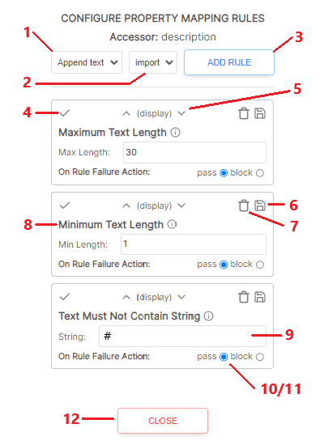
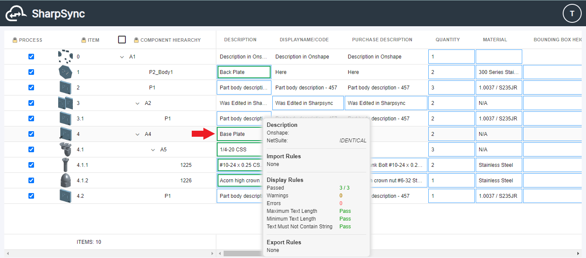

# Rules

To configure the rules for each Property Mapping, click on the corresponding rules icon in the Rules column.

### Rule Type or Category

Rules for property mappings fall into 1 of 3 categories:

<table><thead><tr><th width="140.5546875">Rule Category</th><th width="234.3671875">What it does</th><th>Internal Reference</th><th>Visibility</th></tr></thead><tbody><tr><td>Import Rules</td><td>Modifies incoming data </td><td>Data Transformation</td><td>Tooltip</td></tr><tr><td>Export Rules</td><td>Modifies outgoing data</td><td>Data Transformation</td><td>Tooltip</td></tr><tr><td>Display Rules</td><td>Validates data on-screen</td><td>Data Validation</td><td>Tooltip + Cell border</td></tr></tbody></table>

### Order of Rules

Each type of rule can be reordered within it's own category, but you cannot move an export rule before an import rule The order that rules run in always follow the following order:

* Import
* Display
* Export

You _can_ reorder the rules (there are individual up/down buttons next to the header), but `export` rules cannot appear before `import` rules. Import/Export rules have an orange border, while display rules only have a gray border.

Display Rules (Data Validation) evaluates the data displayed on-screen after being retrieved from a Data Source and after all applicable Import rules have been processed.

#### Concept: Individual sources

Import rules work on the raw source data and are applied to each individual data source's data.

> Each rule runs only on the source that it is being applied on (see image below)

### Rule Legend

When a rule passes, the user is not informed of any problems with the data. When rule fails, a border is displayed on the  cell where the problem appears.


The colors displayed can be modified under Profile > User Settings > Display


<table data-full-width="false"><thead><tr><th width="290">Color scheme</th><th>Description</th></tr></thead><tbody><tr><td></td><td>Orange border - Value did not pass display mapping rule (Warning), the user is able to continue.</td></tr><tr><td></td><td>Red border - Value did not pass display mapping rule (Error), the user is <em>not</em> able to continue.</td></tr></tbody></table>

### Configure Rules

Start by navigating to Property Mappings and click on "Rules" for the Property Mapping you want to edit.

<figure><figcaption></figcaption></figure>

A panel will appear on the side. Expand the Rules dropdown to reveal the available list of rules that can be applied.

<figure><figcaption></figcaption></figure>

1. Select the rule desired. Be sure to select the type of rule that best matches the data type. (Text, Numeric, JavaScript expression, Json value)
2. Select display, import or export to determine when the rule is applied:
   * Display applies the rule in the SharpSync BOM.
   * Import applies the rule as data is being imported into the SharpSync BOM.
   * Export applies the rule as data is being exported from the SharpSync BOM.
3. Click on Add Rule to show the rule in the list.
4. This icon tells you what type of rule it is:
   * Data Validation - Evaluates validity of the cell data.
   * Data Transformation - Changes cell data to match the rule type.
5. This header shows the rule action, and the arrows allow you to move the rule up or down the list.
   * Rules are evaluated from top to bottom. If you want one rule to execute before another, ensure it is ordered correctly.
6. Saves any changes you make to the rule.
7. Deletes the rule from the list.
8. Rule name with :information\_source: tooltip explanation at right.
9. Rule criteria
   * A textbox may be present to allow the user to define the rule parameter.
   * A description will be present if the parameter is not required.
10. On Rule Failure Action - Warning(s) will be present in the cell overlay when the rule fails.
    * Select pass to allow the user to still process the BOM.
    * Select block to require the user to fix the cell data before processing the BOM.
11. Depending on the rule selected, the bottom line may display options for processing the rule. Select the Data Sources that will be updated.
12. Closes and saves the Rules module. Rules in the list will be saved and applied to the BOM.

<figure><figcaption><p>BOM with list of pass/fail Rules on overlay for part A4 - Base Plate (Red Arrow)</p></figcaption></figure>

### Notes

In the example below, the `Format as decimal number` rule runs for both [Data Sources](../data-sources.md) (in this example Onshape and NetSuite). The rule runs on the individual strings of data imported.

<figure><figcaption></figcaption></figure>

The final result for both rules are overlaid in the user interface (the default would be a blue rectangle). Below is a conceptual illustration of the process where&#x20;

* Data Source 1 is DS1
* Data Source 2 is DS2
* 's' is the [rowData](advanced-scripting.md) string value being evaluated

<figure><figcaption></figcaption></figure>


The rule running for DS1 (e.g. Onshape) _is not aware of the data being imported from DS2_ (e.g. NetSuite)_._ That means that when running a rule such as a JavaScript `Text Manipulation` rule, the function runs only for _one_ source at a time, _never for both at the same time_.



One way to get around this is to create a `Text evaluation` rule to match the value of a cell to that of another and return a display message to the user. Or use a `Text manipulation` rule to write a message to a cell value and give the user a message onscreen.


### Example

Let's suppose that we have Data Source 1 (DS1) and Data Source 2 (DS2), the process would be:

#### **Step: Setup the property mappings**

* Setup the 1st column. Give it an accessor of `description` with a column mapping of property `description` for DS1 and for DS2


As a quick reference, here are the instructions for setting up a [Property Mapping](../property-mappings/adding-property-mapping.md#adding-property-mappings).


* Setup a 2nd property column `description2` column. Give it an accessor of `description2`. Also map it to the `description` property.
* Add a `Text evaluation` display rule to the 2nd column.

#### **Step: Pulling the BOM + reviewing the data**

* For now let's say the value that comes from DS1 is the value `Coil`.
* Enable the setting on the 2nd column: `Prefer {DS2} Value`. This forces the value from DS2 to display instead of the value of DS1 displaying by default
* Add a `Text evaluation` rule. This rule has access to an `s` parameter (the current string value). Use the the following logic:
* If the value of `s` is equal to the `description` property, return a message to the user.

Written out in JavaScript it would look like this

```javascript
if (s === rowData.cells.description) 
 return { status: 'failure', message: `The values must not be the same` };
```

Note that returning any value in the `message` above can be customized by you.

The data from DS2 is imported after that of DS1. The rules start running for DS2.

Be sure also to read and understand [Advanced Scripting](advanced-scripting.md).

### Display Rules

#### **Text evaluation**

Evaluates the cell value given the JavaScript expression. Available parameters:

* s (display value)
* rowData (the record containing the accessors data and additional metadata)

Notes on `rowData`: rowData is a object which contains the following noteworthy child items:

* rowData.cells (each cell value without modification. This can include the altered values as set in import rules)
* rowData.modifications (any modifications made by the user as at the time the rule is run)

Special notes:

Whenever you create a text evaluation rule that evaluates the value of _another cell_, you must take into consideration the modifications of the other cell.

e.g. if the accessor you're evaluating for is `myProperty1` and the condition is based on the value of accessor `myProperty2`, first check in your rule for the existence of `rowData.modifications.myProperty2`. If it exists, then use it, otherwise use `rowData.cells.myProperty2`. Example below

```javascript
// if the key (property mapping) exists in the object return its value, 
// otherwise, return the value in the rowData.cells
const myValue2 = "myProperty2" in rowData.modifications ? rowData.modifications.myProperty2 : rowData.cells.myProperty2;

// now do something with the value you got above
if ({conditionBasedOnMyValue2})
  return { message: `the message you want to return` };
```


Interpreting the Results

SharpSync processes and prioritizes each rule in order from top to bottom. Moving a rule up or down the list can change the result depending on the subsequent outcome. See the examples below to gain an idea of how results are evaluated:

**Example 1: Text-based Rule Application**

**Preconditions**

* Property Mapping: Description (Text)
* Sample Cell Data: "Connector Bracket 1\_REL"

**Rules**

1. Prepend Text: "ABC-"
2. Text Must End with String: "\_REL"
3. Maximum Text Length: 25

**Evaluation**

1. [<mark style="color:green;">PASS</mark>](#user-content-fn-1)[^1]: Text is appended to be "ABC-Connector Bracket 1\_REL"
2. [<mark style="color:green;">PASS</mark>](#user-content-fn-1)[^1]: Text does end with the string "\_REL"
3. [<mark style="color:red;">FAIL</mark>](#user-content-fn-1)[^1]: Text length is longer than maximum. Text was originally 23 characters; the prepended text makes the character length 27.

* Quick Fix: change the text in SharpSync by removing characters or abbreviating words. Data Sources can be updated when the BOM is submitted with the changes, depending on the Property Mapping settings.
* If the Maximum Text Length was ordered before the Prepend Text rule, all rules would evaluate as [<mark style="color:green;">pass</mark>](#user-content-fn-1)[^1].

**Example 2: Numeric Rule Application**

**Preconditions**

* Property Mapping: Weight (Numeric value)
* Sample Cell Data: "123.54 kg"

**Rules**

1. Replace Text (removing spaces)
   * Orginal Value: " "
   * New Value: ""
2. Format as Decimal Number
   * Number of Decimals: 0
   * Remove Text: kg|KG|g|lb|lbs
3. Round to Nearest X: 1
4. Number Between
   * Min Value: 1
   * Max Value: 123

**Evaluation**

1. PASS: Space is removed, new text is "123.54kg"
2. PASS: Text is changed to Decimal. Any characters after tenth place is dropped. New value is 123.
3. PASS: Decimal is rounded to the nearest whole number of 123.
4. PASS: Number is between or equal to the minimum and maximum values of 1 and 123.

* If the 2nd and 3rd rules were reversed, the last rule would fail. The number would be rounded first, which would result in the new number being 124, which is larger than the last rule's maximum value.

[^1]: Displayed in the context menu in the BOM Comparison screen
